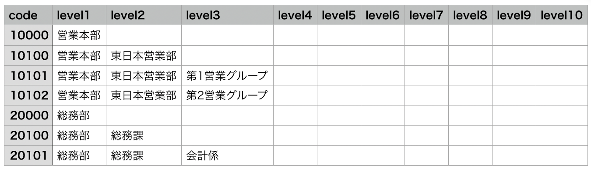
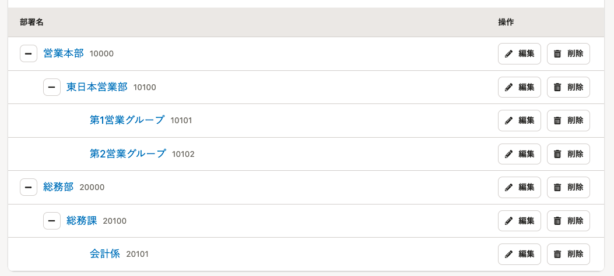

# A. ［code］の列には部署コード、［level］の列には部署名を入力します。

CSVファイルをMicrosoft Excelなどで編集します。 **［code］** の列には部署コード、 **［level］** の列には部署名を入力します。

部署の階層は、上位から順に、level1、level2、level3、となっています。

部署の階層を作る際は、上位部署名をすべて入力してください。以下のように、階段状に入力します。

上記のCSVファイルを取り込むと、SmartHRでは以下のように表示されます。

部署マスターの一括追加・一括更新の操作手順は、下記のヘルプページをご覧ください。

[部署のマスターデータを管理する](https://knowledge.smarthr.jp/hc/ja/articles/360036111074)

## 一括追加する場合の注意点

- 部署コードを必ず入力してください。部署コードの入力がない行は取り込まれません。
- 登録済みの部署コードは指定できません。指定した場合は、エラーとなり取り込まれません。

## 一括更新する場合の注意点

- 部署コードを必ず入力してください。部署コードがない行は取り込まれません。
- 部署コードは一括更新できません。部署の一覧から個別に編集してください。
- 部署コードが一致する部署情報を更新します。
- 部署の表示順は変更できません。部署の表示順を変更する場合は、 **「その他の操作」>「部署を並べ替え」** で並べ替えてください。
