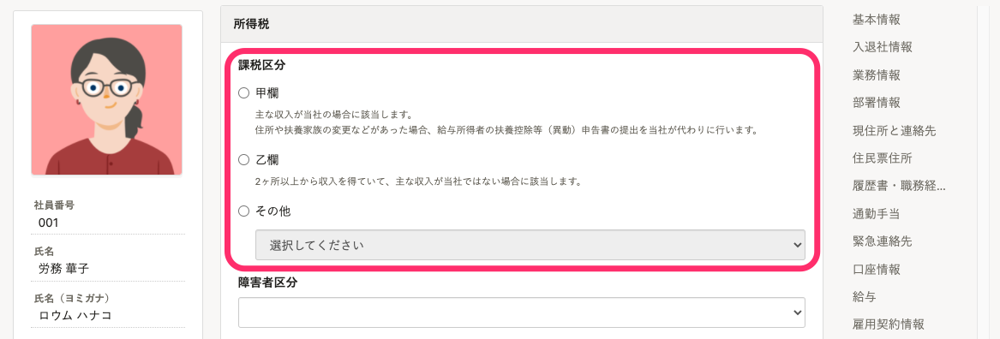
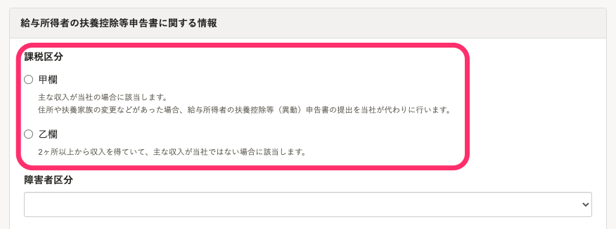

# A. はい。収集できます

2022年2月24日（木）の機能改善でシステム標準従業員項目に追加された、所得税の課税区分（甲欄・乙欄等）を使用してください。

:::related
[所得税の課税区分（甲欄・乙欄）を従業員から収集できるようになります](https://smarthr.jp/update/33147)
:::

:::tips
2022年2月24日（木）の機能改善より前に、カスタム従業員項目を使用して所得税の甲乙情報を管理している場合は、下記のヘルプページを参照してください。
[所得税の甲乙情報をカスタム従業員項目で管理する](https://knowledge.smarthr.jp/hc/ja/articles/360039754473)
:::

従業員招待フォームや申請フォームに課税区分の項目を表示させることで、従業員から情報を収集できます。

:::alert
所得税の課税区分が従業員情報にすでに登録された状態で従業員招待フォームや申請フォームを開くと、登録している課税区分によって表示が異なります。
**従業員情報で「甲欄」または「乙欄」を設定済みの場合**
「甲欄」と「乙欄」のみがフォームに表示され、「その他」は表示されません。
**従業員情報で「その他」を設定済みの場合**
「甲欄」、「乙欄」、「その他」がフォームに表示されますが、従業員が入力できない状態で表示されます。
この場合、対象の従業員の課税区分を「甲欄」または「乙欄」に変更することで、従業員が入力できるようになります。
従業員情報の編集については、[従業員情報を個別に更新する](https://knowledge.smarthr.jp/hc/ja/articles/360036957193)を参照してください。
:::
