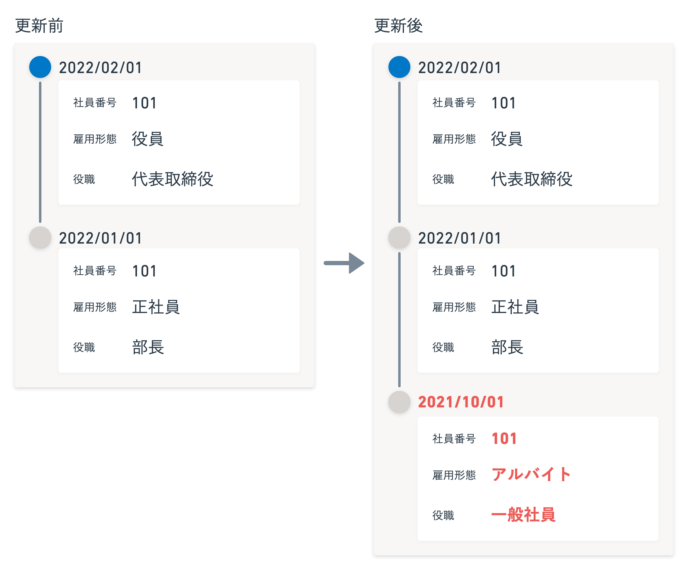
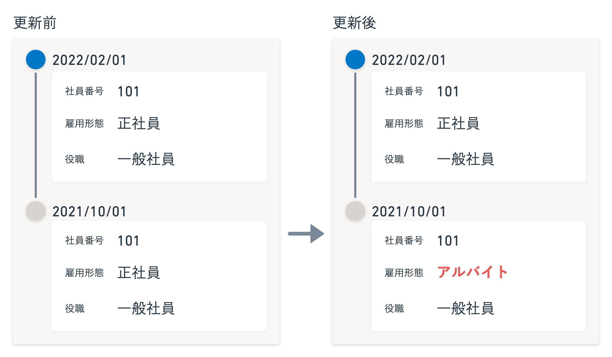
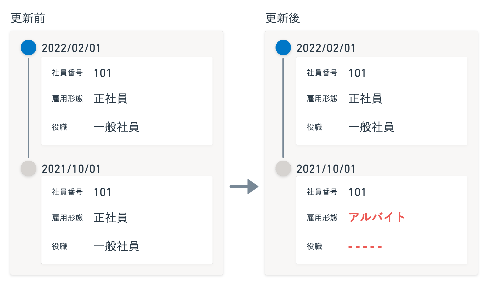

CSVファイルやExcelファイルを使って従業員情報を一括更新する際、適用日を指定できます。

指定した適用日に履歴がない場合、新たな履歴が作られます。

指定した適用日に既に履歴がある場合、ファイルに記載した情報で既存の履歴を上書きします。

# 指定した適用日に履歴がない場合

指定した適用日の履歴がない場合、新たに履歴が作られます。

たとえば以下のファイルで一括更新し、2021/10/01の履歴がない場合、新たに履歴が作られます。

| 社員番号 | 雇用形態 | 役職 | 適用日 |
| --- | --- | --- | --- |
| 101 | アルバイト | 一般社員 | 2021/10/01 |

# 指定した適用日に履歴がある場合

指定した適用日に既に履歴がある場合、ファイルに記載した内容で上書き（更新）します。

たとえば以下のファイルで一括更新をすると、2021/10/01の履歴の「雇用形態」の内容のみ上書き（更新）されます。

| 社員番号 | 雇用形態 | 役職 | 適用日 |
| --- | --- | --- | --- |
| 101 | アルバイト | 一般社員 | 2021/10/01 |

## ヘッダー（項目名）があり、値が空欄の場合

ヘッダー（項目名）があり、値が空欄の場合、既存の内容が空で上書きされます。

たとえば以下のファイルで一括更新すると、2021/10/01の履歴の「役職」は空欄になります。

| 社員番号 | 雇用形態 | 役職 | 適用日 |
| --- | --- | --- | --- |
| 101 | アルバイト |   | 2021/10/01 |

