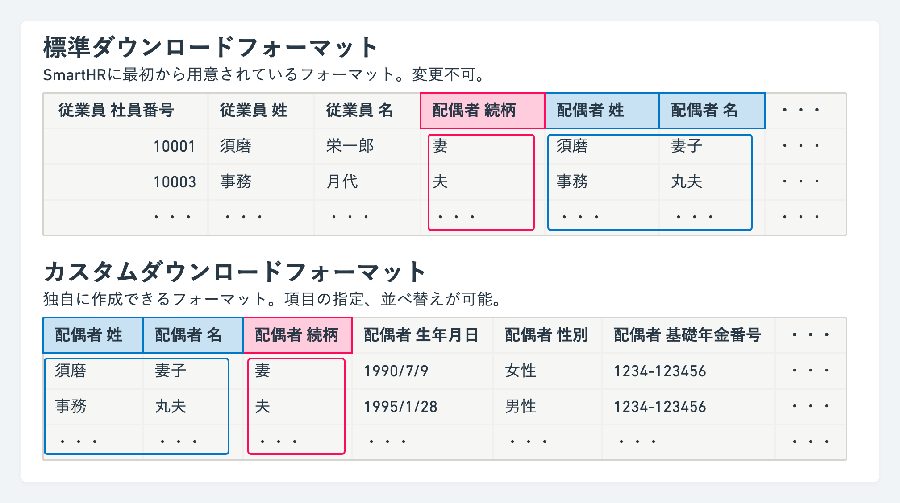
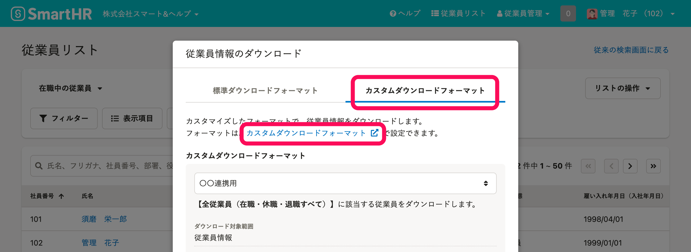
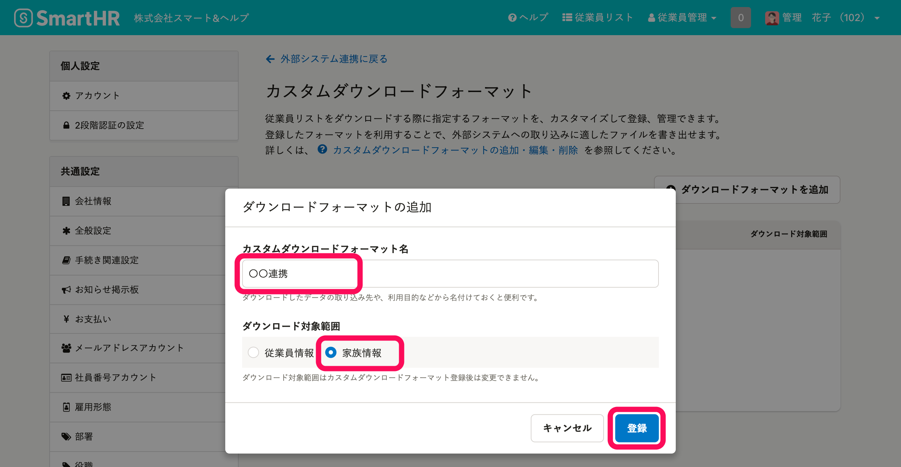
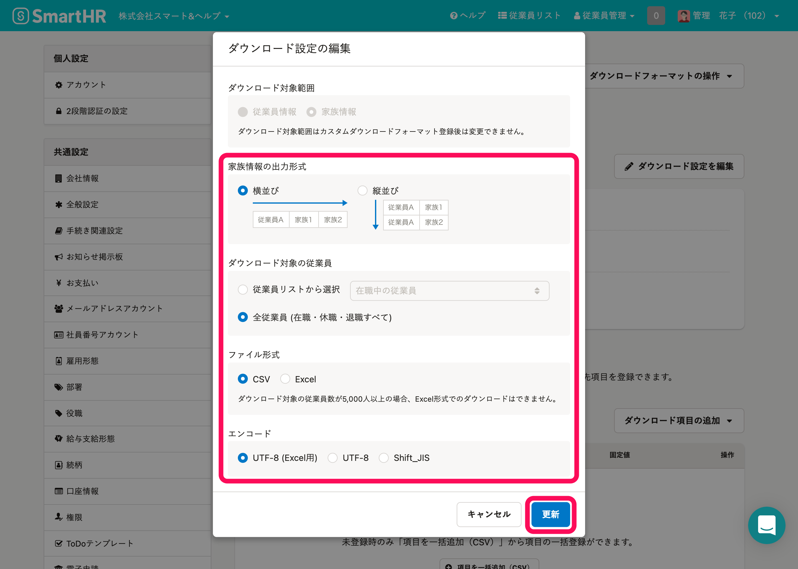
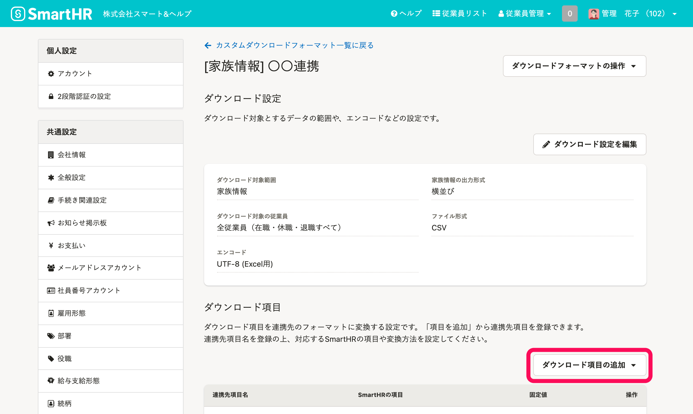
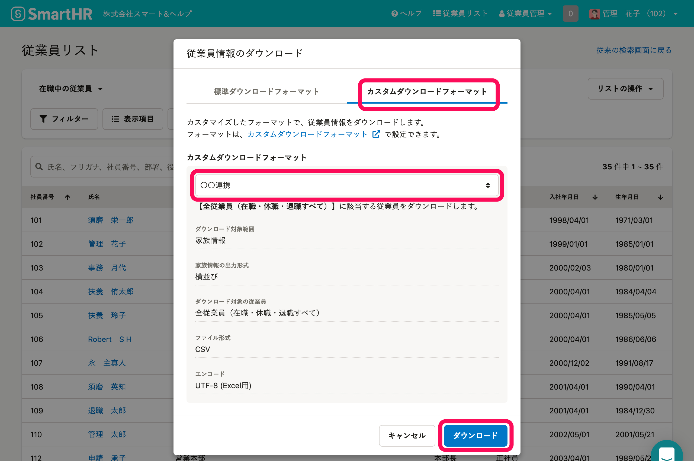
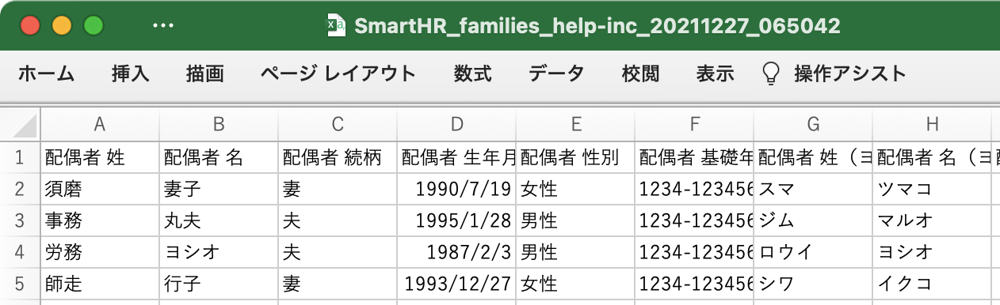

**標準ダウンロードフォーマット**で家族情報をダウンロードすると、**すべての項目が決められた並び順**でダウンロードされます。

**カスタムダウンロードフォーマット**を利用すると、家族情報のうち**連携先システムに必要な項目を、インポート形式にあわせた並び順で**ダウンロードできます。

以下の手順でカスタムダウンロードフォーマットを設定し、ダウンロードしてください。

:::tips
カスタムダウンロードフォーマットはスタンダードプラン以上でご利用いただけます。
スタンダードプランのご利用料金については、[スタンダードプランお見積り](https://smarthr.jp/pricing/quote_standard)からお問い合わせください。
:::

# 1\. カスタムダウンロードフォーマット画面に移動

 **［従業員リスト］>［ダウンロード］** をクリックすると、 **［従業員情報のダウンロード］** ダイアログが表示されます。

 **［カスタムダウンロードフォーマット］** タブをクリックし **［カスタムダウンロードフォーマット］** のリンクをクリックすると、 **［カスタムダウンロードフォーマット］** 一覧画面が表示されます。

:::tips
 **［共通設定］** からも **［カスタムダウンロードフォーマット］** 一覧画面に移動できます。
 **［アカウント名▼］>［共通設定］** をクリックし、画面左のリストにある **［外部システム連携］>［カスタムダウンロードフォーマット］** をクリックすると、 **［カスタムダウンロードフォーマット］** 一覧画面が表示されます。
:::

# 2\. カスタムダウンロードフォーマットを追加

 **［+ダウンロードフォーマットを追加］** をクリックすると、 **［ダウンロードフォーマットの追加］** ダイアログが表示されます。

 **［カスタムダウンロードフォーマット名］** を入力し、 **［ダウンロード対象範囲］** として **［家族情報］** を指定します。

 **［登録］** をクリックすると、カスタムダウンロードフォーマットの詳細画面が表示されます。

# 3\. ダウンロード設定を編集

 **［ダウンロード設定を編集］** をクリックすると、 **［ダウンロード設定の編集］** ダイアログが表示されます。

 **［出力形式］** や **［ダウンロード対象の従業員］** を指定してください。

:::tips
縦並びで連携先システムにインポートしたい場合は、 **［出力形式］** として **［縦並び］** を選択します。
:::

# 4\. ダウンロード項目を追加

 **［ダウンロード項目の追加］** をクリックし、ダウンロードしたい家族情報を追加します。

具体的な手順は、[カスタムダウンロードフォーマットの追加・編集・削除](https://knowledge.smarthr.jp/hc/ja/articles/4404850299289)の**カスタムダウンロードフォーマットを追加する**の**手順3以降**を参考にしてください。

:::tips
家族情報にどのような項目があるかは、以下のページで確認できます。
[【一覧】家族情報CSV凡例](https://knowledge.smarthr.jp/hc/ja/articles/4406454806937)
:::

# 5\. 従業員リストから家族情報をダウンロード

 **［従業員リスト］** 画面で、 **［ダウンロード］** をクリックします。

ダイアログ画面で **［カスタムダウンロードフォーマット］** タブをクリックし、プルダウンから**上記の手順2,3,4で追加したダウンロードフォーマット**を指定します。

 **［ダウンロード］** をクリックすると、ダウンロードの処理が予約されます。

 **［バックグラウンド処理一覧］** 画面に移動し、該当の処理名をクリックすると、**カスタムダウンロードフォーマットで指定した項目・並び順**で、家族情報をダウンロードできます。

