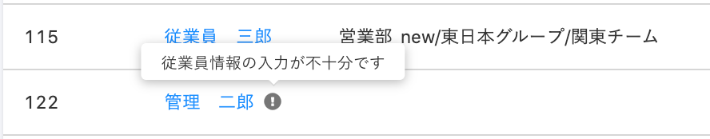

従業員リスト上で、名前の前に\[！\]マークが表示される場合、その従業員の基本情報の入力が不足しています。

# \[！\]マークが出ているとどうなる？

情報の入力が不十分で\[！\]マークが表示されている従業員は、手続きの対象や、メールアドレスアカウントとの紐付けの対象に選ぶことができません。

# 解消するには？

手続きや紐付けをする際は、下記の情報を入力し、\[！\]マークが表示されていないことをご確認ください。

- 姓
- 名
- 姓（ヨミガナ）
- 名（ヨミガナ）
- 戸籍上の性別
- 生年月日
- 現住所
    - 現住所（郵便番号）
    - 現住所（都道府県）
    - 現住所（市区町村）
    - 現住所（丁目・番地）
