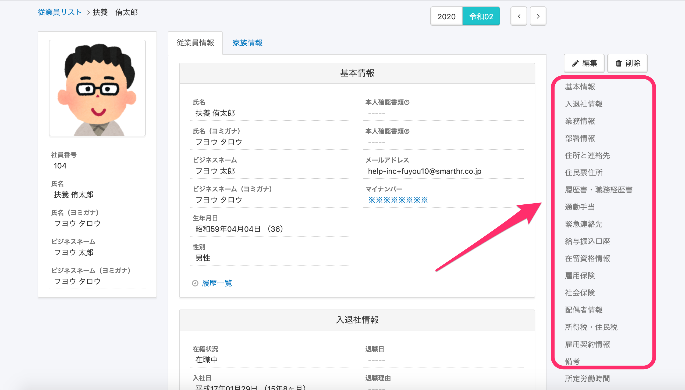

あらかじめSmartHRに設定済みの従業員項目（システム標準従業員項目といいます）は、並び替え・項目追加ができません。

# システム標準従業員項目とは

「システム標準従業員項目」とは、デフォルトでSmartHRに用意されている従業員情報の項目のことです。

上記画像で枠に囲まれている、「基本情報」から「備考」までの項目がシステム標準従業員項目にあたります。

# システム標準従業員項目の一部を非表示にできますか？

## はい、権限の設定を変更すると、システム標準従業員項目も非表示にできます。

システム標準従業員項目も、氏名や社員番号など一部の項目を除いて、表示・非表示を設定できます。

詳しい手順は、下記のページをご覧ください。

:::related
[従業員関連の閲覧・作成・更新・削除の権限を設定する](https://knowledge.smarthr.jp/hc/ja/articles/1500001368101)
[カスタム権限を追加する](https://knowledge.smarthr.jp/hc/ja/articles/360026106594)
:::

# システム標準従業員項目は並び替えできますか？

## いいえ、システム標準従業員項目が表示される順番は並び替えできません。

# システム標準従業員項目の中に項目の追加はできますか？

## いいえ、システム標準従業員項目の中に新しい項目は追加できません。

新しく追加した項目はカスタム従業員項目となり、システム標準従業員項目の後に表示されます。

カスタム項目は、項目の並び替え・追加・削除などが可能です。

カスタム従業員項目については、以下のページをご覧ください。

:::related
[カスタム従業員項目を追加する](https://knowledge.smarthr.jp/hc/ja/articles/360026265513)
:::
