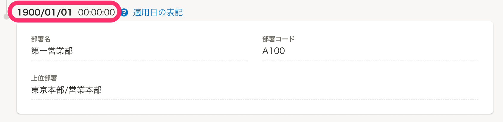

部署マスターの履歴管理機能でよくある質問を記載します。

# Q. 適用日が「1900/01/01 00:00:00」と表示されるのはなぜ？

## A. もっとも古い履歴の適用日です

部署を追加・一括追加すると、もっとも古い履歴の適用日は「**1900/01/01 00:00:00**」になります。

過去に登録したことがある部署コードを使って、新たに部署を追加した場合は、登録時点の日時が適用日になります。

2022年5月現在、適用日の変更はできません。
