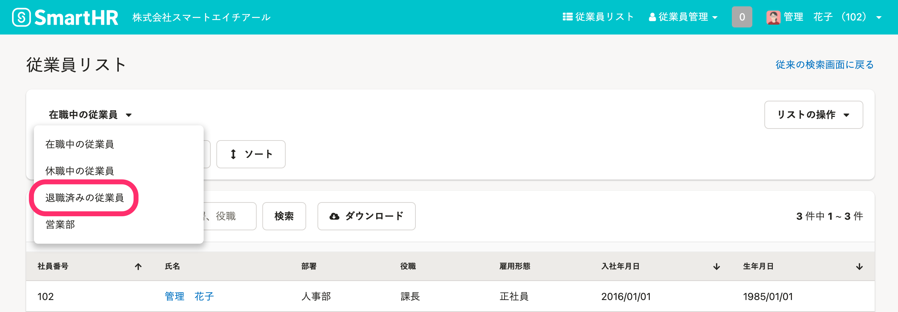
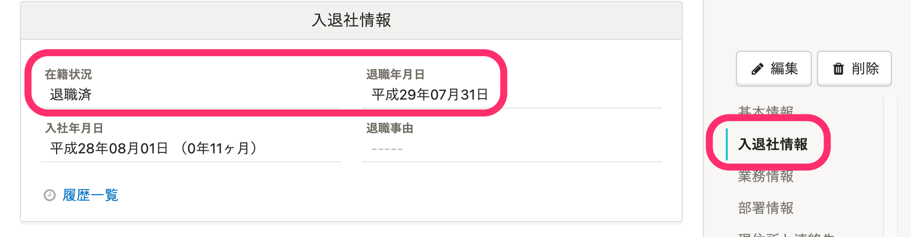

:::tips
2021年4月1日より、「退職済みの従業員」に表示される従業員の条件を変更しました。
あわせて、ご請求の対象となる従業員の条件も変更しました。詳しい変更点は、下記のお知らせをご覧ください。
[「ご請求の対象となる従業員の条件」と在籍状況の仕様変更に関するお知らせ | SmartHR](https://smarthr.jp/other/22960)
:::

# A. 在籍状況が「退職済み」の従業員が表示されます。

在籍状況が **［在職中］** や **［休職中］** の場合は、退職年月日に過去の日付が登録されていても、「退職済みの従業員」には表示されません。

## 在籍状況、退職年月日の確認方法

従業員情報の画面で、 **［入退社情報］** 欄を確認してください。

:::tips
未来の退職年月日を登録している場合は、退職年月日の翌日01:00になると、在籍状況が **［在職中］** から **［退職済］** に変更されます。
例：未来の退職年月日として2021/04/01が登録されていた場合、該当の従業員は2021/04/02 01:00に在籍状況が **［退職済］** となり、 **［退職済みの従業員］** に移動します。
ただし、退職年月日が過去の日付の場合は、在籍状況は自動で変更されません。従業員情報の編集画面にある **［入退社情報］** \> **［在籍状況］** を手動で **［退職済］** に変更してください。
:::
