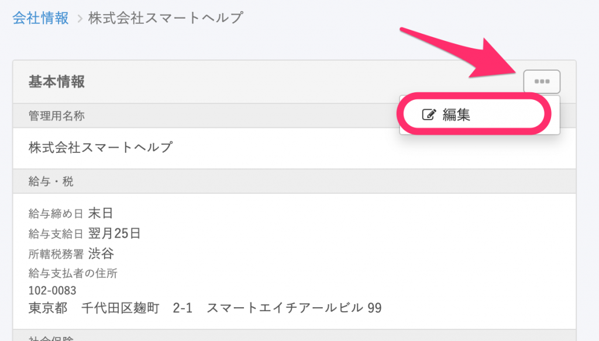

従業員が会社情報の代表者、もしくは事業所情報の代表者として設定されていると、従業員情報ページの右上に **［削除］** ボタンが表示されません。

 **［削除］** が表示されない従業員を削除するには、会社情報の代表者や事業所情報の代表者から外す必要があります。

1つでも代表者として登録されている箇所が残っていると［ **削除］** が表示されませんので、すべての設定箇所をご確認のうえ、代表者から外してください。

:::related
[従業員情報を削除する](https://knowledge.smarthr.jp/hc/ja/articles/360026107554)
:::

# 会社情報の代表者から外す

## 1\. ［共通設定］> ［会社情報］にある［基本情報を編集］をクリック

 **［共通設定］>［会社情報］** と遷移して会社情報画面を開き、 **［基本情報を編集］** をクリックすると、会社情報の編集画面へ遷移します。

## 2\. 会社情報の代表者を変更する

会社情報編集画面の **［代表者］** 欄で、削除したい従業員以外の従業員を選択し、 **｢更新する］** をクリックして保存します。

# 事業所情報の代表者から外す

## 1.［共通設定］>［会社情報］から事業所情報の詳細画面へ

 **［共通設定］>［会社情報］** と遷移して会社情報画面を開き、変更したい事業所名をクリックします。

## 2\. 事業所情報情報詳細画面から、編集画面へ

事業所情報詳細画面の右上にある **［…］メニュー**  から **［編集する］** をクリックし、編集画面へ移動します。

## 3\. 社会保険の代表者から外す

事業所情報編集画面の **［社会保険］** の欄にある代表者の項目を、削除したい従業員以外の従業員に設定します。

## 4\. 労働保険の代表者から外す

事業所情報編集画面の **［労働保険］** の欄にある代表者の項目を、削除したい従業員以外の従業員に設定します。

## 5\. 事業所情報を更新する

事業所情報編集画面の右側に表示されている **［更新する］** をクリックし、事業所情報を更新してください。

:::tips
事業所が複数ある場合は、すべての事業所の「社会保険の代表者」「雇用保険の代表者」から外す必要があります。
:::
