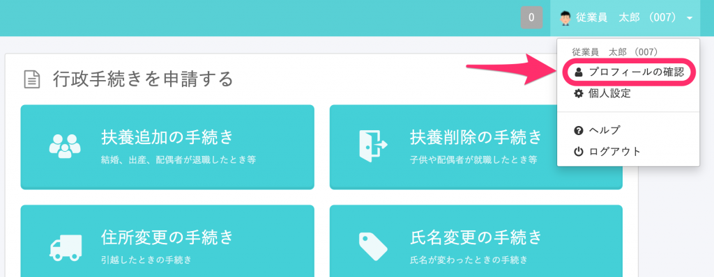
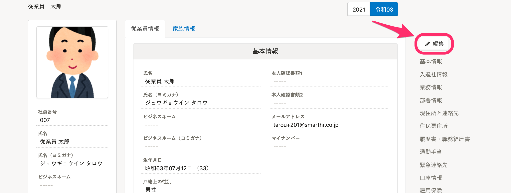
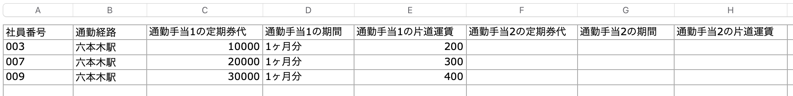

住所変更をせず、通勤手当（交通費）のみを変更する場合、従業員が直接入力する方法と、管理者が変更する方法の2つの対応方法があります。

# 従業員が直接変更する場合

## 1\. 通勤手当の更新権限を付与

システム標準のメンバー権限には、通勤手当の更新権限がありません。

下記ページを参考に、更新権限を付与してください。

:::related
[従業員関連の閲覧・作成・更新・削除の権限を設定する](https://knowledge.smarthr.jp/hc/ja/articles/1500001368101)
:::

## 2\. 従業員に変更を依頼

SmartHRにログインし、 **［アカウント名］>［プロフィールの確認］>［編集］** と進み、通勤手当の項目を入力していただくよう、従業員さまにご連絡ください。

:::tips
スタンダードプランをご利用の場合は、申請機能を利用して、従業員さまに変更を依頼できます。
下記のページを参考に、通勤手当の変更申請フォームの作成してください。
[申請機能でできること](https://knowledge.smarthr.jp/hc/ja/articles/360026103894)
:::

# 管理者が変更する場合

## 1\. 一括更新用のファイルを作成

更新後の通勤手当の情報を準備し、従業員情報の一括更新用のCSVファイル・Excelファイルを作成します。

更新用ファイルの項目は、社員番号と通勤経路・定期券代・期間・片道運賃のみで大丈夫です。

## 2\. 従業員情報を一括更新

用意した一括更新用のファイルで、  **［従業員管理］>［更新する（ファイル）］** から従業員情報の更新をしてください。

従業員情報の一括更新の詳しい手順は、下記のページをご覧ください。

:::related
[複数の従業員情報・家族情報を一括で更新する](https://knowledge.smarthr.jp/hc/ja/articles/360026265333)
:::
