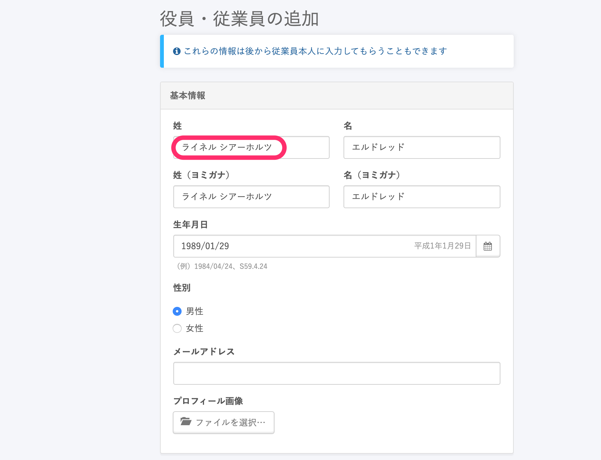
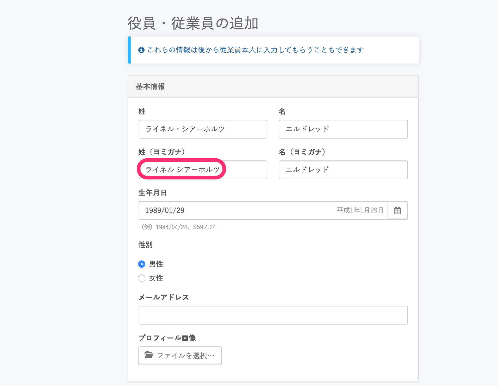
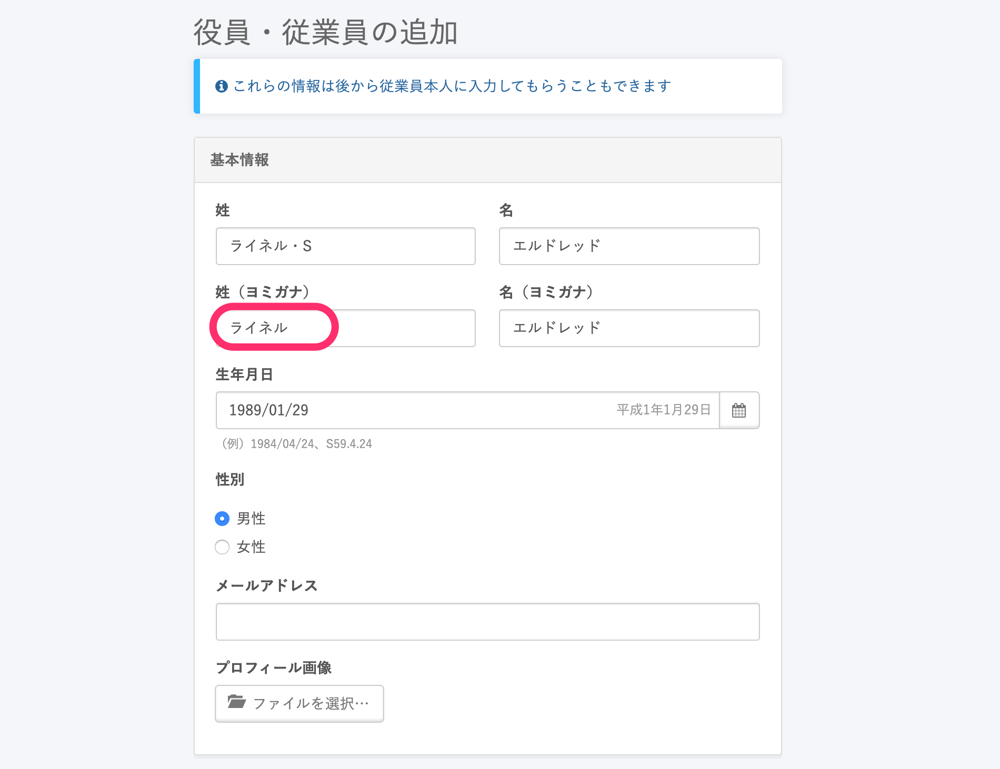
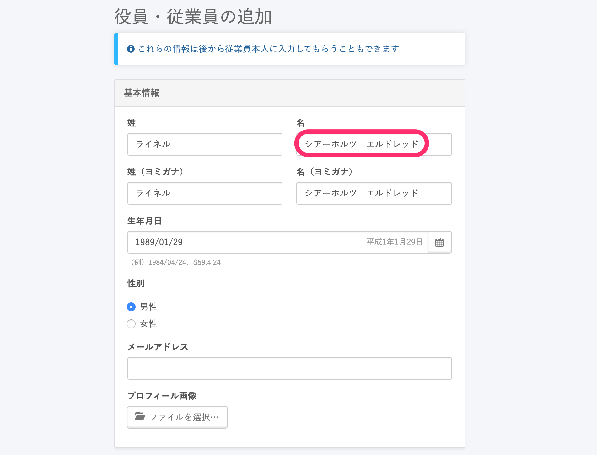

外国人従業員の方でミドルネームをお持ちの場合、身分証等に合わせて姓・名の欄どちらかにミドルネームを入力してください。

※画像は姓の欄での入力例となります。

 なお、姓・名（ヨミガナ）に関しては全角カタカナのみが入力可能となっているため、「・」やアルファベットを利用した場合には自動入力されませんのでお気をつけください。

# 例1. 「・」を入力した場合

「ライネル・シアーホルツ・エルドレッド」と入力した場合は、「・」の部分が「姓（ヨミガナ）」には反映されません。

# 例2. 「・」とアルファベットを入力した場合

「ライネル・S・エルドレッド」と入力した場合は「・S」の部分が「姓（ヨミガナ）」には反映されません。

# 電子申請をされる場合

電子申請をされる場合、「名」欄への入力については e-Gov との連携上の問題により「ミドルネーム　名」の順でご登録いただくことを推奨しております。

