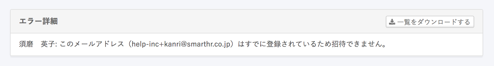

# A. 招待に使用したメールアドレスを使っているアカウントが存在します

SmartHRを利用するためのユーザーアカウントは、1つのメールアドレスにつき1つに限られています。

また、ユーザーアカウントに紐付けられる従業員情報も1つです。

そのため、招待に使用したメールアドレスでアカウント登録がある場合には「このメールアドレス(xxxxx@xxx.xx)はすでに登録されているため招待できません。」というエラーが発生します。

以下に、具体的な状況と対処方法を説明します。

## 原因1：メールアドレスアカウントとしてすでに登録されている

この企業アカウントのメールアドレスアカウントの中に、招待に使用したメールアドレスが登録されています。

メールアドレスアカウントの登録状況は  **画面右上のアカウント名 >［共通設定］>［メールアドレスアカウント］>［一覧］**  で確認できます。

## 対応1-1：招待済みのアカウントに従業員情報が紐付いていなかった場合

招待を試みた従業員情報を、登録済みのメールアドレスアカウントに紐付けてください。

:::related
[メールアドレスアカウントと従業員の紐付け](https://knowledge.smarthr.jp/hc/ja/articles/360026107614)
:::

## 対応1-2：招待済みのアカウントに別の従業員情報が紐付いていた場合

招待したい従業員とは異なる従業員情報が紐付いていた場合には、登録済みのアカウントを残す必要があるかないかで対応方法が変わります。

以下のケースごとに対応してください。

### 登録済みのアカウントが不要な場合

アカウント一覧から、 **［アカウントの編集］** 画面を開き、招待したい従業員を選択し紐付けを行なってください。

アカウントの編集方法は、[アカウントの権限を確認・変更する](https://knowledge.smarthr.jp/hc/ja/articles/360026106574)を参照してください。

### 登録済みのアカウントが必要な場合

一度退職をして入社をし直したケースなど、従業員が過去の給与明細を確認できるようにするには、登録済みアカウントは古い従業員情報を紐付けて保存しておく必要があります。

新たに招待するアカウントを登録するために、従業員には別のメールアドレスを用意してもらい、別のメールアドレスを使って招待を行なってください。

#### 管理者側で対応する

管理者が、従業員の別のメールアドレスを使用して招待メールを送ってください。

#### 従業員側で対応する

従業員自身で社員番号アカウントにログインしたあと、通知用メールアドレスを別のものに変更してください。

:::related
[ログイン・通知用メールアドレスを設定（変更）する](https://knowledge.smarthr.jp/hc/ja/articles/360026263093)
:::

## 原因2：社員番号アカウントの連絡先にメールアドレスが登録されている

すでに社員番号アカウントの連絡先として、同じアドレスが登録されていることが原因です。

社員番号アカウントの登録状況は  **画面右上のアカウント名 >［共通設定］>［社員番号アカウント］>［社員番号アカウント一覧］** で確認できます。

## 対応2-1：招待済みのアカウントが不要な場合

すでに登録されている[社員番号アカウントを削除する](https://knowledge.smarthr.jp/hc/ja/articles/360026263033)と、従業員を招待できます。

社員番号アカウントからメールアドレスアカウントに切り替えたい場合も同様の対応を行なってください。

## 対応2-2：招待済みのアカウントが必要な場合

一度退職をして入社をし直したケースなど、従業員が過去の給与明細を確認できるようにアカウントを残しておく必要がある場合には、下記の対応が必要です。管理者か従業員が下記の対応を行なってください。

#### 管理者側で対応する

管理者が、従業員の別のメールアドレスを使用して招待メールを送ってください。

#### 従業員側で対応する

従業員自身で社員番号アカウントにログインしたあと、通知用メールアドレスを別のものに変更してください。

:::related
[ログイン・通知用メールアドレスを設定（変更）する](https://knowledge.smarthr.jp/hc/ja/articles/360026263093)
:::
:::tips
Googleのメールサービスを利用している場合、エイリアス機能を使って簡単に新しいメールアドレスを作成できます。
■エイリアス機能とは？
通常のメールアドレスに **＋○○**を付けることによって、新しいメールアドレスを作成できる機能です。
例：**help-inc@smarthr.co.jp**というメールアドレスを利用している場合
**help-inc**の後ろに**＋123**を付けるだけで、**help-inc+123@smarthr.co.jp**という別のメールアドレスを利用できます。
従業員さま側でメールアドレスを新規作成する必要はありません。
管理者さまが招待時にメールアドレスを**help-inc+123@smarthr.co.jp**に指定してください。
重複エラーなく招待メールが送られます。
:::
