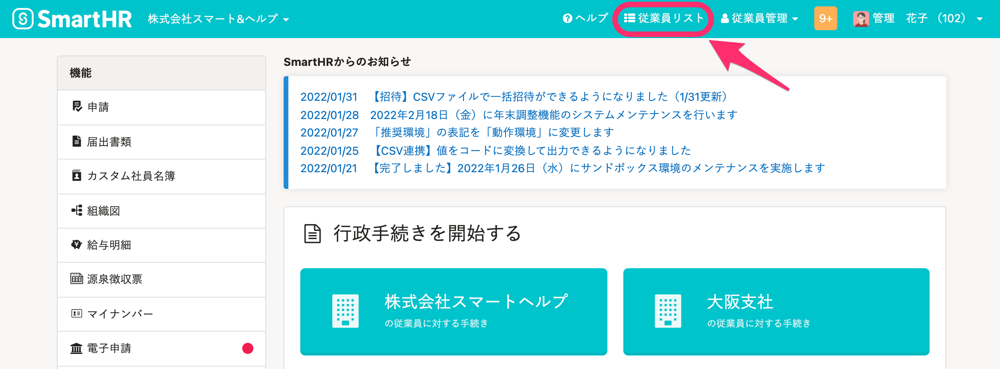
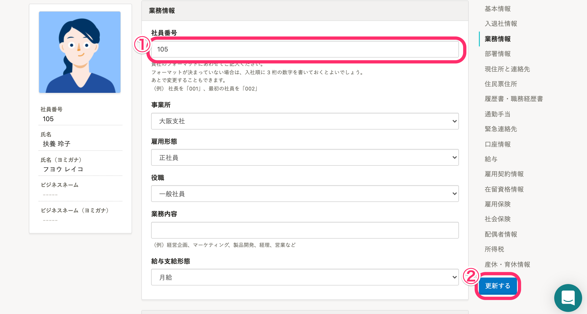
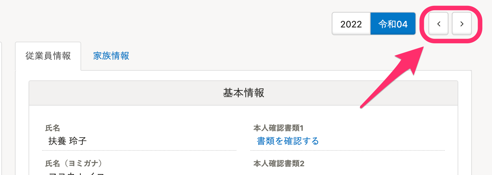

# A. いいえ、社員番号は一括更新の際のキー項目となるため、ファイルを使った一括変更ができません。

社員番号は従業員情報から個別に変更してください。

:::tips
社員番号アカウントの場合、ログイン時に使う社員番号も変更になるため、事前に周知する必要があります。
ログイン・通知用メールアドレスを設定している場合は、メールアドレスでログイン可能です。
[ログイン・通知用メールアドレスを設定（変更）する](https://knowledge.smarthr.jp/hc/ja/articles/360026263093)
:::

## 変更手順

### 1.［従業員リスト］をクリック

トップページ上部にある **［従業員リスト］** をクリックすると、 **［従業員リスト］** の一覧画面が表示されます。

### 2\. 変更したい従業員の氏名をクリック

一覧にある変更したい従業員の氏名をクリックすると、従業員情報画面が表示されます。

### 3\. 従業員情報右上にある［編集］をクリック

従業員情報画面の右上にある **［編集］** をクリックすると、編集画面が表示されます。

### 4\. 社員番号を変更し、［更新する］をクリック

 **［業務情報］>**  **［社員番号］** に、変更したい社員番号を入力し **［更新する］** をクリックすると、従業員情報に反映されます。

:::tips
 **［<］［>］** をクリックすると、社員番号が前後の従業員へ移動できます。

:::
