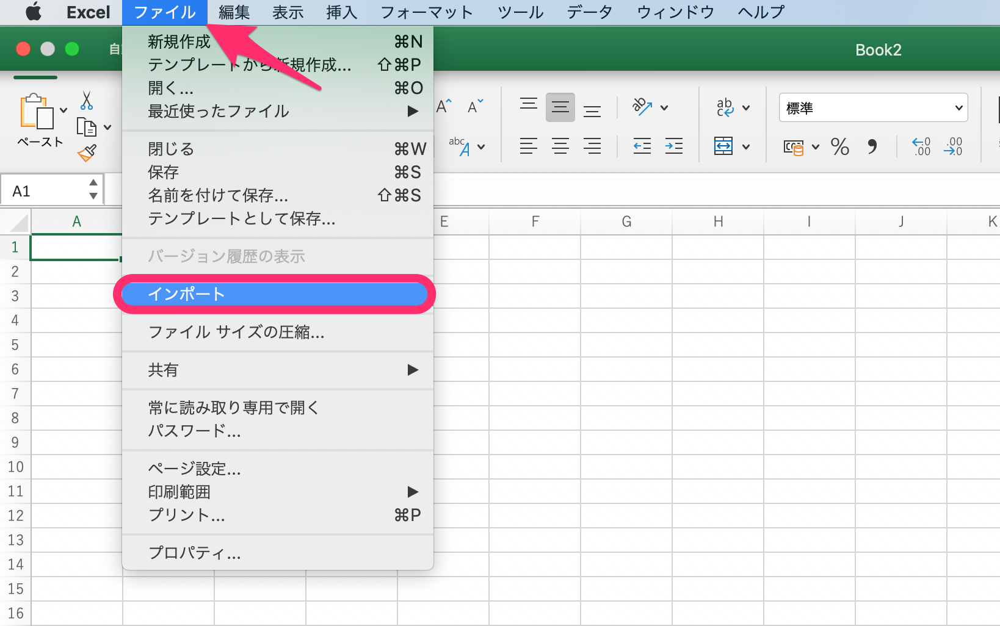
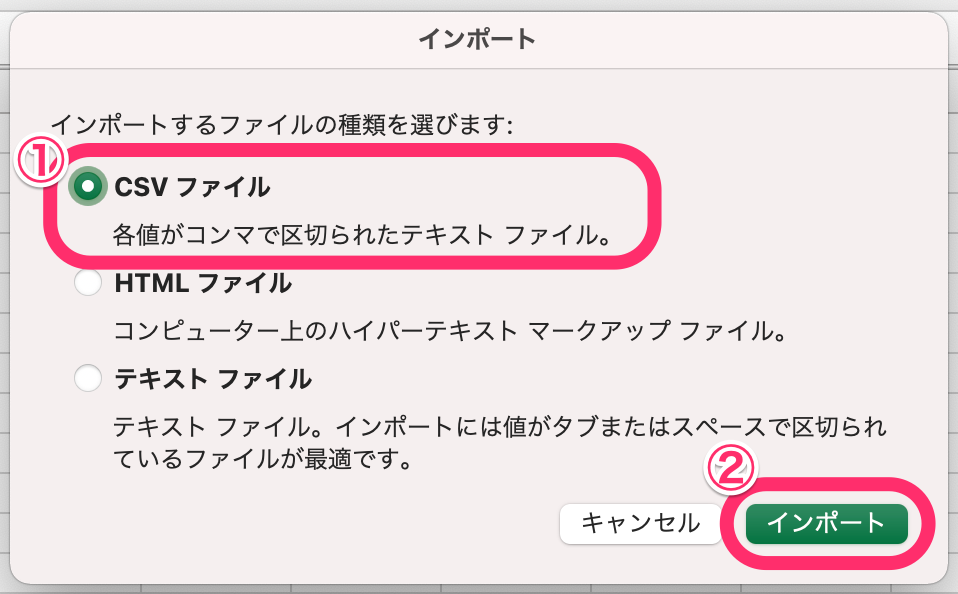
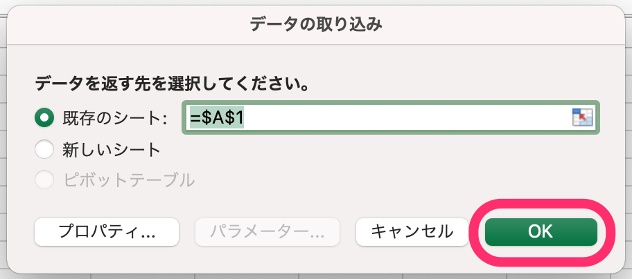

:::alert
このページに記載している内容は、サポート対象外です。
ご不明な点がある場合は、それぞれのサポート元へお問い合わせください。
[SmartHRサポートポリシー](https://knowledge.smarthr.jp/hc/ja/articles/360044805593#toc--4)
:::

# A. ファイルをダウンロード後、列のデータ形式を「文字列」に指定すると、番地を正しく表示できます。

Excelの仕様により、ダウンロードしたCSVファイルをExcelで開くと、住所の番地が日付に書き換えられて表示されることがあります。

:::tips
お使いのOS等、使用環境によって画面の見え方は異なります。
本ページで案内している画面はMacを使用した画面です。
他の使用環境での画面については、以下のヘルプページも参考にしてください。
[Q. CSVファイルをExcelで開くと、社員番号の先頭の「0」が消えてしまう場合はどうすれば良いですか？](https://knowledge.smarthr.jp/hc/ja/articles/360026107354)
:::

## 1\. Excelで新規シートを作成

Excelを開き、 **［空白のブック］** をクリックして新規シートを作成します。

## 2.［ファイル］ > ［インポート］をクリック

メニュー項目  **［ファイル］ > ［インポート］** の順にクリックします。

## 3.［CSVファイル］を選び［インポート］をクリック

インポートダイアログが表示されるので、 **［CSVファイル］** を選択し、 **［インポート］** をクリックします。

インポートするファイルを選択し、 **［データ取り出し］** をクリックします。

## 4.［区切り記号付き］を選択し、［次へ >］をクリック

テキスト ファイル ウィザードの内容を確認し、区切るデータの形式は **［区切り記号付き］** を選択し、 **［次へ >］** をクリックします。

## 5.［タブ］と［カンマ］を選択し、［次へ >］をクリック

区切り文字は **［タブ］** と **［カンマ］** を選択し、 **［次へ >］** をクリックします。

## 6\. 選択したデータのプレビュー欄で、住所の番地を含む列を選択

 **［選択したデータのプレビュー: ］** に表示される項目で、**住所の番地を含む列**をクリックして選択します。

:::tips
Excel for Macの場合、 **［選択したデータのプレビュー:］** に表示される列が限られているように見えることがあります。
その場合は、 **［システム環境設定］>［一般］**  にある  **［スクロールバーの表示］** 項目を **［常に表示］** に設定すると、 **［選択したデータのプレビュー:］** にスクロールバーが表示され、右にスクロールできるようになります。

列数が多い場合は、この方法を使って右にスクロールし、設定したい列を選択してください。
:::

## 7.［文字列］を選択し、［完了］をクリック

列のデータ形式は **［文字列］** を選択し、 **［完了］** をクリックします。

 **［文字列］** を選択すると、選択したデータのプレビューで、列のデータ形式が **［標準］** から **［文字列］** に変更されたことが確認できます。 

## 8\. データを配置する場所を指定し、［OK］をクリック

取り込んだデータを配置するシートと行・列を指定して、右下にある **［OK］** をクリックすると、データが正しく取り込まれます。

【Excelの画面】

