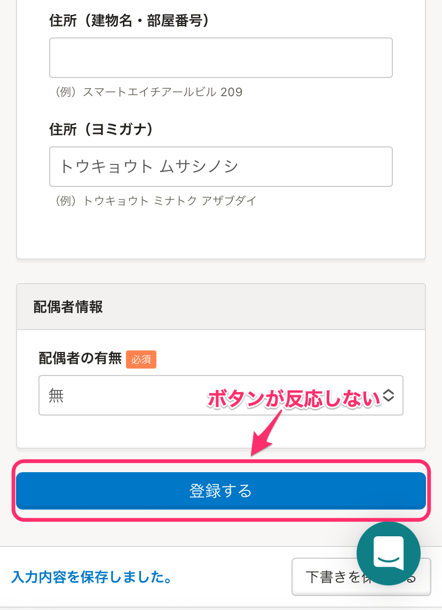

# A. SmartHRの動作環境を確認し、Google ChromeやSafariなどのブラウザで開き直してください。

スマートフォンのメールアプリ内のWebブラウザからSmartHRの招待フォームを入力し **［登録する］** をタッチすると、従業員情報の入力画面からページが切り替わらない場合があります。

これは、SmartHRの動作環境を使っていないことが原因と考えられます。

## 対処法

標準のメールアプリやGmailアプリ、Yahoo!メールアプリなどのアプリ内のWebブラウザは使わずに、動作環境であるGoogle ChromeやSafariなどのブラウザにURLをコピーして開いてください。

:::related
[SmartHRの動作環境は？](https://knowledge.smarthr.jp/hc/ja/articles/360035170054)
:::
