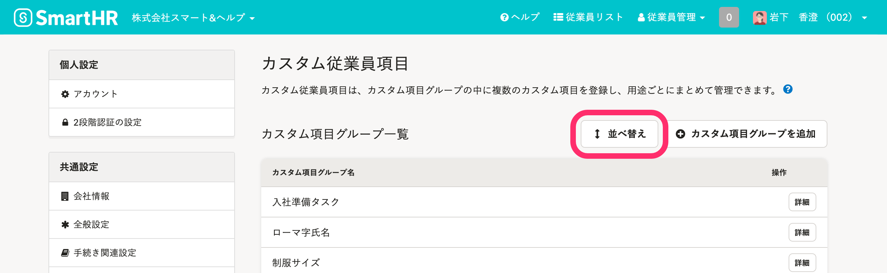
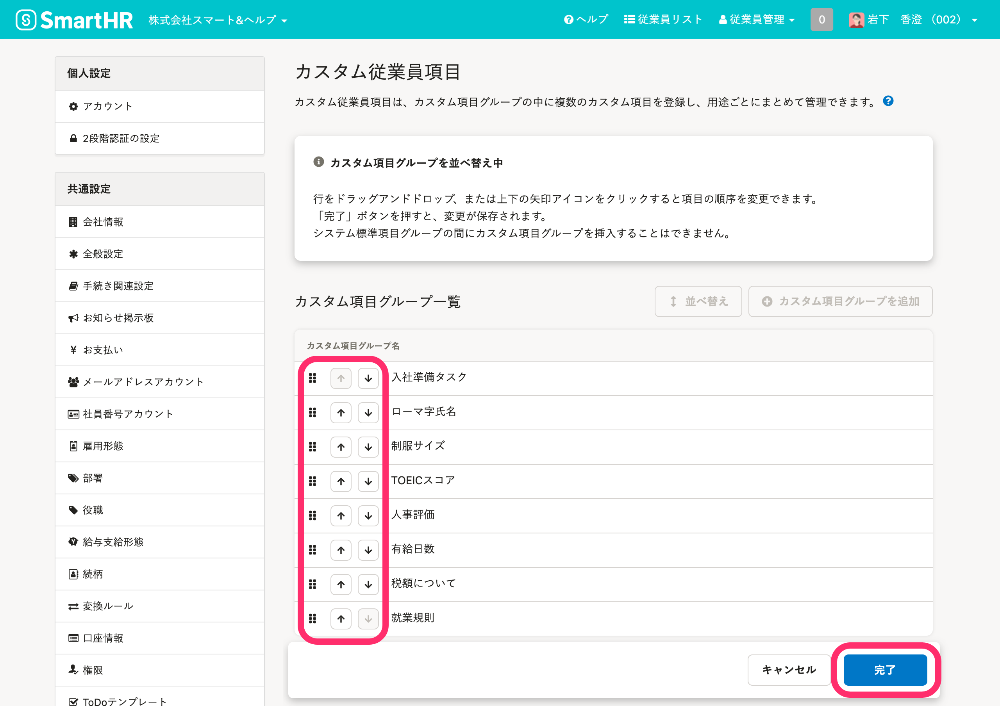
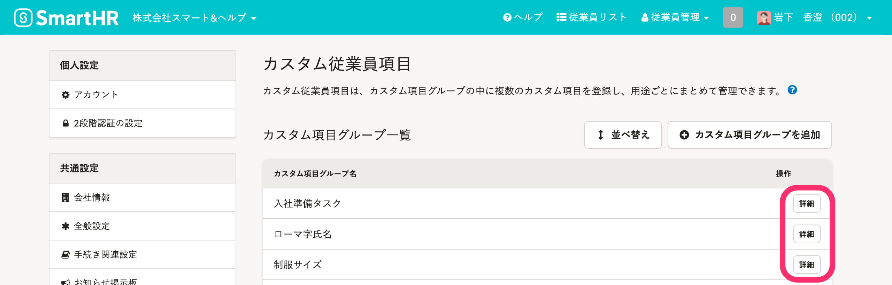
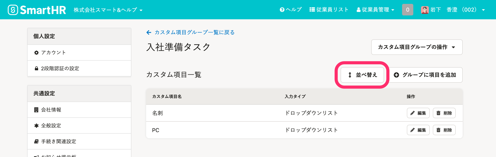
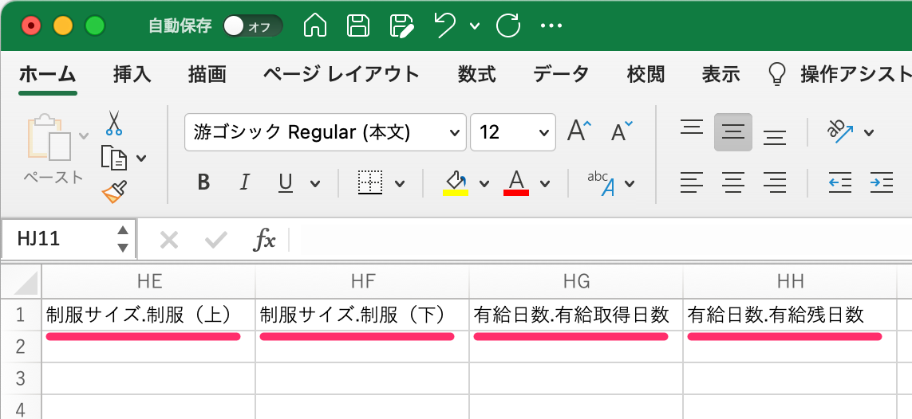

# カスタマイズで作った従業員項目を、「基本情報」などの中に入れることはできますか？

## いいえ、できません。

氏名やメールアドレス、住所など、SmartHRにあらかじめ用意されている従業員項目（＝システム標準項目）の編集・追加、非表示にする機能はありません。

また、従業員項目の並べ替えで、システム標準項目の間にカスタム項目を挿入する機能も、現在は用意してません。

従業員項目のカスタマイズで作成した項目（＝カスタム項目）は、システム標準の従業員情報の後に表示されます。

なお、カスタム項目同士の並べ替えは可能です。

# カスタマイズした項目の文字数などに制限はありますか？

## はい、登録できる文字数やファイルのサイズには制限があります。

詳しくは下記のページをご覧ください。

:::related
[【一覧】\[入力タイプ\] ごとのカスタム従業員項目の表示](https://knowledge.smarthr.jp/hc/ja/articles/360026264613)
:::

# 作成したカスタム項目をコピーして増やすことはできますか？

## いいえ、カスタム項目の複製はできません。

お手数ですが、1つずつご登録ください。

# 複数の企業アカウントがある場合、他の企業アカウントにカスタム項目をコピーできますか？

## いいえ、企業アカウントをまたぐ場合も、カスタム項目の複製はできません。

お手数ですが、各企業アカウントでカスタム項目の作成をお願いします。

# 作成したカスタム項目は並べ替えられますか？

## はい、 項目グループ単位での並べ替え、項目グループ内での項目単位での並べ替え、どちらも可能です。

項目グループ単位で並べ替える場合は、 **［共通設定］>［カスタム従業員項目］** の画面で **［並べ替え］** をクリックしてください。

行をドラッグアンドドロップ、または上下の矢印アイコンをクリックして、 **［完了］** をクリックすると順序が変更されます。

項目グループ内の項目単位の並べ替えは、 **［カスタム従業員項目］>［詳細］** の画面からできます。

 **［並べ替え］** をクリックし、項目の順序を変えて **［完了］** をクリックすると、順序が保存されます。

# 作成したカスタム項目が、従業員の画面に表示されないのはなぜ？

## カスタム項目の閲覧権限が設定されていない可能性があります。

[カスタム従業員項目を追加する](https://knowledge.smarthr.jp/hc/ja/articles/360026265513#toc--7)を参考に、 **［閲覧］**  **［更新］** の権限を従業員さまに付与してください。

# 従業員情報の一括登録・一括更新で、カスタム項目の情報も編集できますか？

## はい、一括登録、一括更新できます。

CSVファイルやExcelファイルの項目名を「 **項目グループ名.項目名** 」と設定してください。

 **［従業員リスト］** 画面から入手できるサンプルファイルには、カスタム項目も追加されているため、サンプルファイルのご利用を推奨します。

:::related
[複数の従業員情報を一括で登録する](https://knowledge.smarthr.jp/hc/ja/articles/360026107234)
[複数の従業員情報・家族情報を一括で更新する](https://knowledge.smarthr.jp/hc/ja/articles/360026265333)
:::
