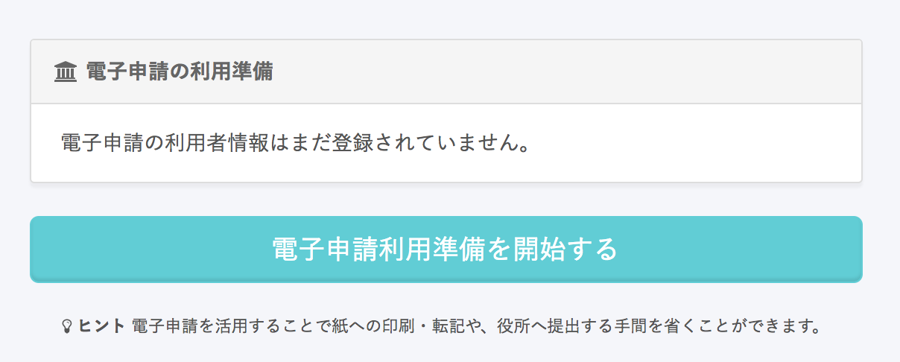
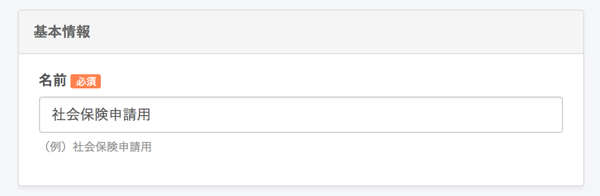
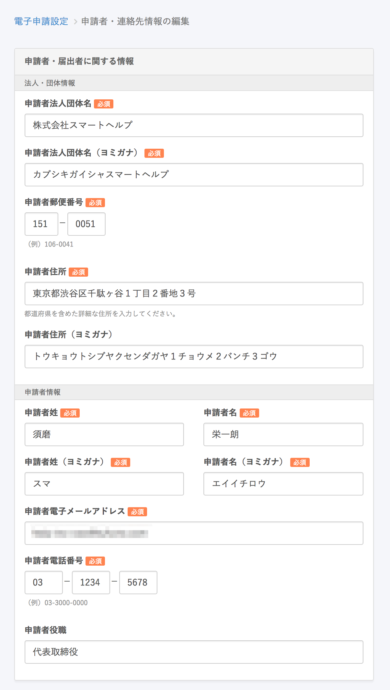
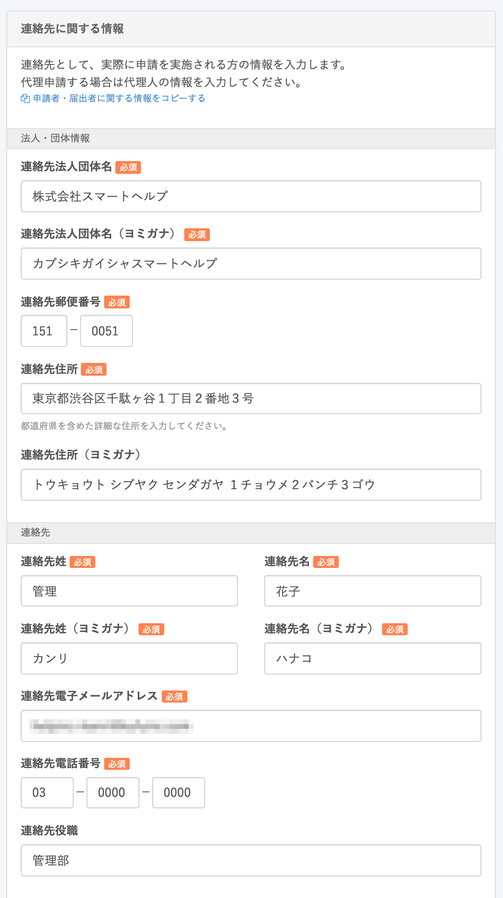
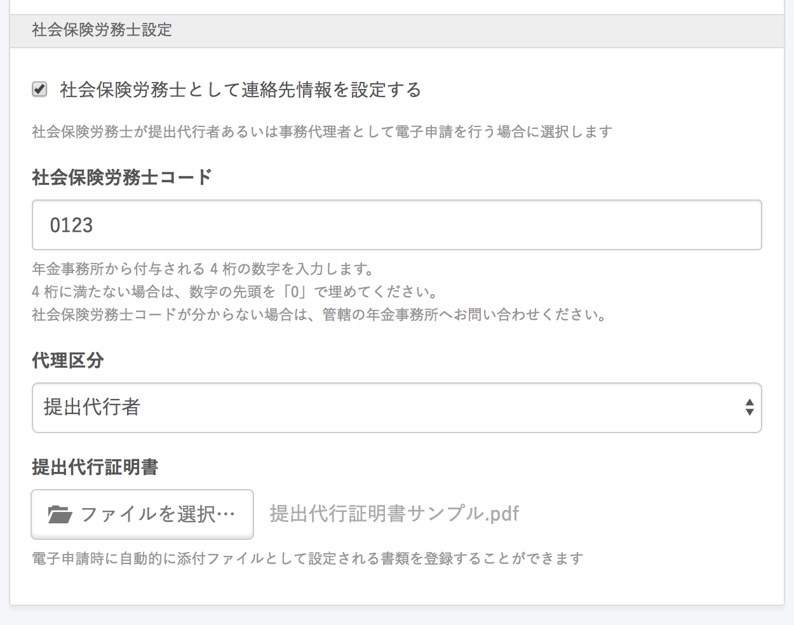

 **画面右上のアカウント名 >［共通設定］>［電子申請］>［電子申請利用準備を開始する］** をクリックし、電子申請に必要な情報を登録します。

※ 1件以上の申請者・連絡先情報が登録されている場合は、 **［電子申請利用準備を開始する］** ではなく、 **［電子申請申請者を追加する］** ボタンが表示されます。

# 基本情報

申請者情報の名称を入力してください。

事業所ごとに申請者が異なる場合や、社会保険/雇用保険で申請者が異なる場合などに**複数**の申請者情報を設定できます。

その際に区別できるような名称をご登録ください。

# 申請・届出者に関する情報

**代表者**の情報を入力してください。

※ 基本的にはこちらで登録した **［申請者電子メールアドレス］** 宛に連絡が入ることはありません。

# 連絡先に関する情報

## 法人・団体情報と連絡先

連絡先として、実際に申請を実施される方の情報を入力します。

社内の担当者や社会保険労務士など、代表者に変わり申請届出事務を行う場合は、その方の連絡先を入力してください。

※ 電子申請の進捗連絡や、役所からの電話連絡などはこちらに届きます

## 社会保険労務士設定

社会保険労務士が電子証明書を登録し、電子申請を代行する場合に設定します。

※ 社労士を介さずに自社の担当者が電子申請を行う場合は空欄のままで問題ございません。

社会保険労務士が電子申請を行う場合は、 **「提出代行に関する証明書」** を添付する必要があります。

PDFあるいはJPEGファイルで提出代行に関する証明書を登録しておくと、申請の度にファイルを添付する手間を省略できます。

:::tips
**代理区分について**
■ 提出代行
社会保険労務士が申請書等を行政機関等に受理されるまでに行う行為。
書類提出の際、行政機関等に事実上の説明補正等を行い、不備のない書類を提出する行為。
■ 事務代理
社会保険労務士が本人に代わり申請等を行い、当該申請等に係る行政機関等の質問に対する回答等をするだけでなく、当該申請等に係る行政機関等の調査又は処分に関する主張又は陳述まで行うことができる行為。
※ 詳しくは顧問社労士にご確認ください。
:::
