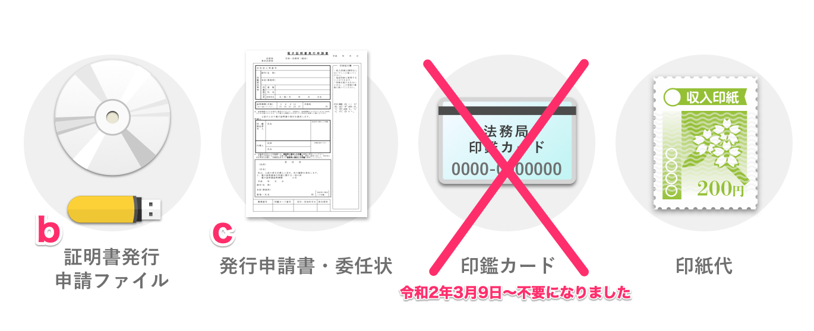

[法務局 (電子認証登記所)](http://www.moj.go.jp/ONLINE/CERTIFICATION/GLANCE/glance.html) で **ファイル形式の電子証明書** を自社で取得する方法を説明します。

なお、取得したファイル形式の電子証明書は、あらかじめSmartHRに登録する必要があります。

:::related
[電子申請の利用をはじめる準備をする](https://knowledge.smarthr.jp/hc/ja/articles/360026265713)
:::
:::alert
SmartHR では、ファイル形式（.pfx または .p12）の電子証明書のみご登録・ご利用いただけます。
ICカード形式には対応しておりません。
:::
:::tips
SmartHR Mag.にて、電子証明書取得の流れを説明したWebワークショップの動画もご覧いただけます。
[【徹底解説】最短1日！ ビックリするほど簡単な「電子証明書」の取得方法｜SmartHR Mag.](https://mag.smarthr.jp/procedure/detail/denshishoumeisho_shutoku_howto/)
また、法務省が発行している [電子証明書取得のご案内｜法務省](http://www.moj.go.jp/MINJI/minji06_00028.html) もあわせてご参考ください。
:::

# 法務局で取得する場合の3つのステップ

法務局で取得する場合は、大きく分けて3ステップです。

取得可能な環境が整っており、提出内容に不備がなければ、 **最短1日**で電子証明書を取得できます。

# Step1 発行申請ファイルの作成

電子証明書を取得するには**発行申請ファイル**を作成する必要があります。

発行申請ファイルは、会社や代表者の情報や電子証明書取得時に必要となるパスワードなどを登録するファイルです。

※ 登記されている内容で作成する必要があります。**登記事項証明書**をお手元に用意されることをオススメします。

発行申請ファイルは法務省より提供されている専用のソフトウェア (商業登記電子認証ソフト) で作成します。

:::alert
2021年9月現在、商業登記電子認証ソフトは Windows 対応版のみの提供となっております。
Windows PC のご用意が難しい場合は、民間の認証局 にて電子証明書の取得をお願いいたします。
:::

## 1\. ソフトをダウンロードする

商業登記電子認証ソフトを [「商業登記電子認証ソフト」のダウンロード｜法務省](http://www.moj.go.jp/MINJI/minji06_00027.html) のページよりダウンロードします。

ソフトの動作環境の詳細もダウンロードページに記載されています。

:::tips
「商業登記電子認証ソフト」の動作環境、ダウンロード方法、操作方法等に関するお問い合わせは、  **「登記・供託オンライン申請システム操作サポートデスク」** までお願いします。
お問い合わせ先電話番号などは、下記のページをご覧ください。
[システムの操作に関するお問い合わせ｜登記・供託オンライン申請システム](https://www.touki-kyoutaku-online.moj.go.jp/contact/concact_support.html)
:::

## 2\. 申請ファイルを作成する

### 2-1. ソフトを起動

**商業登記電子認証ソフト**を起動します。

### 2-2.［鍵ペアファイル及び証明書発行申請ファイルの作成］をクリック

 **［鍵ペアファイル及び証明書発行申請ファイルの作成］** をクリックします。

### 2-3. 情報を入力する

各項目に情報を入力します。

入力が終わったら、 **［鍵ペアファイル及び証明書発行申請ファイル作成実行］** をクリックします。

※ 入力フィールドをクリックすると、各項目のヒントが表示されます。

以下に注意点をまとめましたのでご参考ください。

| 項目名 | 注意点 |
| :-- | :-- |
| 商号又は名称 | 登記されているとおりに入力してください（全角128文字以内） |
| 本店又は主たる事務所 | 登記されている住所を登記のとおりに入力してください（全角128文字以内） |
| 印鑑提出者の氏名 | 印鑑届出をされている方の氏名を登記されているとおりに入力してください（全角126文字以内） |
| 印鑑提出者の資格 | 登記されているとおりに入力または次の中から選択してください（代表取締役・支配人・社員・代表執行役・代表社員・代表理事・取締役・日本における代表者・理事・理事長） |
| 電子証明書の有効期間（証明期間） | 3ヶ月〜27ヶ月まで（3ヶ月ごと）の期間で選択できます。期間によって手数料が異なります。 |
| 電子証明書の鍵長 | 2,048 ビットのみの為、選択の必要はありません |
| 鍵ペアファイルパスワード | 後ほど電子証明書を取得する際に必要なパスワードを、あらかじめここで設定しておきます。忘れないようにご注意ください。（半角英数字8文字~30文字/英数字混在必須） |
| 電子証明書の使用休止届出用暗証コード | 電子証明書の使用を休止する際に必要なコードを、あらかじめここで設定しておきます。忘れないようにご注意ください。（半角英数字8文字~30文字/英数字混在必須） |
| 証明書発行申請ファイルの格納先 | これから生成される証明書発行申請ファイルの保存先を指定します。迷った時は、デスクトップに「電子証明書」というフォルダを作成し、そのフォルダを指定しましょう |
| 鍵ペアファイル、発行申請書・委任状ファイルの格納先 | これから生成される２つのファイルの保存先を指定します。迷った時は、証明書発行申請ファイルと同じフォルダを指定しましょう。（デスクトップに「電子証明書」というフォルダを作成し、そのフォルダを指定） |

### 2-4. ファイルと保管場所を確認する

**鍵ペアファイル、証明書発行申請ファイル作成結果**が表示されます。

以下のファイルと保管場所を確認します。

**a** 鍵ペアファイル：審査終了後、電子証明書を取得する際に必要なファイルです。
**b** 証明書発行申請ファイル：法務局へ提出するファイルです。
**c** 発行申請書・委任状ファイル：法務局へ提出する書類（PDF）です。

## 3\. 法務局へ行く準備をする

「2-4. ファイルと保管場所を確認する」の手順で **b** の場所に保存された **「証明書発行申請ファイル」** をUSBメモリやCD等に保存します。

ファイル名は自動的に **「SHINSEI」** となります。

「2-4. ファイルと保管場所を確認する」の手順で **c** の場所に保存された **「発行申請書・委任状」** を印刷し、必要な箇所に記入・捺印をします。

:::alert
 **「証明書発行申請ファイル」** に有効期限はありませんが、「商業登記電子認証ソフト」のバージョンがかわると処理できない場合がありますのでご留意ください。
:::

# Step2 法務局での発行申請

## 4\. 管轄の法務局で申請手続きをする

管轄の法務局に行って、電子証明書の取得を申請します。

管轄の法務局は下記のページをご覧ください。

[管轄のご案内：法務局](http://houmukyoku.moj.go.jp/homu/static/kankatsu_index.html)

申請に必要なものは、 **「証明書発行申請ファイル」、「発行申請書・委任状」** 、**印紙代**の3つです。

ほとんどの法務局に印紙売り場があり、現地で印紙を購入できます。

印紙代は、「2-3. 情報を入力する」で設定した証明期間（3ヶ月〜27ヶ月）で異なります。

2021年9月時点の印紙代の例は、以下のとおりです。

- 証明期間 3ヶ月 の場合：1,300 円
- 証明期間 12ヶ月 の場合：4,300 円
- 証明期間 24ヶ月 の場合：8,300 円

:::tips
印紙代は高い頻度で変更されているため、最新情報は下記のページでご確認ください。
証明期間が9ヶ月や18ヶ月の場合の印紙代も、下記のページに記載されています。
[電子証明書取得のご案内｜法務省](http://www.moj.go.jp/MINJI/minji06_00028.html)
:::

### 4-1. 持参した書類を窓口に提出する

 **「証明書発行申請ファイル」、「発行申請書・委任状」、印紙代** を窓口に提出します。

### 4-2. 「電子証明書発行確認票」を受け取る

審査完了後、電子証明書のシリアル番号が書かれた **「電子証明書発行確認票」** が交付されます。

シリアル番号は、Step3で電子証明書ファイルをダウンロードする際に必要です。

:::tips
窓口が混んでいなければ、所要時間は30分〜1時間程度です。
:::

# Step3 電子証明書ファイルの取得

## 5\. ソフトから電子証明書取得を実行する

Step1で利用したソフト（商業登記電子認証ソフト）を利用して、電子証明書ファイルをダウンロードします。

Step2で交付された **「電子証明書発行確認票」** をお手元にご用意ください。

### 5-1. 商業登記電子認証ソフトを起動する

**商業登記電子認証ソフト**を起動し、 **［電子証明書取得］** をクリックします。

### 5-2. 情報を入力する

各項目に情報を入力します。

入力が終わったら、 **［電子証明書取得実行］** をクリックします。

※ 入力フィールドをクリックすると、各項目のヒントが表示されます。

以下に注意点をまとめましたのでご参考ください。

|   項目名   |   注意点   |
| :-- | :-- |
| シリアル番号 | Step2で法務局から交付された「電子証明書発行確認票」に記載されているシリアル番号を入力します（半角数字16桁） |
| 鍵ペアファイル パスワード | Step1で設定した鍵ペアファイルパスワードになります |
| 電子証明書格納先 | これから取得する電子証明書ファイルの保存先を指定します。迷った時は、証明書発行申請ファイルなどと同じフォルダを指定しましょう。（デスクトップに「電子証明書」というフォルダを作成し、そのフォルダを指定）保管に十分ご注意ください。 |
| 電子証明書パスワード | 電子証明書の登録や電子申請を実行する際に都度必要となるパスワードです。忘れないようにまた、保管に十分ご注意ください。（半角英数字8文字~30文字/英数字混在必須） |

### 5-3. ハッシュ値の一致を確認する

 **［電子認証登記所との通信について］** というページが表示されます。

「電子認証登記所登記官の電子証明書について」のページの [URL](http://www.moj.go.jp/ONLINE/CERTIFICATION/REGISTRY/registry12-1.html) をクリックして、 **［電子認証登記所との通信について］** に添付されているハッシュ値と **［電子認証登記所登記官の電子証明書及びハッシュ値］** に記載されているハッシュ値が一致しているかを確認をしてください。

ハッシュ値の一致を確認できたら、 **［続行］**  をクリックします。

### 5-4. ダウンロードを確認する

 **［電子証明書取得結果］** に記載されている場所に、ファイル形式の電子証明書 （.p12）がダウンロードされていることを確認してください。

以上で電子証明書の取得完了です。

:::tips
法務局で取得する他に、**民間の認証局**で取得する方法もあります。
電子政府のウェブサイトで公開されている認証局はこちらでご確認いただけます。
[認証局のご案内 | e-Gov電子申請](https://shinsei.e-gov.go.jp/contents/preparation/certificate/certification-authority.html)
上記ページの中で、 SmartHRでご利用できるファイル形式（.pfx または .p12）の電子証明書を取得できるのは、以下2つのサービスです。
- [DIACERTサービス（特定認定認証サービス）｜三菱インフォメーションネットワーク株式会社](http://www.diacert.jp/index.html) （macOS非対応）
- [セコムパスポートfor G-ID｜セコムトラストシステムズ株式会社](http://www.secomtrust.net/service/ninsyo/forgid.html) （macOS非対応）
対応可能な手続きや対応OS、諸費用などの詳細は、認証局により異なりますので、詳しくは各認証局にお問い合わせください。
:::
:::tips
電子証明書の取得サポートを行っている企業へ依頼する方法もあります。
[Graffer 電子証明書取得サポート｜Graffer®](https://ttzk.graffer.jp/e-cert)
詳細はサービス提供者へお問い合わせください。
:::
