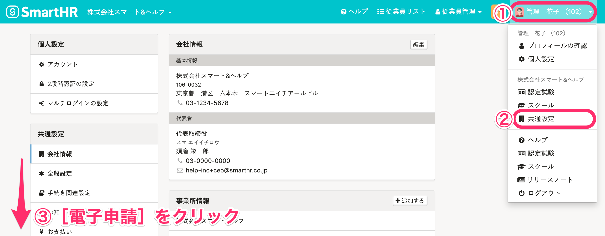
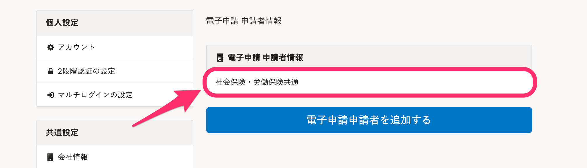
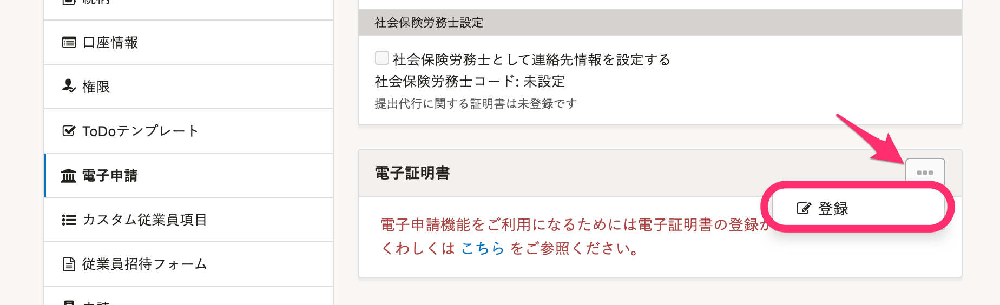
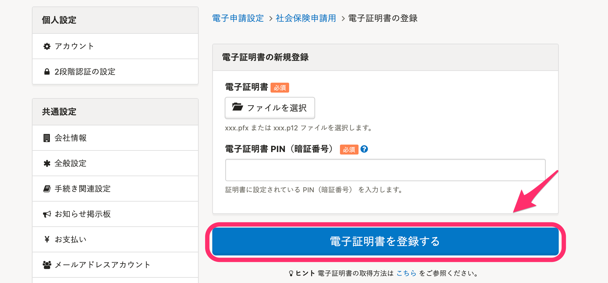

電子申請を行うには、電子証明書の登録が必要です。

電子証明書には、ファイル形式とICカード形式があります。

SmartHRでは**ファイル形式の電子証明書**（.pfx または .p12）にのみ対応しています。

電子証明書の取得方法と変更方法は、それぞれ下記のページをご覧ください。

[電子証明書を取得する](https://knowledge.smarthr.jp/hc/ja/articles/360026105674)

[電子証明書を変更する](https://knowledge.smarthr.jp/hc/ja/articles/360026105634)

# 電子証明書の登録方法

## 1\. 画面右上のアカウント名 > ［共通設定］>［電子申請］をクリック

 **画面右上のアカウント名 >［共通設定］** をクリックし、画面左に表示される **［共通設定］** \> **［電子申請］** をクリックすると、 **［電子申請 申請者情報］** 画面が表示されます。

## 2\. 申請者情報名をクリック

電子証明書を登録したい申請者情報名をクリックすると、 **［社会保険申請用］** 画面が表示されます。

または、下記のページの手順で電子申請申請者を新しく追加できます。

[電子申請申請者と連絡先を設定する](https://knowledge.smarthr.jp/hc/ja/articles/360026104914)

## 3\. ［…］メニュー >［登録］をクリック

画面下部の **［電子証明書］** 欄の右にある **［...］メニュー >［登録］** をクリックすると、電子証明書の登録画面が表示されます。

## 4\. ［電子証明書］と［電子証明書PIN（暗証番号）］を登録し［電子証明書を登録する］をクリック

 **［電子証明書］** と **［電子証明書PIN（暗証番号）］** を登録し、 **［電子証明書を登録する］** をクリックすると、登録が完了します。

:::tips
電子証明書 は、拡張子が **.pfx** または **.p12** のファイルのみご登録いただけます。
一度電子証明書ファイルを登録していれば、操作PCに証明書ファイルがなくても電子申請が行なえます。
PIN（暗証番号） については下記のページをご覧ください。
[電子証明書のPIN（暗証番号）とは](https://knowledge.smarthr.jp/hc/ja/articles/360026106954)
:::
