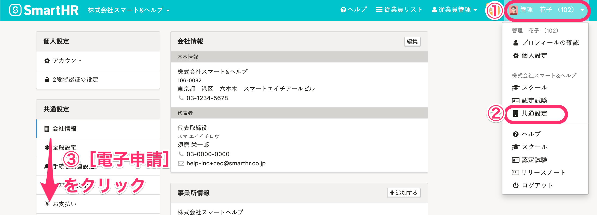
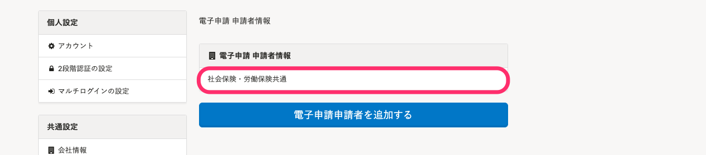
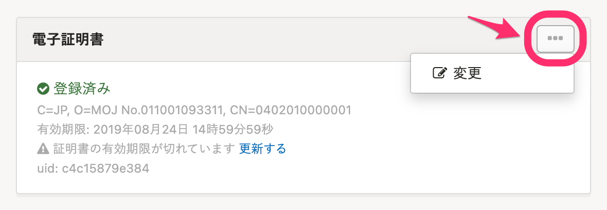
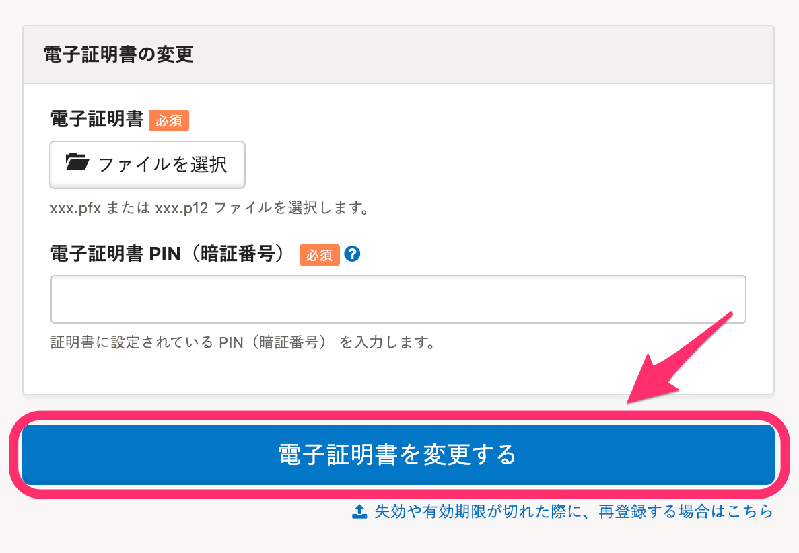
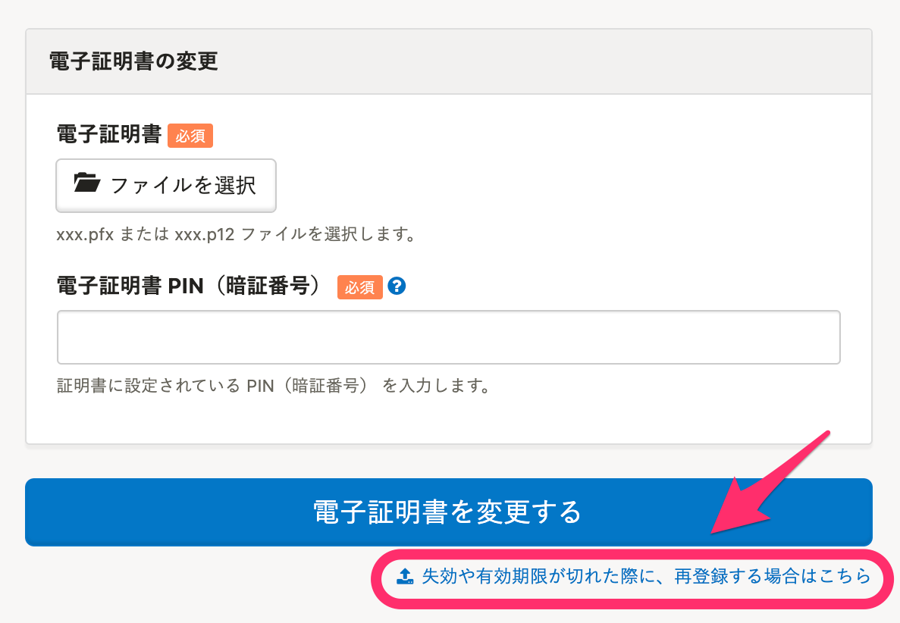
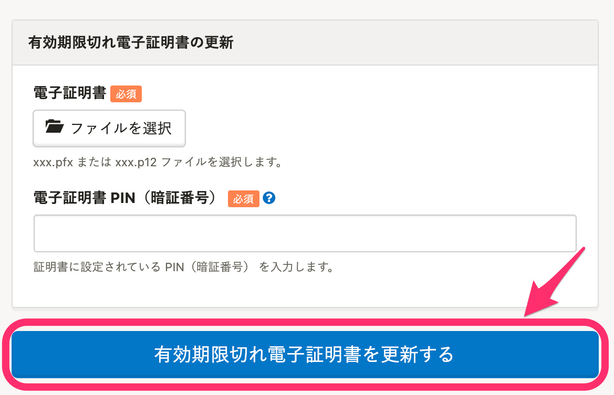
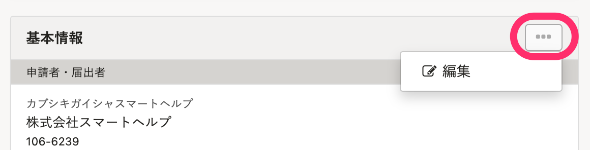
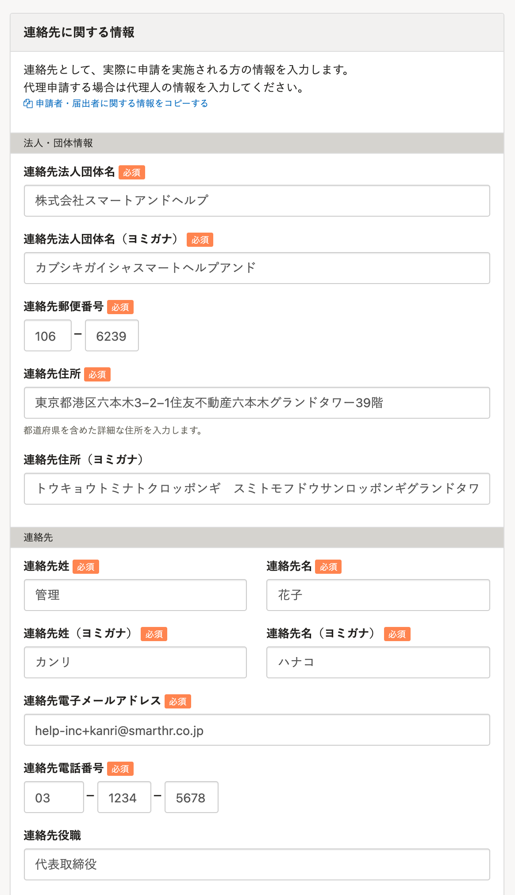
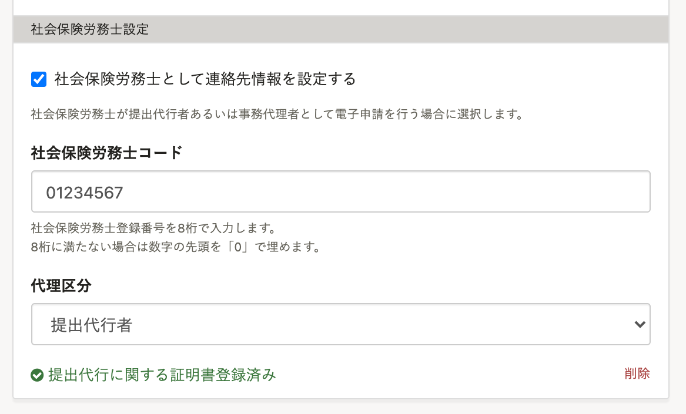

電子証明書を変更する方法は、状況に合わせて以下の2つに分かれます。

**1\. 異なる企業/持ち主 の電子証明書に変更する場合**

例：自社の電子証明書から社労士の電子証明書を利用することになった

**2\. 同じ企業/持ち主 の新しい電子証明書を再登録する場合**

例：

- 電子証明書の有効期限が切れてしまった
- 社名・所在地・代表者情報などの登記情報に変更が発生し、電子証明書が無効になってしまった

各変更手順は以下をご覧ください。

# 1\. 異なる企業／持ち主 の電子証明書に変更する場合

## 1-1. 画面右上のアカウント名 > ［共通設定］>［電子申請］をクリック

 **画面右上のアカウント名 >［共通設定］** をクリックします。

画面左に **［共通設定］** メニューが表示されたら、 **［電子申請］** をクリックします。

## 1-2.［電子申請 申請者情報］から任意の申請者情報をクリック

 **［電子申請 申請者情報］** から、任意の申請者情報をクリックします。

## 1-3. ［電子証明書］欄の右にある［…］メニュー >［変更］をクリック

画面下部の **［電子証明書］** 欄の右にある **［...］** メニュー > **［変更］** をクリックします。

## 1-4. 新しい電子証明書と［電子証明書PIN（暗証番号）］を登録する

新しい電子証明書と **［電子証明書PIN（暗証番号）］** を登録し、 **［電子証明書を変更する］** をクリックします。

# 2\. 同じ企業／持ち主 の新しい電子証明書を再登録する場合

## 2-1. 画面右上のアカウント名 >［共通設定］>［電子申請］をクリック

 **画面右上のアカウント名 >［共通設定］** をクリックします。

画面左に **［共通設定］** メニューが表示されたら、 **［電子申請］** をクリックします。

## 2-2.［電子申請 申請者情報］から任意の申請者情報をクリック

 **［電子申請 申請者情報］** から、任意の申請者情報をクリックします。

任意の申請者情報を選んだ後、 **［電子証明書］** をクリックしてください。

## 2-3. ［電子証明書］欄の右にある［…］メニュー >［変更］をクリック

画面下部の **［電子証明書］** 欄の右にある **［...］** メニュー > **［変更］** をクリックします。

## 2-4. ［失効や有効期限が切れた際に、再登録する場合はこちら］をクリック

画面右下にある、 **［失効や有効期限が切れた際に、再登録する場合はこちら］** をクリックします。

## 2-5. 新しい電子証明書と［電子証明書PIN（暗証番号）］を登録する

新しい電子証明書と **［電子証明書PIN（暗証番号）］** を登録し、 **［電子証明書を変更する］** をクリックします。

:::alert
電子証明書の変更や再登録をした際に、「利用者認証でエラーが発生しました」というエラーが表示された場合は、e-Gov側での認証登録が完了していない可能性があります。
詳しくは、以下のヘルプページをご確認ください。
[電子申請でエラーや警告が表示される場合は？](https://knowledge.smarthr.jp/hc/ja/articles/360026105554)
:::

# 連絡先を変更する（必要な場合のみ）

社労士情報の変更や労務手続きのアウトソース・内製化に伴い、連絡先の変更がある場合は［連絡先に関する情報］の登録内容を更新してください。

## 1\. 画面右上のアカウント名 >［共通設定］>［電子申請］をクリック

 **画面右上のアカウント名 >［共通設定］** をクリックすると、画面左側に **［共通設定］** メニューが表示されます。

 **［電子申請］** をクリックすると、 **［電子申請 申請者情報］** が表示されるので、任意の申請者情報をクリックします。

## 2\. ［基本情報］欄の右にある［...］メニュー >［編集］をクリック

 **［基本情報］** 欄の右にある **［…］** メニュー > **［編集］** をクリックします。

## 3\. ［連絡先に関する情報］に新しい情報を登録し、［更新する］をクリック

 **［連絡先に関する情報］** に新しい情報を登録し、 **［更新する］** をクリックします。

:::tips
社会保険労務士が提出代行者あるいは事務代理者として電子申請を行なう場合は、 **［社会保険労務士］** の情報も登録してください。
その際、社労士は 「提出代行に関する証明書」を作成し、PDF 化したものを、同項目にアップロードする必要があります。
「提出代行に関する証明書」 を［社会保険労務士設定］に登録していれば、申請ごとに添付する必要はありません。

社労士を介さずに自社の担当者が電子申請を行なう場合は空欄のままで問題ありません。
:::
