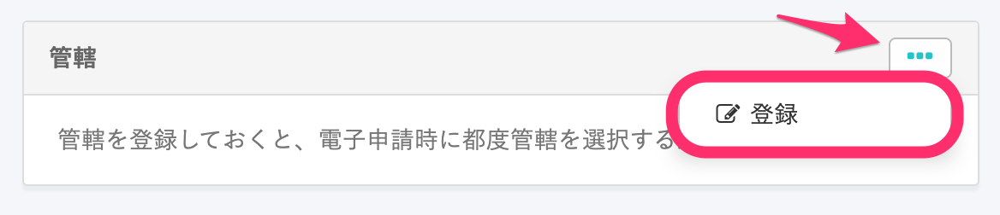

[登録した申請者・連絡先情報](https://knowledge.smarthr.jp/hc/ja/articles/360026104914) を事業所情報と紐付けることで、電子申請をご利用いただけるようになります。

また、提出先の管轄を設定しておくと、電子申請時に都度管轄を選択する必要がなく、便利です。

# 申請者・連絡先情報の設定

## 1\. 画面右上のアカウント名 > ［共通設定］をクリック

 **画面右上のアカウント名 >［共通設定］** をクリックしてください。

## 2\. ［共通設定］にある［会社情報］で［事業所情報］>［事業所名］をクリック

画面左に **［共通設定］** が表示されるので、メニューにある **［会社情報］** をクリックします。

画面左の **［事業所情報］** のリストで、事業所名をクリックしてください。

## 3\. ［...］メニュー >［編集］をクリック

 **［基本情報］** 右の **［…］メニュー >［編集］** をクリックします。

## 4\. 電子申請申請者を指定し、［更新する］をクリック

### 4-1. ［社会保険］の［電子申請申請者］をプルダウンから選択する

 **［社会保険］** 項目下部にある **［電子申請申請者］** で、登録済みの **［電子申請 申請者情報］** から指定したいものを選択します。

### 4-2.［労働保険］の［電子申請申請者］をプルダウンから選択する

 **［労働保険］** 項目下部にある **［電子申請申請者］** で、登録済みの **［電子申請 申請者情報］** から指定したいものを選択します。

社会保険、労働保険、それぞれの電子申請者の設定が済んだら、 **［更新する］** をクリックして、設定を保存します。

# 提出先管轄の設定

## 1\. 画面右上のアカウント名 >［共通設定］をクリック

 **画面右上のアカウント名 >［共通設定］** をクリックしてください。

## 2\. ［共通設定］にある［会社情報］で［事業所情報］>［事業所名］をクリック

画面左に **［共通設定］** が表示されるので、メニューにある **［会社情報］** をクリックします。

画面左の **［事業所情報］** のリストで、事業所名をクリックしてください。

## 3.［...］メニュー >［登録］をクリック

 **［管轄］** 右の **［…］メニュー >［登録］** をクリックします。

:::tips
 **［管轄］** 項目は電子申請手続き用に使われるため、電子申請情報を登録していないアカウントには表示されません。
 **［管轄］** 項目が見当たらない場合は、一度 **［共通設定］>［電子申請］** にて電子申請情報をご登録ください。
:::

## 4\. 管轄を選択し、［登録］をクリック

各項目にて、事業所の管轄を選択し、 **［登録］** をクリックしてください。

 **［公共職業安定所］** 、 **［事務センター］** 、［ **年金事務所］** 、 **［労働局］** を登録することをおすすめします。

:::tips
ここで登録した管轄は、手続きで **［電子申請依頼］** をする際の **［提出先］** に反映されます。

それぞれの管轄は、以下を電子申請する際の **［提出先］** に反映されます。
- 公共職業安定所：主に雇用保険に関する労働保険関係の手続き
- 事務センター：主に定時決定（算定基礎）や健康保険、年金などの社会保険関係の手続き
- 年金事務所：社会保険関係の手続き
- 労働局：年度更新などの労働保険適用徴収関係の手続き
以下の項目が未登録でも、電子申請に支障ありません。
- 労働基準監督署又は公共職業安定所
- 労働基準監督署
- 労働局又は労働基準監督署
:::
