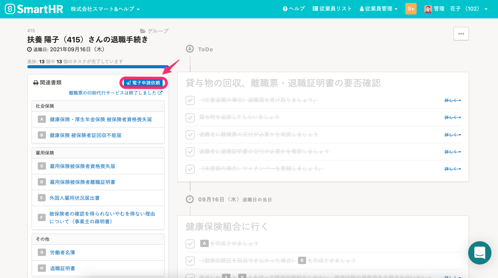

電子申請をご利用いただく際に踏む手順をご説明します。

電子申請依頼は、管理者もしくは電子申請を依頼する権限を付与したカスタム権限のアカウントのみ行なえます。

# （初回のみ）利用開始準備

電子申請のご利用には事前準備が必要です。
詳しくは下記のページをご覧ください。

[電子申請の利用をはじめる準備をする](https://knowledge.smarthr.jp/hc/ja/articles/360026265713)

# 申請の流れ

電子申請は手続き作成後、 **① 申請依頼** → **[② 申請の実行](https://knowledge.smarthr.jp/hc/ja/articles/360026264453)** という流れで行ないます。

SmartHRでの電子申請に対応している書類は下記のページをご覧ください。

[【一覧】SmartHRでの電子申請に対応している書類](https://knowledge.smarthr.jp/hc/ja/articles/360026106514)

# 手順

## 1\. 電子申請をする手続きを開く

電子申請したい手続きのページ（ToDo リストのあるページ）を開きます。

## 2\. ［関連書類］欄にある［電子申請依頼］をクリック

左メニューの **［関連書類］** 欄にある **［電子申請依頼］** をクリックします。

:::alert
会社情報に電子申請申請者が設定されていない場合、エラーメッセージが表示されます。

下記のヘルプページを参考に、電子申請申請者を設定してください。
[電子申請者情報と提出先管轄を設定する](https://knowledge.smarthr.jp/hc/ja/articles/360026104814)
:::

## 3\. 電子申請する書類を選ぶ

電子申請に対応している書類が一覧で表示されるので、電子申請する書類を選びます。

## 4\. ［電子申請依頼を行う］をクリック

新規電子申請依頼のページが表示されるので、内容を確認して **［電子申請依頼を行う］** をクリックします。

:::tips
この時、画面右上の **［アカウント名］>［共通設定］>［電子申請］** の **［連絡先］** にて登録したメールアドレス宛に申請依頼が作成された旨が通知されます。
:::

## 5\. 引き続き［申請の実行］をする場合

引き続き **［申請の実行］** をする場合は、下記のページをご覧ください。

[電子申請手順 ② 申請を実行する](https://knowledge.smarthr.jp/hc/ja/articles/360026264453)

# 内容に不備がある場合

編集が必要な箇所が表示されます。

下記のページでご案内している手順をご参考に、書類内容を編集後、再度電子申請依頼をしてください。

[手続きで作成した書類を編集する](https://knowledge.smarthr.jp/hc/ja/articles/360026105774)

# 添付書類がある場合

 **［添付ファイルを追加する］** より、**PDF**または**JPEG**形式でファイルを添付してください。

:::tips
**電子申請の手順**
電子申請手順 – ① 申請依頼　現在ご覧のページです。
[電子申請手順 – ② 申請の実行](https://knowledge.smarthr.jp/hc/ja/articles/360026264453)
:::
