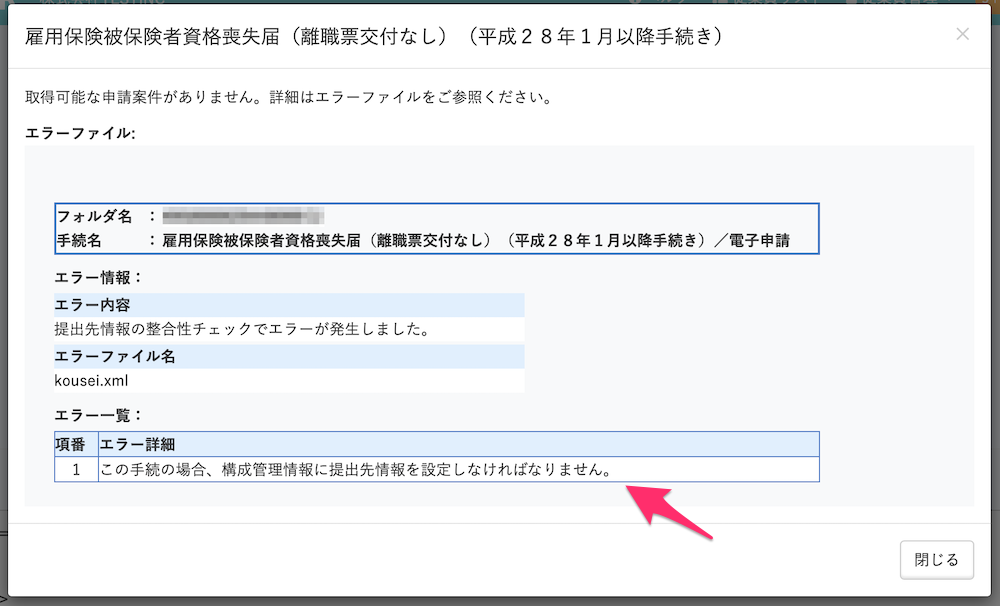

電子申請は依頼をした後で実行をしないと、役所へは送信されません。

電子申請の実行は、管理者もしくは電子申請を実行する権限を付与したカスタム権限のアカウントのみ行なえます。

# 申請の実行

## 1\. \[機能\] > \[電子申請\] をクリック

トップページ左上の **\[機能\]** 欄にある **\[電子申請\]** をクリックし、一覧から対象の電子申請詳細ページを開きます。

または、[電子申請手順 ① 申請を依頼する](https://knowledge.smarthr.jp/hc/ja/articles/360026266073) から引き続きご対応頂くことが可能です。

## 2\. PINを入力し \[電子申請の実行\] をクリック

申請内容や添付資料等に問題がなければ、 **電子証明書の PIN（暗証番号）** を入力し、**\[電子申請の実行\]** をクリックしてください。

:::tips
電子証明書のPINについては下記のページをご覧ください。
[電子証明書のPIN（暗証番号）とは](https://knowledge.smarthr.jp/hc/ja/articles/360026106954)
:::

## 3\. 電子申請のステータスを確認する

電子申請のステータスが **\[処理中\]** から **\[役所到達\]** になれば申請完了です。
お手続き（審査）が完了するまで引き続きステータスの確認をお願いします。

:::tips
ステータスは下記のページをご覧ください。
[【一覧】電子申請一覧の「状態」](https://knowledge.smarthr.jp/hc/ja/articles/360026265693)
申請の審査ステータス確認方法は下記のページをご覧ください。
[公文書やコメント通知の内容を確認する](https://knowledge.smarthr.jp/hc/ja/articles/360026265293)
:::

# 内容に不備がある場合

**\[電子申請の実行\]** 後に申請内容に不備があった場合は、**\[エラー\]** となります。

**\[エラー一覧\]** に記載されている内容をご確認の上、対象箇所の編集をお願いいたします。

書類の編集方法は下記のページをご覧ください。

[手続きで作成した書類を編集する](https://knowledge.smarthr.jp/hc/ja/articles/360026105774)

:::tips
**電子申請の手順**
- [電子申請手順 – ① 申請依頼](https://smarthr.jp/help/e-gov/467)
- 電子申請手順 – ② 申請の実行　現在ご覧のページです。
:::
