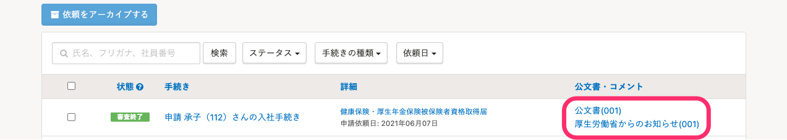
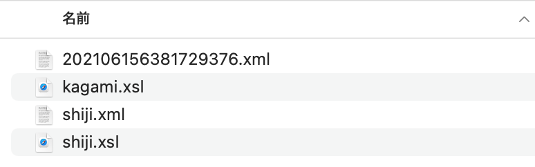
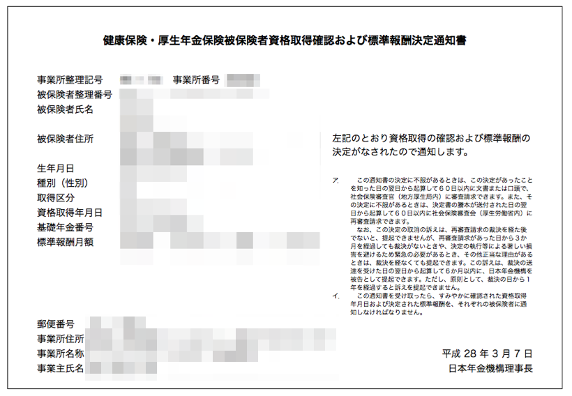
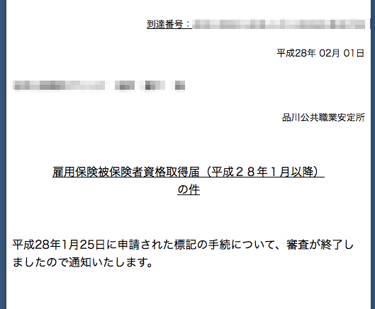

審査が進むと、公文書やコメント通知（ZIPファイル）が **［電子申請一覧］** に表示されます。

公文書やコメント通知をダウンロードし、内容を確認してください。

電子申請のステータスと、審査終了までの時間については下記のページをご覧ください。

[【一覧】電子申請一覧の「状態」](https://knowledge.smarthr.jp/hc/ja/articles/360026265693)

:::tips
**返戻**になった場合も、状態（ステータス）は **［審査終了］** と表示されます。
公文書・コメントの内容は必ず確認してください。
:::

# 公文書やコメント通知を確認する

## 1.［電子申請］>［公文書・コメント］をクリック

トップページ左側の **［電子申請］** をクリックし、 **［電子申請一覧］** を表示します。

一覧から確認したい申請の **［公文書・コメント］** をクリックし、ZIPファイルをダウンロードしてください。

:::tips
公文書のダウンロード期限は設けていません。SmartHRを利用中であれば、いつでもダウンロードすることが可能です。
:::

## 2.ファイルの内容を確認する

ZIPファイルを展開し、公文書やコメント通知（XMLファイル）をブラウザで開いて確認してください。

該当のファイルをブラウザにドラッグ＆ドロップすると、簡単に表示できます。

なお、フォルダには、公文書やコメント通知を閲覧するための補助的なファイルも含まれます。ファイルを移動する場合には、フォルダ内のすべてのファイルを移動してください。

## ファイルが正しく表示されない場合は？

下記の2点を確認してください。

#### ZIPファイルが正しく展開（解凍）されているか

パソコンの設定によっては、ZIPファイルをダブルクリックしただけでは展開（解凍）されず、中身をプレビューしている状態の場合があります。

Windowsの場合は、該当のZIPファイルを右クリックして表示されるメニューから［すべて展開］を選択し、ZIPファイルを展開してださい。

Macの場合は、該当のZIPファイルを選択して、上部のメニューバーから［ファイル］>［開く］を選択し、ZIPファイルを展開してださい。

#### ブラウザおよびブラウザの設定を確認してください

Windowsをご利用の場合は、Internet ExplorerでXMLファイルを開くと、すぐにファイルの内容を確認できます。

Internet Explorer以外のブラウザでXMLファイルを表示するには、ブラウザの設定が必要です。

下記のページの「Internet Explorerのブラウザ以外で、XMLファイル形式の公文書ファイルを開く方法を教えてください。」をご覧ください。

[電子公文書｜e-Gov電子申請](https://shinsei.e-gov.go.jp/contents/help/faq/document.html)

# 公文書やコメント（お知らせ）が届く申請

- 健康保険・厚生年金保険被保険者資格取得届
- 雇用保険被保険者資格取得届
- 健康保険・厚生年金保険被保険者資格喪失届
- 雇用保険被保険者資格喪失届
- 労働保険年度更新申告書
- 健康保険・厚生年金保険被保険者報酬月額算定基礎届

:::tips
基本的に各種公文書は電子版で通知され、紙で通知されることはありません。SmartHRよりご確認いただき、必要であればダウンロードしてご利用ください。
:::

## 書類サンプル

### 健康保険・厚生年金保険被保険者資格取得確認および報酬決定通知書

### 雇用保険被保険者資格取得届の審査通知

