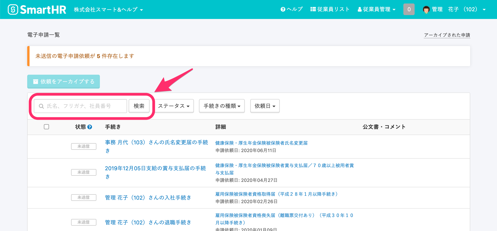
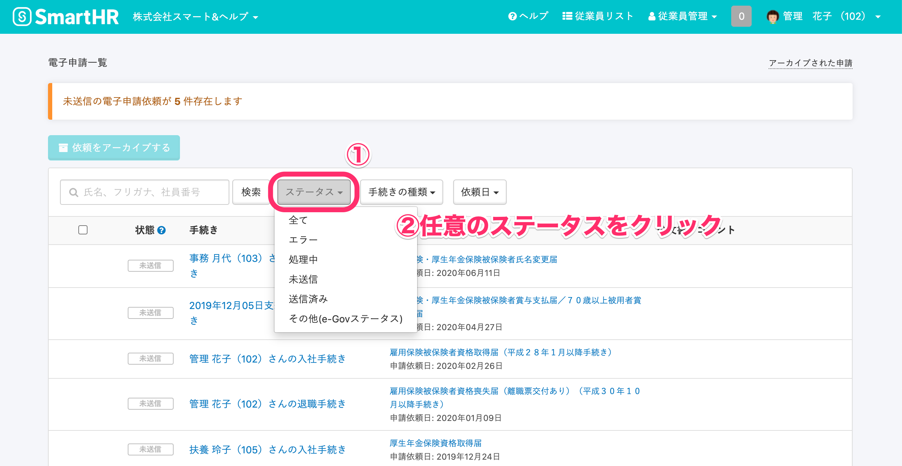
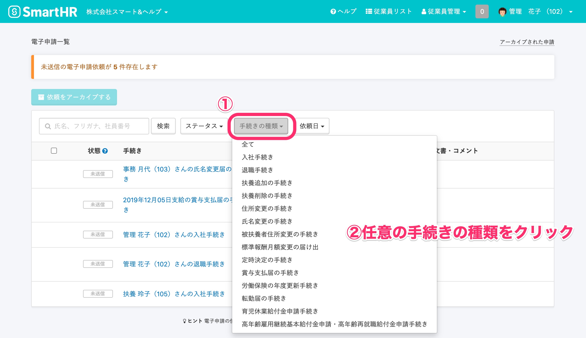
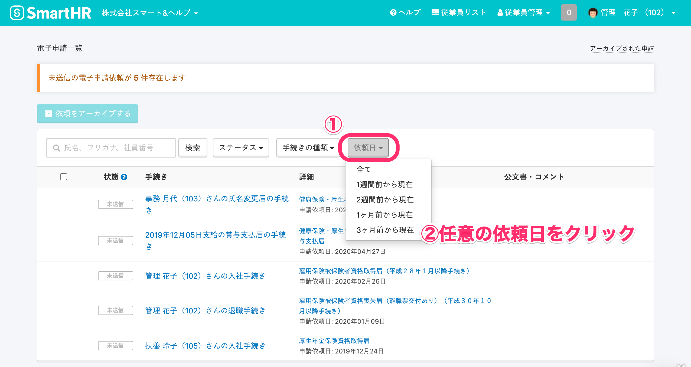

電子申請一覧画面では、従業員の氏名、社員番号による検索、申請の進捗状況、手続きの種類、依頼日から、依頼済み電子申請の抽出ができます。

申告漏れや申請の重複などの確認にご活用いただけます。

:::tips
**\[アーカイブされた申請\]** 画面でも、同様に電子申請の条件抽出ができます。
:::

# 従業員氏名や社員番号で検索する

検索フォームに従業員の氏名や社員番号を入力し、**\[検索\]** をクリックしてください。

対象の従業員が含まれた手続きの電子申請が表示されます。

:::alert
以下に該当する手続きの電子申請は、従業員の氏名や社員番号での検索対象外です。
**1\. 複数名の従業員が対象の手続き**
定時決定の手続き、賞与支払届の手続き、報酬月額の変更にまつわる電子申請は検索できません。
報酬月額の変更手続きは、給与改定の対象者を選択する方法がCSVのインポート指定、個別に従業員を選択する指定のどちらであっても検索の対象外です。
**2\. 特定の従業員に紐づかない手続き**
労働保険の年度更新手続きは、従業員情報を含まないため検索できません。
**3\. すでに削除されている手続き**
手続き自体を削除している場合は検索の対象外です。
また、申請内容に含んでいた従業員情報を削除した場合も同様ですので、ご注意ください。
:::

# 申請の進捗状況、手続きの種類、依頼日で絞り込む

## 電子申請依頼後のステータスで絞り込む

電子申請依頼の進行状況を示す「未送信」「送信済み」「エラー」などのステータスで抽出したい場合は、**\[ステータス\]** のプルダウンから任意のステータスを選択してください。

選択できるステータスは以下の通りです。

| **ステータス名** | **概要** |
| --- | --- |
| 全て | 全てのステータスを表示します。 |
| エラー | 申請内容に不備があった申請を表示します。 |
| 処理中 | SmartHRからe-Govへ申請を送信し、e-Gov側が受け取った書類のチェックを行っている申請を表示します。 |
| 未送信 | SmartHRからe-Govへ送信されていない申請を表示します。 |
| 送信済み |   SmartHRからe-Govへ送信されている申請を表示します。   |
| その他 | 役所到達、役所審査中、審査終了、手続終了など、SmartHRからe-Govへ送信後のステータスに該当する申請を表示します。 |

## SmartHR上の手続きで絞り込む

**\[手続きの種類\]** のプルダウンから任意の手続きを選択してください。

選択できる手続きの種類は以下の通りです。

| **表示される項目名** |
| --- |
| 全て |
| 入社手続き |
| 退職手続き |
| 扶養追加の手続き |
| 扶養削除の手続き |
| 住所変更の手続き ※ |
| 氏名変更の手続き |
|   被扶養者住所変更の手続き   |
| 定時決定の手続き |
| 賞与支払届の手続き |
| 労働保険の年度更新手続き |
| 転勤届の手続き |
| 育児休業給付金申請手続き |
| 高年齢雇用継続基本給付金申請・高年齢再就職給付金申請手続き |

 ※2019年4月末をもって、e-Govの住所変更届の電子申請は廃止しています

## 依頼日で絞り込む

**\[依頼日\]** のプルダウンから任意の項目を選択してください。

選択できる項目は以下の通りです。

| **表示される項目名** |
| --- |
| 全て |
| 1週間前から現在 |
| 2週間前から現在 |
| 1ヶ月前から現在 |
| 3ヶ月前から現在  |
