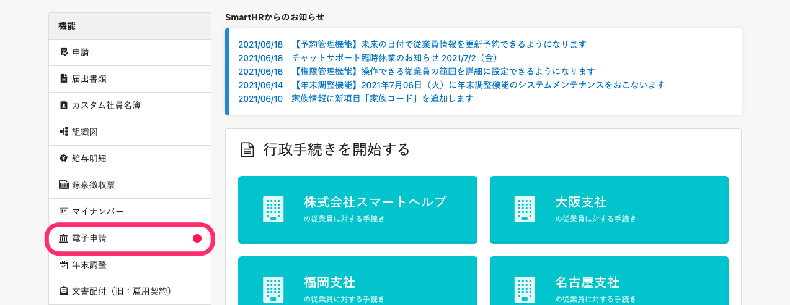
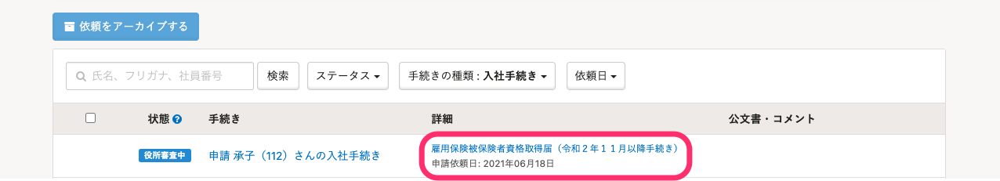
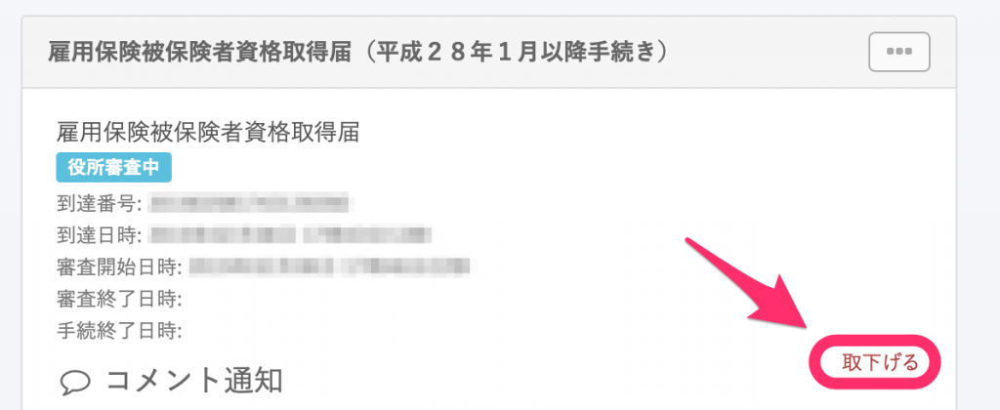

:::alert
電子申請の取り下げは、SmartHR上では**雇用保険**の申請のみ可能となります。
社会保険の申請に関する取り下げは、日本年金機構が設置する事務センターにお問い合わせください。
:::

状態が **［未送信］** または **［エラー］** の場合は、どの申請でも削除していただくことができます。

詳しくは下記のページをご覧ください。

[電子申請を削除する](https://knowledge.smarthr.jp/hc/ja/articles/360026106834)

# 1\. ［機能］>［電子申請］をクリック

トップページ左の **［機能］** 欄にある **［電子申請］** をクリックします。

# 2\. ［電子申請一覧］をクリック

 **［電子申請一覧］** をクリックし、取り下げしたい手続きの書類名をクリックして詳細ページを開きます。

# 3\. ［取下げる］をクリック

詳細ページ右下に表示される **［取下げる］** をクリックしてください。

