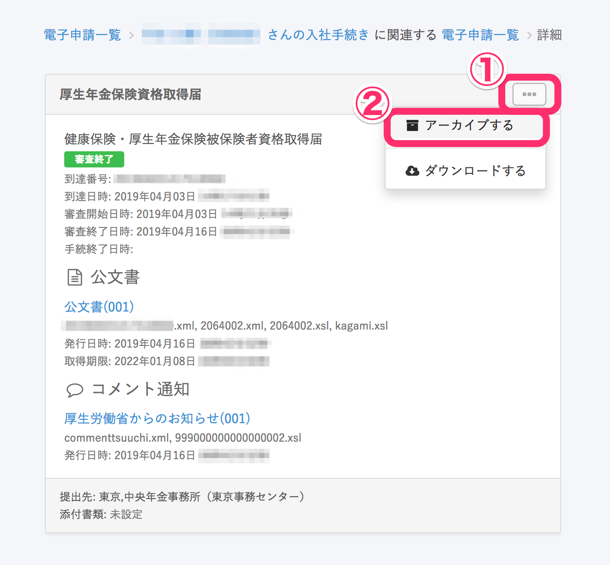
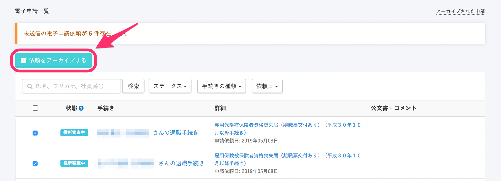
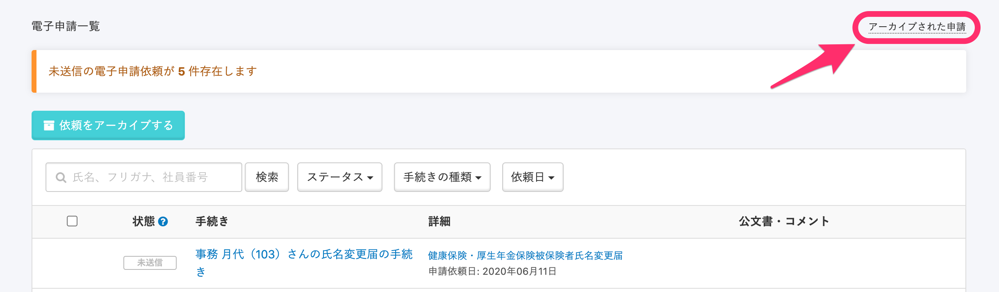
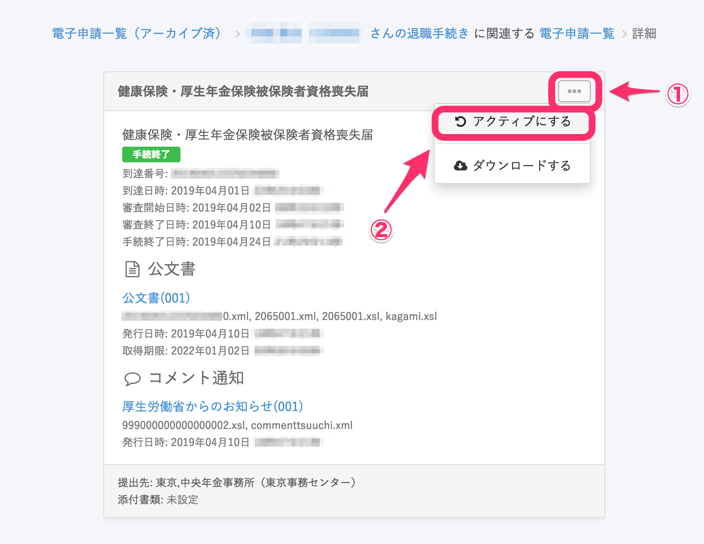

電子申請をアーカイブする方法と、アーカイブした電子申請を元に戻す方法を説明します。

# アーカイブ機能とは？

確認済みの申請などをアーカイブ一覧に移動させ、電子申請一覧を見やすい状態にしておくことができます。

:::tips
・「役所審査中」など、終了していないものをアーカイブしても特に問題ありません。アーカイブ一覧の中でステータスが進捗します。
・審査中となった申請は、その後の進捗に影響があるため「削除」することができません。一覧から表示不要となった申請は「削除」の代わりに「アーカイブ」機能をご利用ください。
:::

# アーカイブする

## 1件ずつアーカイブする場合

1件ずつアーカイブするには、アーカイブしたい申請ページに移動し、書類名の右にある **\[…\]メニュー** を開いて **\[アーカイブする\]** をクリックすると、アーカイブできます。

## 複数の申請を一括アーカイブする場合

複数の申請を一括アーカイブする場合、アーカイブしたい申請にチェックを入れて **\[依頼をアーカイブする\]** をクリックすると、アーカイブできます。

# アーカイブされた申請を確認する

電子申請一覧ページ右上にある **\[アーカイブされた申請\]** をクリックすると、**\[電子申請一覧 （アーカイブ済）\]** に移動できます。

# アーカイブから電子申請一覧に戻す（アクティブにする）

## 1\. 電子申請一覧（アーカイブ済み）画面で、詳細リンクをクリック

電子申請一覧 （アーカイブ済）から、電子申請一覧に戻したい申請の詳細リンクをクリックします。

## 2\. \[...\]メニュー > \[アクティブにする\] をクリック

書類名の右にある **\[…\]メニュー > \[アクティブにする\]** をクリックすると、選んだ電子申請が電子申請一覧画面に戻ります。

