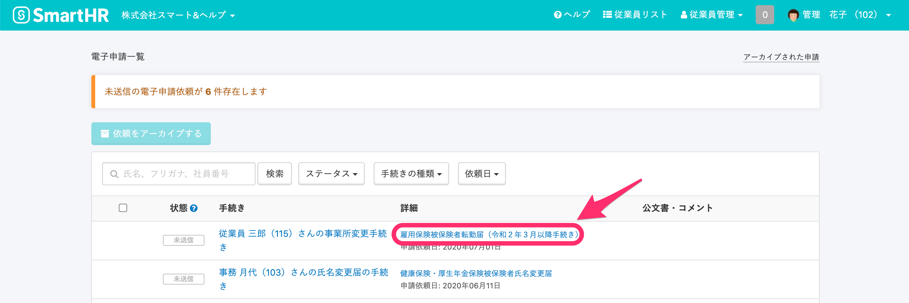
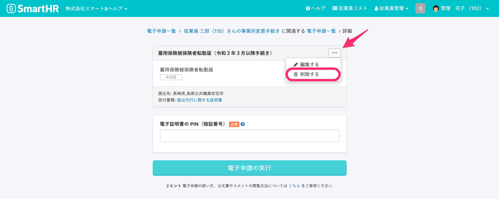
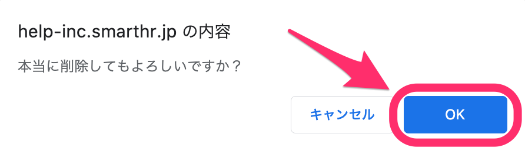
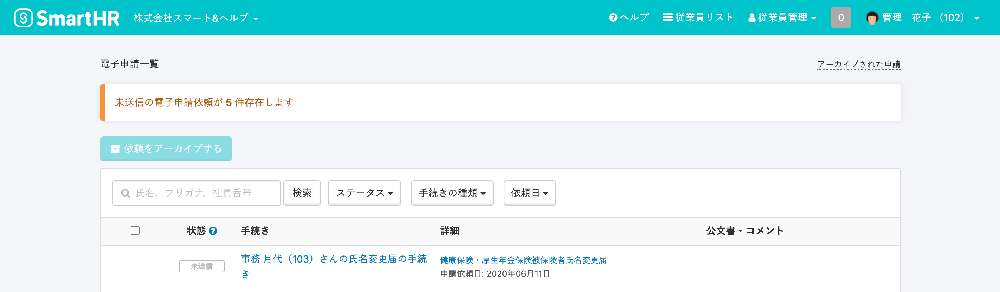

電子申請を削除するには、 **\[電子申請\] > \[電子申請一覧\]** にて書類名をクリックし、該当書類のページにある **\[…\]メニュー** から **\[削除する\]** を選んで削除できます。

# 削除可能な申請

SmartHR で削除ができる電子申請は、**未送信** または **エラー** 状態の申請のみとなります。

その他のステータスでは、**取下げ**をしていただく必要があります。

取り下げについては、下記のページをご確認ください。

[雇用保険の電子申請を取り下げる](https://knowledge.smarthr.jp/hc/ja/articles/360026265613)

# 操作手順

## 1\. \[電子申請\] > \[電子申請一覧\] にて書類名をクリック

トップページ左側の **\[機能\]** 欄にある **\[電子申請\]** をクリックし、**\[電子申請一覧\]** 画面に移動してください。

**\[詳細\]** 欄にある削除したい手続きの書類名をクリックすると、書類詳細ページに移動します。

## 2\. \[...\]メニュー > \[削除する\] をクリック

書類詳細ページにある **\[…\]メニュー** を開いて **\[削除する\]** をクリックすると、確認ダイアログが表示されます。

確認ダイアログの **\[OK\]** をクリックすると、当該電子申請が **\[電子申請一覧\]** から削除されます。

## 3\. 手続きの削除を確認する

**\[電子申請一覧\]** にて、手続きが削除されていることを確認してください。

