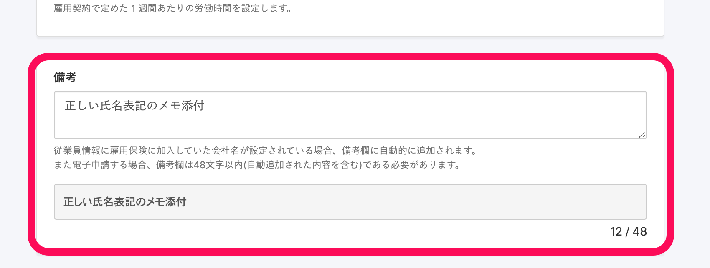
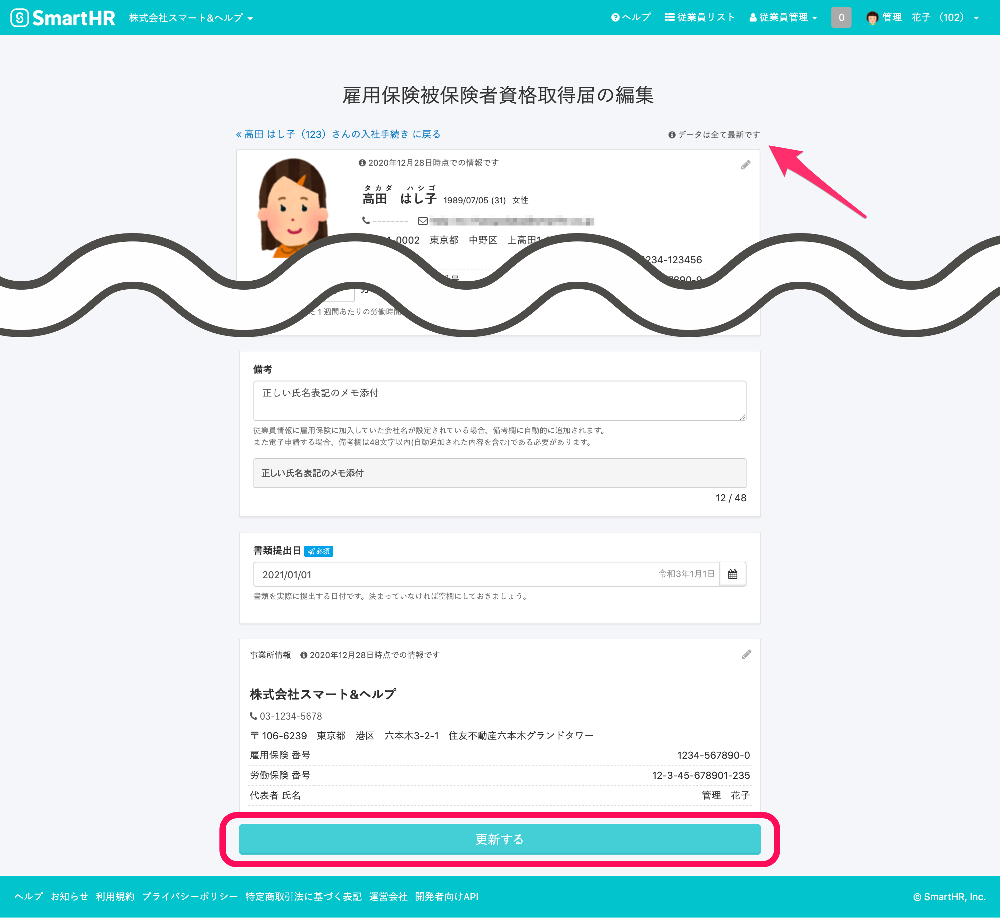
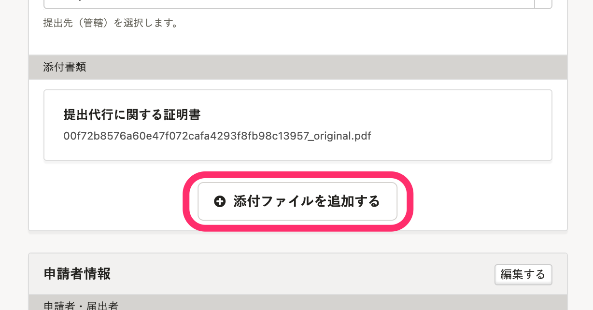
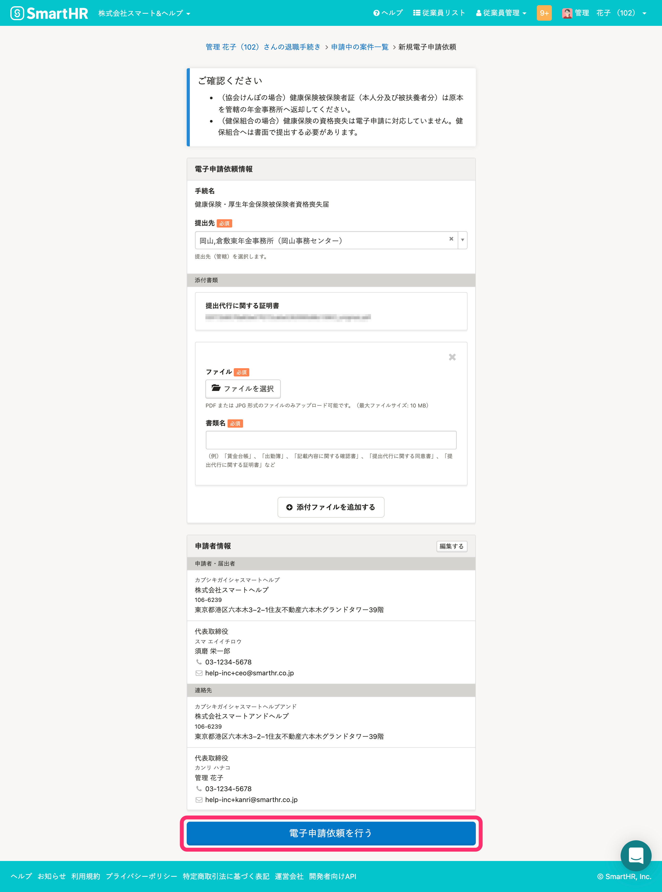

# 電子申請で添付ファイルを利用するケース

電子申請には、e-Gov側の制限で利用できる文字や文字数などの制約があります。

電子申請データでは送信できない申し送り事項を添付ファイルを使うのは、以下のようなケースが考えられます。

- e-Gov電子申請で使用できない文字を届出書類内で使用したい場合。（電子申請を送信すると  **「指定可能な文字以外が指定されています」**  という旨のエラーメッセージが表示される）
- 備考欄に複数記載したい事項があって、文字数制限以内に収まらない。

:::alert
一度の電子申請で添付送信できるファイルの容量は、1ファイルごと最大10MBです。
複数のファイルを添付する場合は、上限が100MBになります。
:::

# 書類の備考欄に「メモ添付」と記入し、電子申請依頼画面で添付ファイルをアップロード

## 1\. PDFファイルを作成

備考欄に記載したい申し送り事項を書き込んだPDFファイルを作成します。

:::alert
e-Govでは、電子申請時に添付するファイル名に使用できない文字があります。
万一、使用した場合は  **「ファイル名に指定できない文字が使用されています。」**  という旨のエラーメッセージが表示されるので、修正してください。
[ファイル名に使用できる文字について｜電子政府の総合窓口e-Gov イーガブ](https://shinsei.e-gov.go.jp/contents/help/notes/filename-letters.html)
:::

## 2\. ［備考］欄にメモを添付したことを記入する

**届出書類編集画面**の **［備考］** 欄に、メモを添付する旨を記載します。

## 3\. 届出書類を更新する

**届出書類編集画面**の下の **［更新する］** をクリックします。

## 4\. PDFをアップロードし、電子申請依頼を実行する。

手続き画面の **［電子申請依頼］** ボタンをクリックして、**新規電子申請依頼画面**を表示します。

 **［電子申請依頼情報］** の **［添付書類］** 項目の **［+添付ファイルを追加する］** をクリックし、申し送り用PDFファイルをアップロードします。

新規電子申請依頼画面下部にある **［電子申請依頼を行う］** をクリックします。

