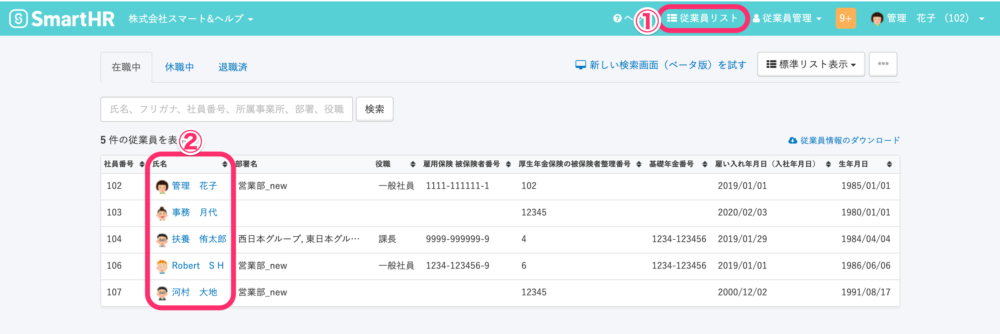
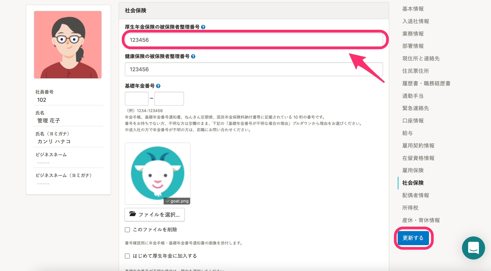
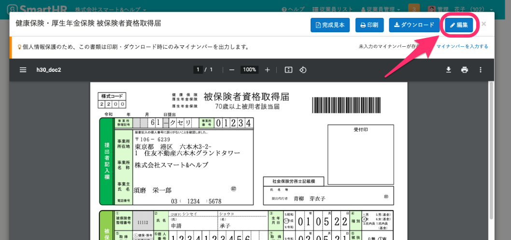
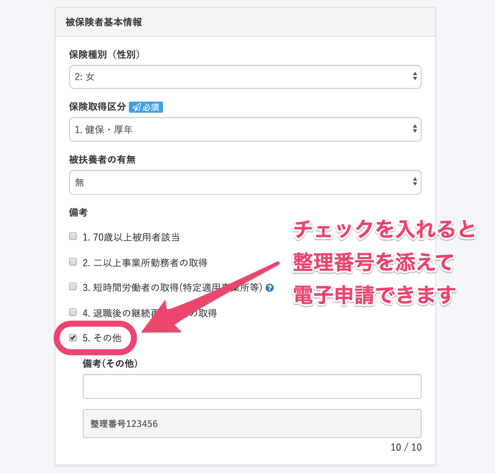

電子申請時に厚生年金保険の整理番号を指定する方法を説明します。

:::alert
年金事務所の担当者によっては、申請時に送信したものと異なる番号が採番されてしまう可能性もあるようです。
番号を必ず指定したい場合は、電子申請ではなく、紙で申請を行なってください。
:::

# 従業員情報に［厚生年金保険の被保険者整理番号］を登録する

## 1\. ［従業員リスト］から［従業員情報］編集画面を表示する

ヘッダーメニューの **［従業員リスト］** をクリックして従業員リストを表示します。

対象者の **氏名** をクリックして、 **［従業員情報］** 画面へ移動します。

## 2\. ［社会保険］>［厚生年金保険被保険者整理番号］を記入する

 **［従業員情報］** 画面右上にある **［編集］** をクリックして従業員情報の編集画面に切り替え、 **［社会保険］** 項目グループの **［厚生年金保険の被保険者整理番号］** 欄に整理番号を入力し、 **［更新する］** をクリックします。

# 届出書類編集画面の［備考］欄の［その他］にチェックを入れる

## 3\. ［備考欄］>［その他］にチェックを入れる

手続き画面の **［関連書類］** 欄で **［健康保険・厚生年金保険 被保険者資格取得届］** をクリックすると表示される届出書類の**プレビュー画面**から、 **［編集］** をクリックします。

 **［健康保険・厚生年金保険 被保険者資格取得届］** （協会けんぽ以外は **［厚生年金保険 被保険者資格取得届］** と表示されます）の編集画面で、  **［被保険者基本情報］** の **［備考］** 欄にある **［その他］** にチェックを入れます。

チェックを入れると、備考欄の下に表示されている整理番号を電子申請データに含めます。

（将来的には、備考を使わずに希望する整理番号を申請できるような改善を予定しています）

備考欄の下に表示されている整理番号を修正したい場合は、従業員情報の登録を修正してください。

:::alert
関東ITSの場合、 **［その他］** のチェックボックスは表示されません。
備考欄に整理番号を記載してください。
:::

# 被保険者の名前に機種依存文字を使用している場合

**被保険者の氏名などにe-Govで使用できない文字を使用している場合**、整理番号の指定にだけでなく、代用した漢字と正しい漢字についての説明も添える必要があります。

電子申請の備考欄には文字数制限があるため、その場合は、備考欄にはメモを添付した旨のみを記入し、添付ファイルに整理番号の指定と漢字表記に関する申し送り事項を記入の上、電子申請します。

この場合、備考欄の文字数制限エラーの原因となるため、従業員情報の \[厚生年金保険の被保険者整理番号\] は空欄にした状態で電子申請データを作成してください。

:::related
[備考欄に入力したい内容を添付ファイルとして添えて電子申請する](https://knowledge.smarthr.jp/hc/ja/articles/360059386954)
:::
