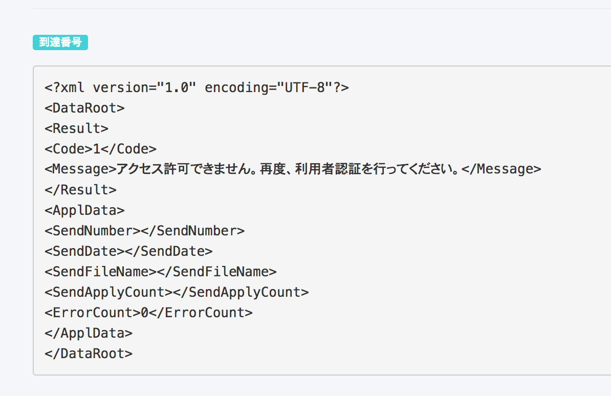
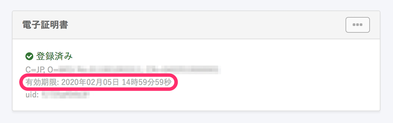
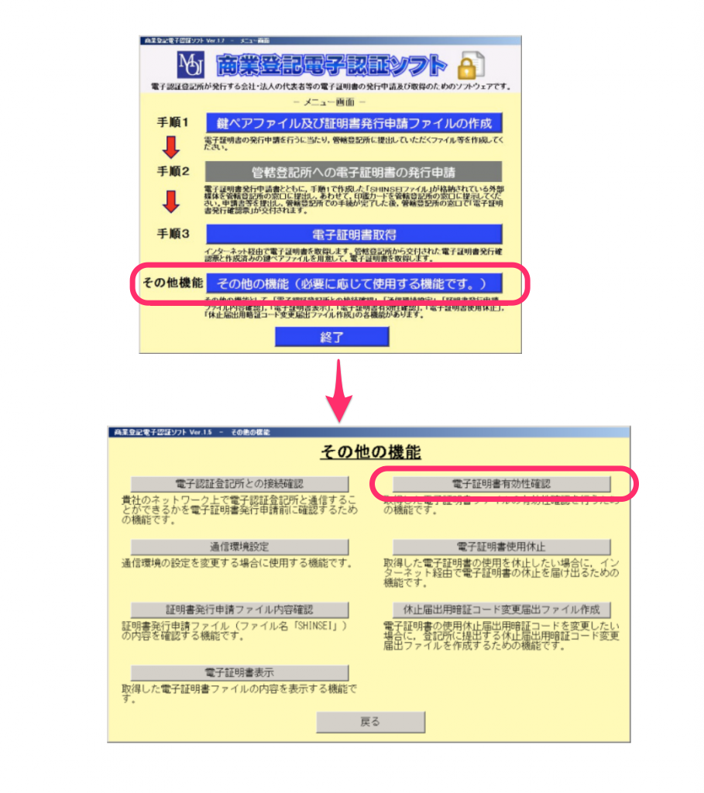

電子証明書の登録の際に「利用者認証でエラーが発生しました」というエラーになったり、電子申請を実行する際に「電子申請に失敗しました」と表示されたり、申請済みの電子申請に下図のようなメッセージが表示されエラーになってしまったりする場合、以下の理由が考えられます。

# 入力したPIN（パスワード）に誤りがある

電子申請の実行時に入力したPINが、登録されている電子証明書のものとは異なる可能性があります。

## エラーメッセージ

PIN が不正です

## 対応方法

正しいPINを入力してください。

コピーアンドペーストをしている場合は、前後にスペースなどが含まれていないか、改めてご確認ください。

# e-Govへのセッションが一時的に切れた

SmartHRとe-Govとの連携の仕組み上、一時的にセッションが切れてしまうことがあります。

## 対応方法

10分ほど時間をおいてから再度お試しください。

# 電子証明書の有効期間が切れている

新規申請時だけでなく、申請中のステータス確認の際も、有効な電子証明書が必要です。

電子証明書の有効期限は、 **画面右上のアカウント名 > \[共通設定\] > \[電子申請\] > 任意の申請者情報 > \[電子証明書\]** にて確認できます。

## エラーメッセージ

証明書の有効期限が切れています

## 対応方法

有効な電子証明書をSmartHRに登録してください。

登録手順は下記のページをご覧ください。

[電子証明書を変更する](https://knowledge.smarthr.jp/hc/ja/articles/360026105634)

:::tips
法務局で登録した電子証明書を利用していて、商業登記電子認証ソフトをお持ちの場合、登録されている電子証明書が有効かどうかの確認が可能です。

詳しくは[商業登記電子認証ソフト操作手引書｜法務省民事局商事課](http://www.moj.go.jp/content/001248852.pdf)の 「第３ 商業登記電子認証ソフトの「その他の機能」について」>「３ 電子証明書の有効性確認の機能」 を参考にしてください。
なお、商業登記電子認証ソフトの使い方については、弊社ではお答えできかねますので、以下へお問い合わせをお願いします。
[登記・供託オンライン申請システム操作サポートデスク｜ 登記ねっと 供託ねっと](https://www.touki-kyoutaku-online.moj.go.jp/contact/concact_support.html)
:::

# 社名・所在地・代表者情報などに変更があった

電子証明書が有効期限内であっても、電子証明書に記録された情報（社名・所在地・代表者情報など）の変更に関する登記がされた場合、その電子証明書は失効してしまいます。

詳しくは、下記のページをご覧ください。

[法務省 よくあるご質問・ご照会 【Ｑ17】証明期間中であっても電子証明書が失効することがあると聞きましたが，どのような場合ですか？｜法務省](http://www.moj.go.jp/MINJI/minji06_00034.html#17)

※ 登記変更を申請された時点で、古い情報が記録された電子証明書は利用できなくなりますので、ご留意ください。

## エラーメッセージ

アクセス許可できません。再度、利用者認証を行ってください。

## 対応方法

登記完了後、電子証明書を取得し、SmartHRに登録してください。

登録手順は下記ページをご覧ください。

[電子証明書を変更する](https://knowledge.smarthr.jp/hc/ja/articles/360026105634)

:::alert
新しく電子証明書を取得する必要がある場合、取得までに時間がかかることが予想されます。
お急ぎの場合は、紙での申請もご検討ください。
:::

# e-Gov側での認証登録が完了していない

電子証明書の取得直後は、e-Govでの認証登録が完了していないため、SmartHRに正しい電子証明書を登録しようとしても「利用者認証でエラーが発生しました」と表示されてしまいます。

## エラーメッセージ

利用者認証でエラーが発生しました

## 対応方法

証明書の取得後、1日〜2日時間をおいてから再度お試しください。

日にちをおいても同様のエラーが発生してしまう場合は、チャットサポートでお問い合わせください。
