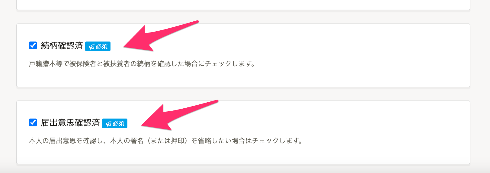
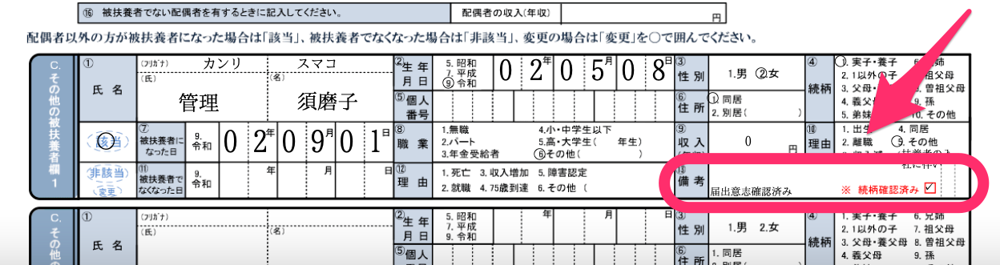
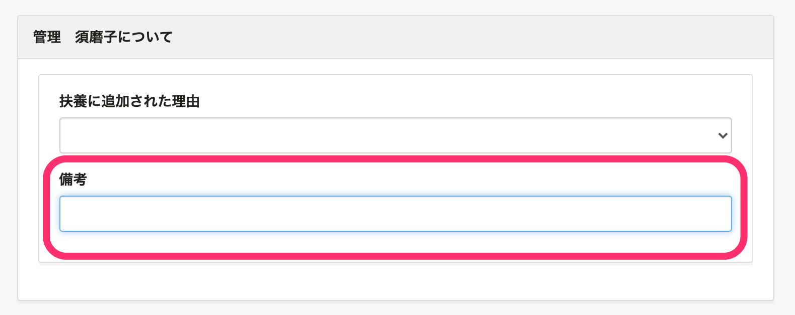

# 備考欄には［続柄確認済み］［届出意思確認済み］を考慮した、39文字以内で入力してください。

電子申請で入力できる文字数には制限があり、「健康保険 被扶養者（異動）届・国民年金第3号被保険者関係届」の備考欄の文字数は最大39文字までになります。

文字数を超えてしまった場合、 **「備考は39文字以内で入力してください。」** というエラーメッセージが表示されます。

## ［続柄確認済］［届出意思確認済］も備考欄に含まれます。

また「健康保険 被扶養者（異動）届・国民年金第3号被保険者関係届」の編集画面で、 **［続柄確認済］［届出意思確認済］** にチェックが入っている場合は、備考欄に「届出意思確認済み。 」「続柄確認済み。」（16文字）分の文字数が含まれます。

 **「健康保険 被扶養者（異動）届・国民年金第3号被保険者関係届」PDF画面例** 

そのため **［続柄確認済］［届出意思確認済］** にチェックが入っている場合の備考欄には、16文字を差し引いた23文字までの入力になります。

