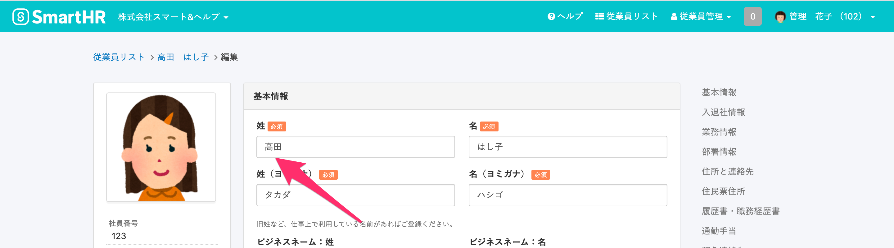

# 従業員情報を修正後、電子申請をしてください。

電子申請で利用できる文字には制限があり、一部文字（環境依存文字、機種依存文字）を含んだ申請ができません。

氏名や住所等に利用できない文字が含まれていた場合、 **「被保険者氏名に電子申請では利用できない文字が入力されています。」** というエラーメッセージが表示されます。

エラーメッセージ例： 氏名に「髙（ハシゴダカ）」が含まれている場合

:::tips
e-Govで入力が可能な文字については、以下のページをご覧ください。
[入力可能な文字について｜電子政府の総合窓口e-Gov イーガブ](https://shinsei.e-gov.go.jp/contents/help/notes/letters.html)
:::

この場合、届出書類の作成は電子申請で利用できる文字を代用し、備考欄で正しい漢字表記に関する申し送りを添えて申請します。

1.  一般的に認知度が高く、担当にも文章で伝わる程度の漢字であれば、備考欄に直接、正しい漢字表記を記載する。例えば、「髙」「𠮷」のように「はしごだか」「下が長い吉」など。
2.  文章だけでは伝わらない、認知度が低い文字の場合には、備考欄にメモを添付したことを記載して、PDF またはJPEG 形式の添付ファイルにて詳細を説明する。

# 正しい文字を記載したPDFファイル添付して電子申請する手順

電子申請の備考欄には、文字数制限があるため、ここではPDFファイルを使う方法を紹介します。

## 1\. PDFファイルを作成

本来の漢字表記を伝える申し送りを記載したPDFをファイル作成します。

正しい漢字と、書類に代用した漢字を明確に記載します。

## 2\. 該当データを常用漢字にする

**届出書類編集画面**の右上にある、 **［鉛筆アイコン］** をクリックして、従業員情報の編集画面に移動します。

[従業員情報の編集画面](https://knowledge.smarthr.jp/hc/ja/articles/360036957193)で、該当データを代用する漢字で修正し、従業員情報を更新します。

ヨミガナ欄に、入力した文字のヨミガナが自動的に追記されるので、修正の際はご注意ください。

※ 常用漢字を代用することができない場合はカタカナを使用してください。

## 3\. 届出書類に従業員情報を同期する

**届出書類編集画面**の右上にある **［最新のデータに更新する］** をクリックします。

「本当に更新してよろしいですか？」というメッセージが表示されるので、 **［OK］** をクリックします。

## 4\. ［備考］欄にメモを添付したことを記入する

**届出書類編集画面**の **［備考］** 欄に、メモを添付する旨を記載します。

## 5\. 届出書類を更新する

**届出書類編集画面**の右上の表示が  **「データは全て最新です」**  になったことを確認のうえ、画面下の **［更新する］** をクリックします。

## 6\. PDFをアップロードし、電子申請依頼を実行する。

手続き画面の **［電子申請依頼］** ボタンをクリックして、**新規電子申請依頼画面**を表示します。

 **［電子申請依頼情報］** の **［添付書類］** 項目の **［+添付ファイルを追加する］** をクリックし、申し送り用PDFファイルをアップロードします。

新規電子申請依頼画面下部にある **［電子申請依頼を行う］** をクリックします。

:::alert
一度の電子申請で添付送信できるファイルの容量は、1ファイルごと最大10MBです。
複数のファイルを添付する場合は、上限が100MBになります。
:::
