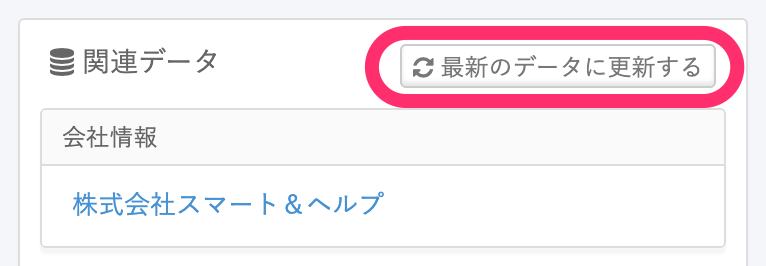
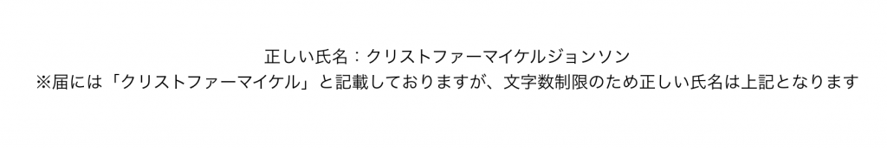
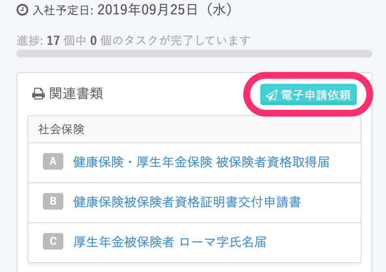
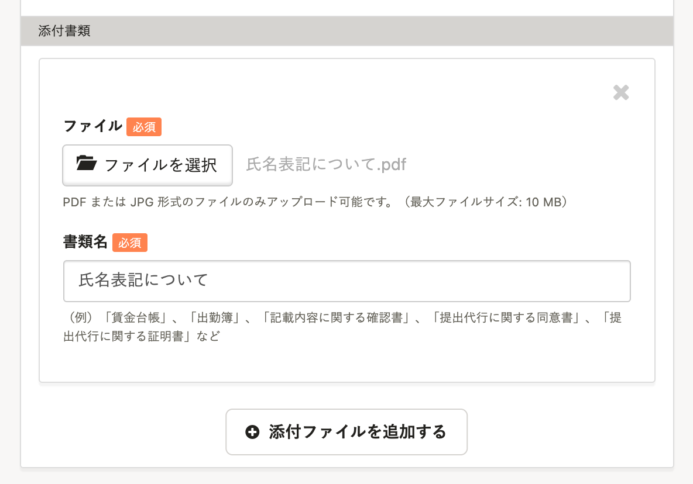
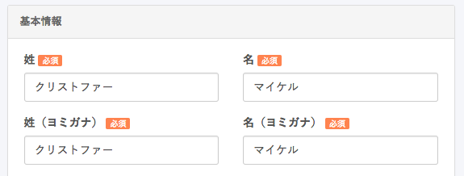

SmartHRから手続きの電子申請を行なう際は、e-Gov側の仕様により氏名に文字数制限があるため、氏名を一時的に合計12文字以内にする必要があります。

外国籍の方など、氏名が12文字以上（スペース含む）となる方の電子申請を行う場合は下記の対応をお願いします。

# 1\. 基本情報の ［姓］［名］を12文字以内で入力

従業員情報の基本情報の **［姓］［名］を一時的に合計12文字以内** で入力します。

# 2\. 手続きページで［最新のデータに更新する］をクリック

手続きページの **［関連データ］** にて、 **［最新のデータに更新する］** をクリックします。

※実行することで手順1で変更した氏名が書類へ反映されます。

# 3\. PDFファイルを作成する

下図のようにフルネームが記載されたPDFファイルを作成します。

※SmartHRでは作成できないため、Wordなどで作成してください。

# 4\. ［電子申請依頼］をクリック

手続き画面から **［電子申請依頼］** をクリックし、「新規電子申請依頼」画面へ進んでください。

# 5\. 電子申請依頼を実行する

 **［添付書類］** に手順3で作成したPDFファイルを添付し、電子申請依頼を実行します。

※フルネームが記載されたPDFファイルを添付することにより、フルネームで電子申請が受理されます。

:::alert
一度の電子申請で添付送信できるファイルの容量は、1ファイルごと最大10MBです。
複数のファイルを添付する場合は、上限が100MBになります。
:::

# 6\. ［従業員リスト］で従業員の氏名を更新する

電子申請の手続き完了後、 **［従業員リスト］** より、該当従業員の氏名をフルネームの表記に更新してください。

漢字ではない場合はカタカナで入力します。

:::tips
スペースも1文字としてカウントされますのでお気をつけください。
例: 「クリストファー　マイケル　ジョンソン」の場合、 **「クリストファー　マイケル」** までで12文字となります。
:::

## 基本情報への入力例

