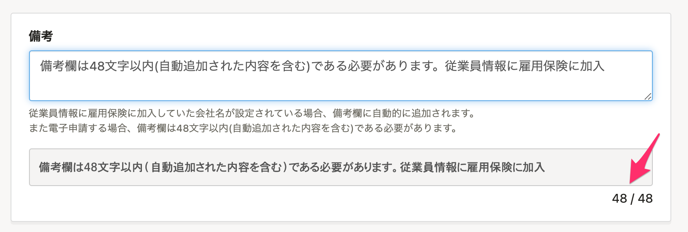
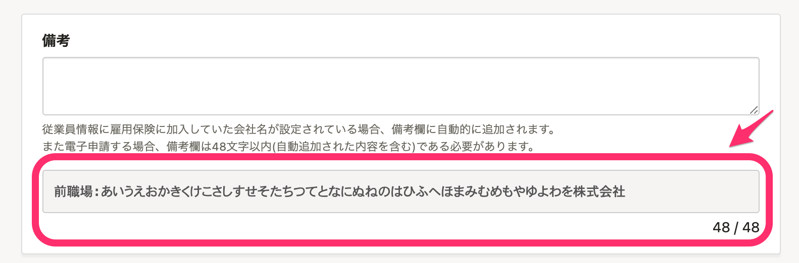
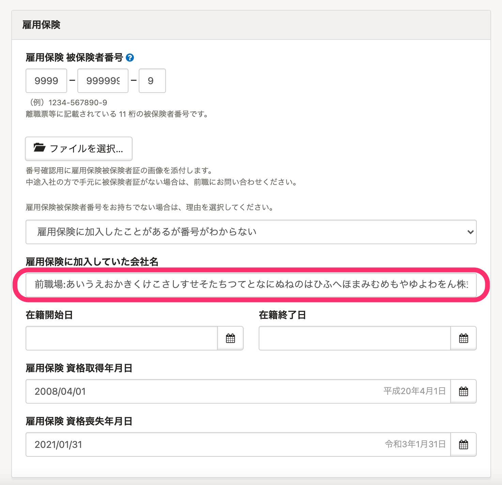

# ［雇用保険に加入していた会社名］をご確認の上、48文字を超える場合はファイルを別途添付してください。

電子申請で入力できる文字数には制限があり、「雇用保険被保険者資格取得届」の備考欄の文字数は、最大48文字までになります。

**従業員情報に雇用保険に加入していた会社名が設定されている場合**、備考欄には、従業員情報に登録されている **［雇用保険に加入していた会社名］** が自動で追加されるため、その文字数も合わせて48文字以内に収める必要があります。

備考欄の内容が48文字以内に収まらない場合は、添付ファイルを作成して情報を送信してください。

詳しい方法は、以下のヘルプページをご覧ください。

:::related
[備考欄に入力したい内容を添付ファイルとして添えて電子申請する](https://knowledge.smarthr.jp/hc/ja/articles/360059386954)
:::
:::tips
### 「従業員情報に雇用保険に加入していた会社名が設定されている場合」とは
従業員から情報を収集する際、雇用保険被保険者番号がわからない場合に、従業員情報として雇用保険に加入していた会社名を登録してもらいます。
従業員情報 >  **［雇用保険］** \> 雇用保険被保険者番号をお持ちでない理由のプルダウンメニューから、 **［雇用保険に加入したことがあるが番号がわからない］** を選択すると、 **［雇用保険に加入していた会社名］** の入力欄が表示されます。
備考欄には、「**前職場:雇用保険に加入していた会社名**」として自動追加されます。

:::
