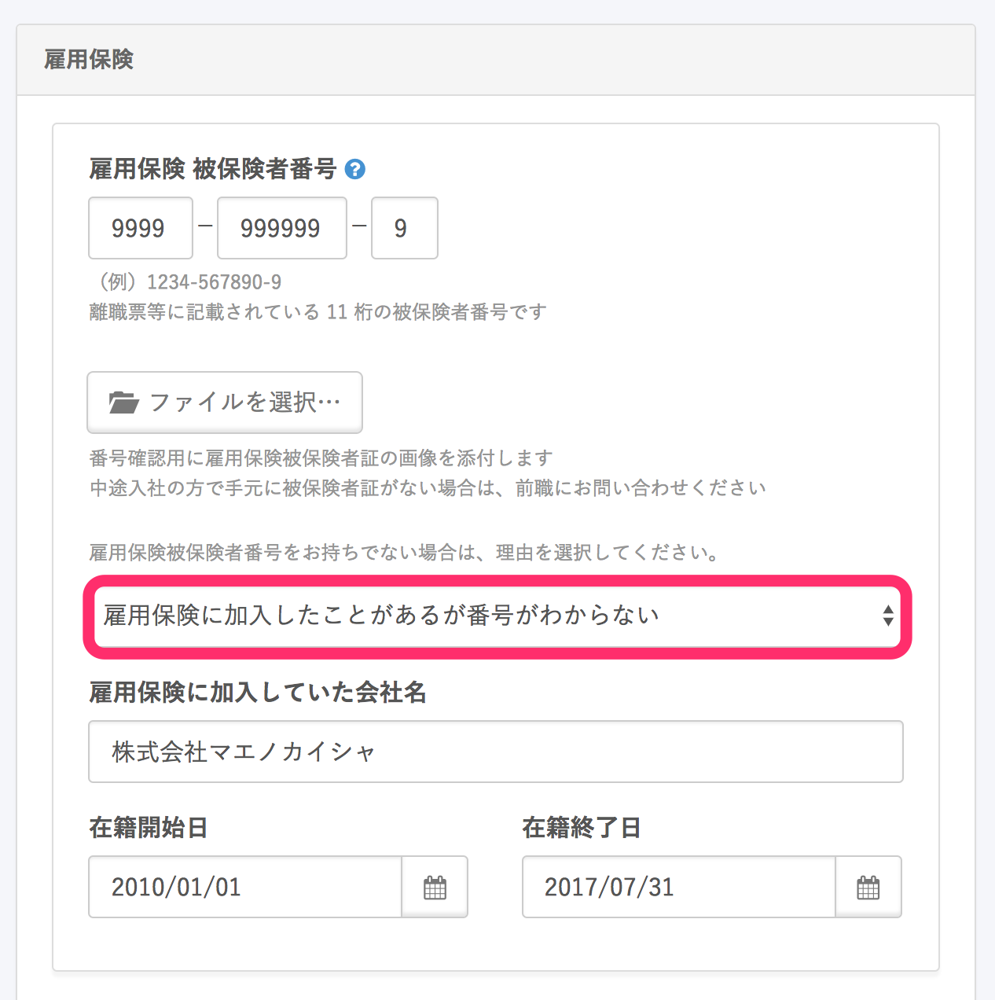

雇用保険被保険者番号が不明な場合でも、前職場名と在籍期間を備考欄に記載することで申請が可能です。

（ハローワークにて、登録されているデータを照会されます）

基本情報に前職場名と在籍期間をご登録いただければ、自動で雇用保険資格取得届の備考欄に表示されます。

また、基本情報へのご登録は、管理者・従業員、どちらの権限でも可能です。

# 1\. \[従業員リスト\] > 従業員名をクリック

ログイン後のトップページ右上にある **\[従業員リスト\]** をクリックすると、従業員の名前が一覧表示されます。

従業員リストにて、該当の従業員の端にある **\[鉛筆アイコン\]** をクリックしてください。

# 2\. \[雇用保険\] をクリック

**\[鉛筆アイコン\]** をクリックすると、該当の従業員ページに遷移します。

次に、ページ右側にあるメニューの **\[雇用保険\]** をクリックしてください。

クリックすると、**\[雇用保険\]** 欄にある **\[雇用保険被保険者番号をお持ちでない場合は、理由を選択してください。\]** という項目が表示されます。

# 3. \[雇用保険に加入したことがあるが番号がわからない\] をクリック

**\[雇用保険被保険者番号をお持ちでない場合は、理由を選択してください。\]** にて、 **\[雇用保険に加入したことがあるが番号がわからない\]** を選択してください。

被保険者番号欄にダミーの数字（例: 9999-999999-9）が自動入力され、雇用保険に加入していた会社名や在籍期間を登録する項目が表示されます。

# 4. \[雇用保険に加入していた会社名\] \[在籍開始日\] \[在籍終了日\] を入力

**\[雇用保険に加入していた会社名\] \[在籍開始日\] \[在籍終了日\]** を入力し、従業員情報ページを更新します。

手続きを作成すると、雇用保険資格取得届の備考欄に前職場名と在籍期間が入力された状態になります。

:::alert
電子申請をされる場合は、 e-Gov側で文字数制限があるため、48文字以内（スペース含む）に収める必要があります。
文字数は、雇用保険被保険者資格取得届の編集ページで確認できます。

文字数がオーバーしてしまう場合は、前職場名と在籍期間を記載したPDFファイルを用意し、電子申請時に添付して申請してください。
（PDFファイルに決まったフォーマットはありません。内容がわかればOKです）
:::
