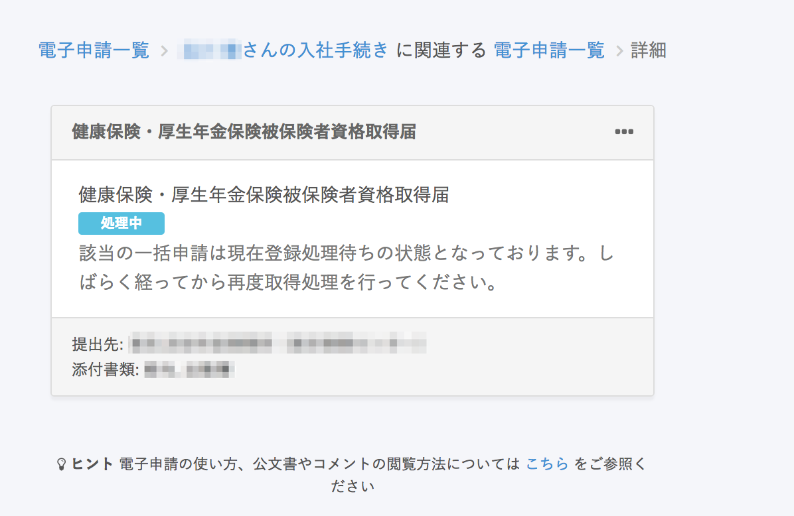

電子申請の詳細画面を開いたとき、ステータスが処理中のまま「該当の一括申請は現在登録処理待ちの状態となっております。しばらく経ってから再度取得処理を行ってください。」というメッセージが表示されることがあります。

上記のメッセージが表示された場合は、時間を置いて画面をリロードしてください。

# 再度取得処理とは？

メッセージに表記されている「再取得処理」とは、電子申請のステータスをもう一度取得することを指しています。

電子申請を最初からやり直していただく必要はございません。しばらく経ってから、電子申請の画面をリロードしてください。
