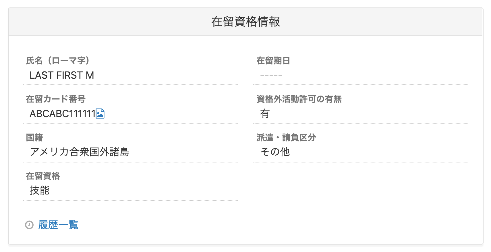

雇用保険資格取得届と雇用保険資格喪失届の電子申請の様式が令和2年11月2日から変更になりました。

新しい様式では、在留資格情報の内容が特定の条件を満たす必要があります。

# 在留資格情報とは

従業員情報の中の **\[在留資格情報\]** の欄の項目です。

# 雇用保険資格取得届・資格喪失届の電子申請（令和2年11月以降手続き）の提出条件

以下の表のA〜Eのいずれかのパターンの場合、電子申請が可能です。

| パターン | 氏名（ローマ字） | 在留カード番号 | 在留期日 | 国籍 | 在留資格 |
| --- | --- | --- | --- | --- | --- |
| **A** | 空欄 | 空欄 | 空欄 | 空欄 | 空欄 |
| **B** | 記載あり | 記載あり | 記載あり | 記載あり | 記載あり |
| **C** | 記載あり | 記載あり | 空欄 | 記載あり | 記載あり |
| **D** | 記載あり | 空欄 | 記載あり | 記載あり | 記載あり |
| **E** | 記載あり | 空欄 | 空欄 | 記載あり | 記載あり |

# エラーが出た場合の対応方法

雇用保険資格取得届や雇用保険資格喪失届の電子申請依頼を行なう際に **\[外国人雇用者に関する項目の入力不備があります\]** というエラーが表示された場合、従業員情報の在留資格情報欄を修正した後、手続き画面で **\[最新のデータに更新する\]** を押してください。

:::related
[書類作成後に変更した情報を、作成済みの書類に反映する](https://knowledge.smarthr.jp/hc/ja/articles/360026106774)
:::
