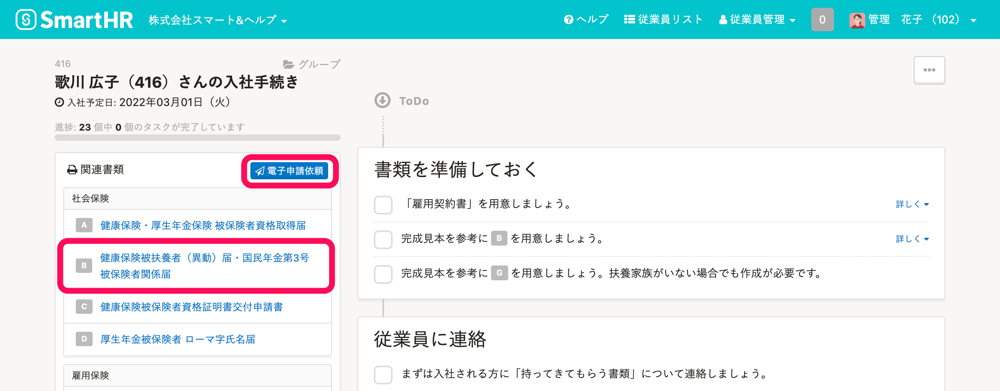
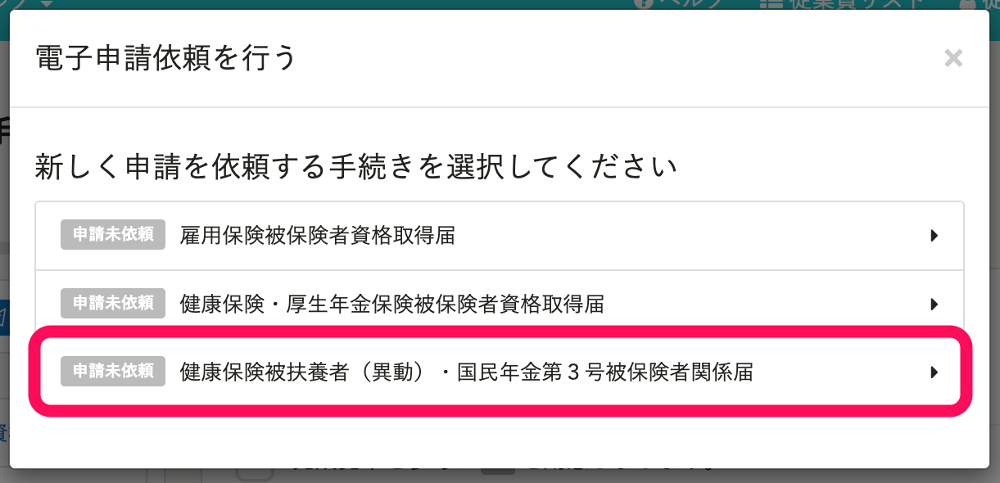
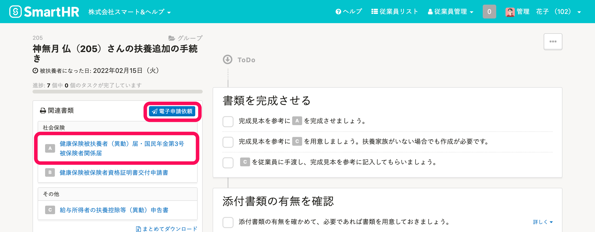
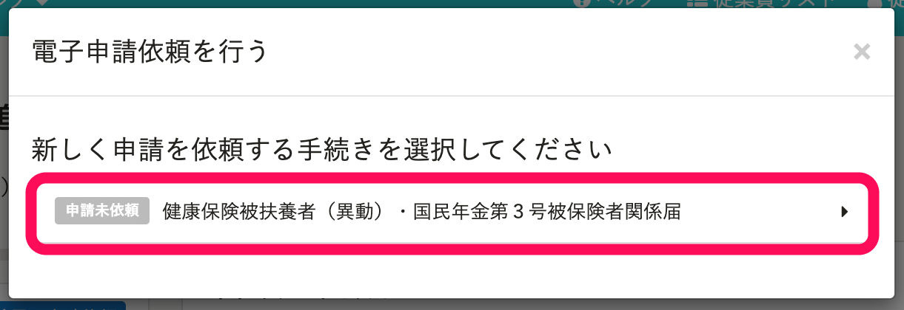

**健康保険被扶養者（異動）届・国民年金第3号被保険者関係届** の電子申請を、SmartHRで行なうことができます。

# 対応状況

現在、**協会けんぽ**のみに対応しています。

|   | 入社の手続き | 扶養追加の手続き | 扶養削除の手続き |
| --- | --- | --- | --- |
| 協会けんぽ | ○ | ○ | ○ |
| 協会けんぽ以外の健保 | 順次対応 | 順次対応 | 順次対応 |

:::tips
2022/2/28から、扶養削除の手続きにも対応しました。
:::

# 入社の手続き

扶養家族の情報が登録されている従業員の入社手続きを作成すると、 **「健康保険被扶養者（異動）届・国民年金第3号被保険者関係届」** が生成されます。

ページ左側 **［関連書類］** 欄の **［電子申請依頼］** ボタンをクリックすると、 **［電子申請依頼を行う］** モーダルが表示されます。

モーダルにある **［健康保険被扶養者（異動）・国民年金第３号被保険者関係届］** をクリックすると、 **［新規電子申請依頼］** 画面に移動して、電子申請を依頼できます。

:::related
[入社の手続きをはじめる](https://knowledge.smarthr.jp/hc/ja/articles/360026266093)
[従業員から情報が提出された後、入社手続きを進める](https://knowledge.smarthr.jp/hc/ja/articles/360026265873)
:::
:::tips
扶養家族が登録されていない場合は、トップページの **［扶養追加の手続き］** より手続きを作成し、SmartHRに情報を登録できます。
従業員本人にSmartHRにログインしてもらい、 **［扶養追加の手続き］** を申請いただくこともできます。
従業員側の操作手順は、[従業員から扶養追加の手続きを申請する](https://knowledge.smarthr.jp/hc/ja/articles/360026262113) を参照してください。
:::

# 扶養追加・扶養削除の手続き

扶養追加もしくは扶養削除の手続きを作成すると、 **「健康保険被扶養者（異動）届・国民年金第3号被保険者関係届」** が生成されます。

ページ左側 **［関連書類］** 欄に **［電子申請依頼］** ボタンをクリックすると、 **［電子申請依頼を行う］** モーダルが表示されます。

モーダルにある **［健康保険被扶養者（異動）・国民年金第３号被保険者関係届］** をクリックすると、 **［新規電子申請依頼］** 画面に移動して、電子申請を依頼できます。

:::related
[扶養追加の手続きをする](https://knowledge.smarthr.jp/hc/ja/articles/360026262033)
[扶養削除の手続きをする](https://knowledge.smarthr.jp/hc/ja/articles/360026103454)
:::

# 電子申請の手順に関する詳しい情報

以下のページをご覧ください。

- [電子申請手順 ① 申請を依頼する](https://knowledge.smarthr.jp/hc/ja/articles/360026266073)
- [電子申請手順 ② 申請を実行する](https://knowledge.smarthr.jp/hc/ja/articles/360026264453)

その他、電子申請の使い方の詳細は以下からご覧いただけます。

[電子申請の使い方 | 記事一覧](https://knowledge.smarthr.jp/hc/ja/sections/360004836413)
