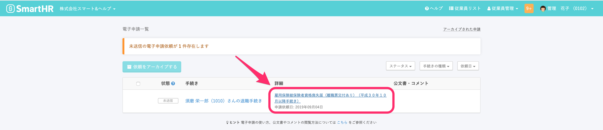

電子申請が **\[役所到達\]** の状態になった時点で、その申請に対して付与される一意の番号になります。
役所へ直接申請の進捗確認や、取り下げをする場合などに使用します。

# 1\. トップページ > \[電子申請\] をクリック

トップページの左側にある **\[電子申請\]** をクリックします。

# 2\. \[電子申請一覧\] で任意の書類名をクリック

**\[電子申請一覧\]** 画面の **\[詳細\]** 欄に書類名が一覧表示されるので、任意の書類名をクリックします。

書類名をクリックした先の画面で、電子申請の到達番号をご確認いただけます。

