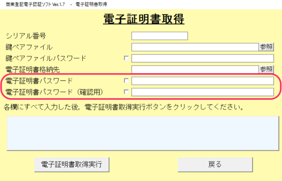

**PIN**は電子証明書に設定された暗証番号です。
**電子証明書パスワード**と呼ばれる場合もあります。

※ SmartHRのログインパスワードとは異なります。

# SmartHRでPINが必要な処理

1.  電子証明書の登録／変更時
2.  電子申請の実行時

にそれぞれPINの入力が必要となります。

# PINがわからない時は？

PIN がわからない場合は、法務局または証明書を発行された会社にお問い合わせください。

:::tips
「商業登記電子認証ソフト」を利用して、法務局で電子証明書を取得された場合は、下図赤枠にご入力いただいたパスワードがPINになります。

:::
