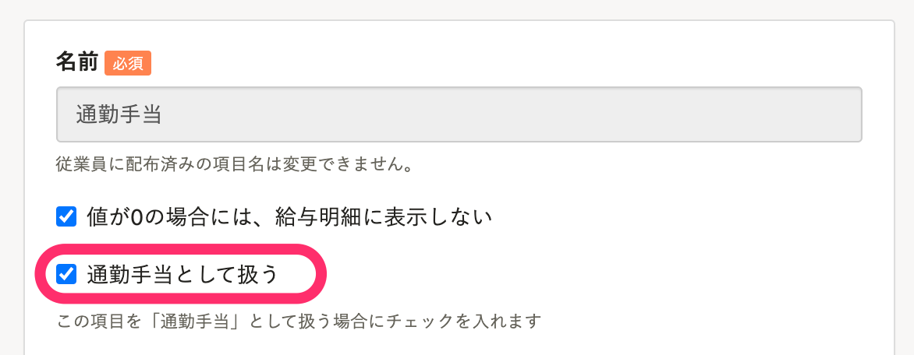
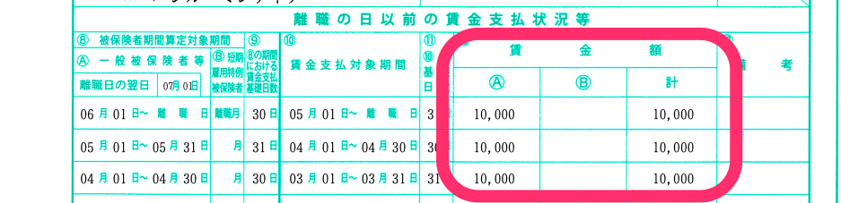

# A. 「雇用保険被保険者離職証明書」に反映されます。

給与明細の項目設定で、 **［通勤手当として扱う］** にチェックを入れると、退職の手続きで作成される「雇用保険被保険者離職証明書」の **［賃金額］** に反映されます。

退職する従業員の給与明細に **［通勤手当として扱う］** のチェックを入れた項目がある場合、該当金額が反映される仕組みです。

 **「雇用保険被保険者離職証明書」>［賃金額］** 

