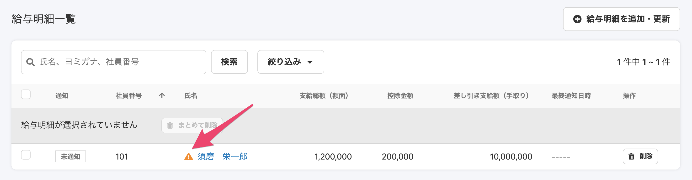
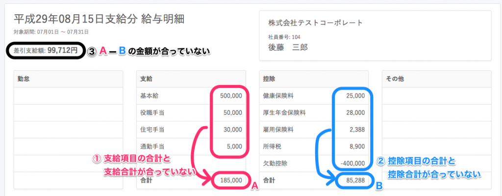
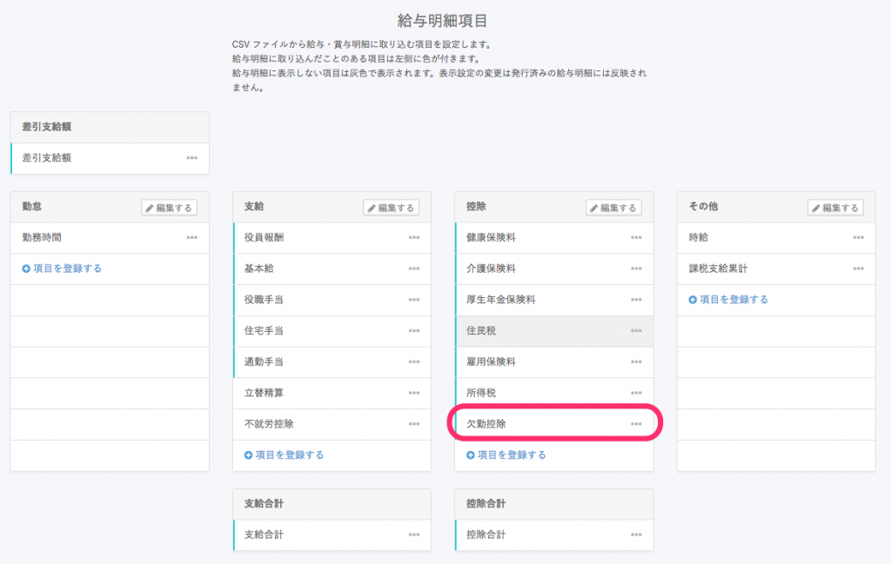
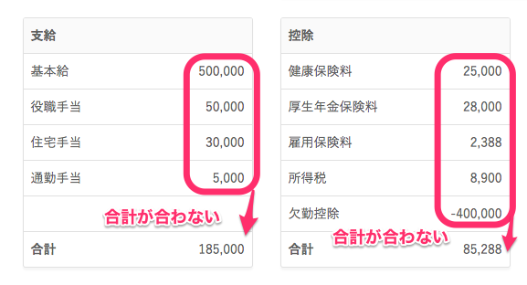
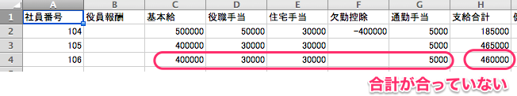

給与明細の「項目の合計」と「各種合計」が一致しない状態で、給与明細のステータスが「未確定」の場合、一覧画面に **\[！\] アイコン** が表示されます。

**\[！\] アイコン** がつく原因としては以下が考えられます。

# \[！\] アイコンがつく原因

次のいずれかの数字が合っていない場合、 **\[！\] アイコン** がつきます。

1.  支給項目の合計と支給合計が合っていない
2.  控除項目の合計と控除合計が合っていない
3.  支給合計−控除合計の金額が差引支給額の金額と合っていない

:::tips
**\[！\] アイコン**が表示されていても、明細の確定・公開は可能です。
明細を確定すると、 **\[！\] アイコン**は表示されなくなります。
:::

## 数字が合わない原因

1.  支給、控除の項目が間違って登録されている（例：支給なのに控除に項目が表示されている）
2.  明細項目が非表示になっているものがある
3.  CSVの合計の数値が間違っている

### ① 支給、控除の項目が間違って登録されている（例：支給なのに控除に項目が表示されている）

SmartHRに登録した給与明細項目をご確認ください。支給項目なのに控除項目として登録されていると、インポートした際に「控除」に入ってしまいます。

例：「欠勤控除」という項目は支給項目なのに控除項目として登録されていた

インポートするCSVは支給項目に入っているが、

SmartHRの給与明細は「控除」に入ってしまっているため、合計が合わない状態となっています。

### ② 明細項目が非表示になっているものがある

CSVには項目、金額があるのに、SmartHRに登録されている項目が「非表示」となっている場合は明細に表示がされないため、画面上に表示される項目の金額と各種合計が合わない状態となります。

### ③ CSVの合計の数値が間違っている

インポートしたCSVの内容に誤りがある場合、SmartHRの画面に表示される項目の合計とCSVの各種合計が合わない状態となります。

