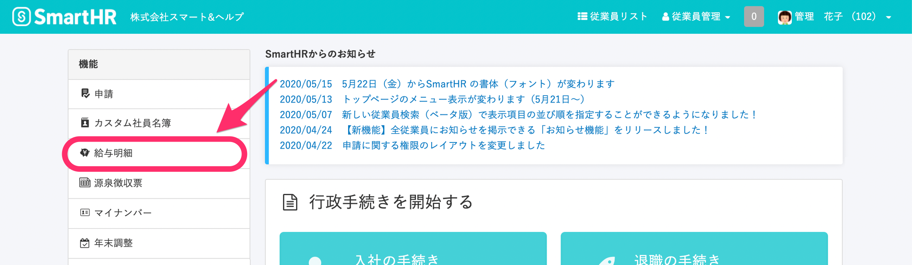
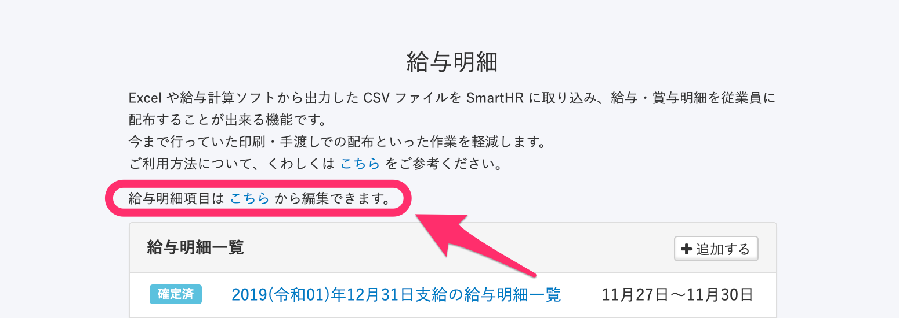
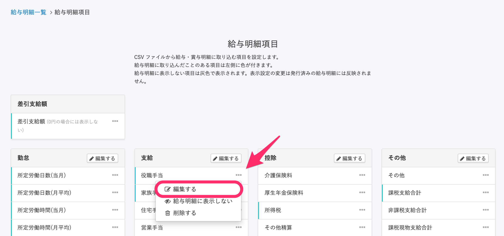
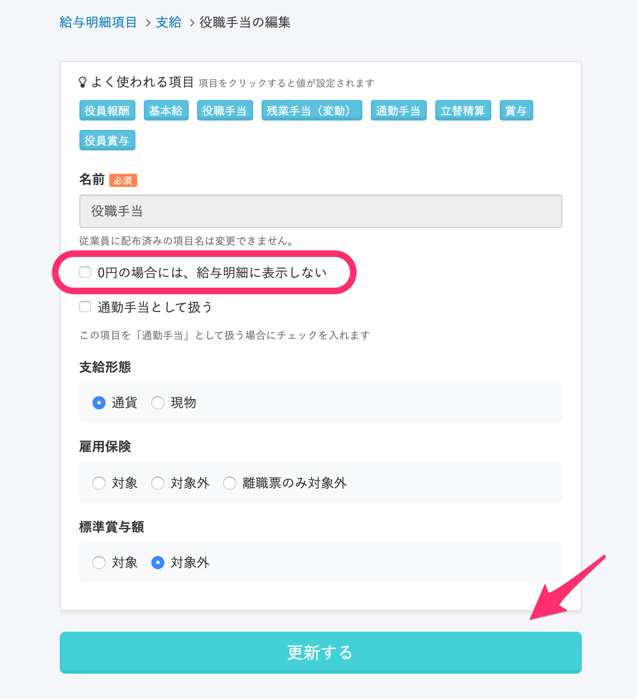

取り込んだ給与明細に0円の項目がある場合、給与明細にその項目を表示しない設定が可能です。

# 1\. \[機能\] > \[給与明細\] をクリック

トップページ左側の **\[機能\]** にある **\[給与明細\]** をクリックします。

# 2\. \[給与明細項目は こちら から編集できます\] の \[こちら\] をクリック

給与明細項目の編集画面を確認します。

# 3\. \[...\] メニュー > \[編集する\] をクリック

設定を行いたい項目名横の **\[…\]メニュー > \[編集する\]** をクリックします。

# 4\. \[0円の場合には、給与明細に表示しない\] にチェックを入れる

項目編集画面にて **\[0円の場合には、給与明細に表示しない\]** にチェックを入れ **\[更新する\]** をクリックします。

上記の設定を行った項目に対し、インポートする CSV 内の該当項目に 「0」 の数値が入力されている場合、給与明細からは項目自体が非表示になります。
