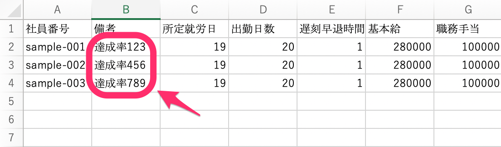
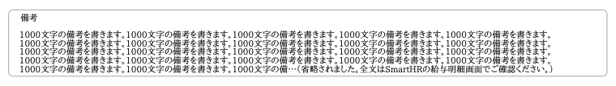
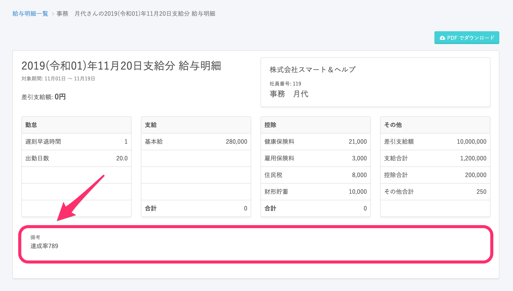
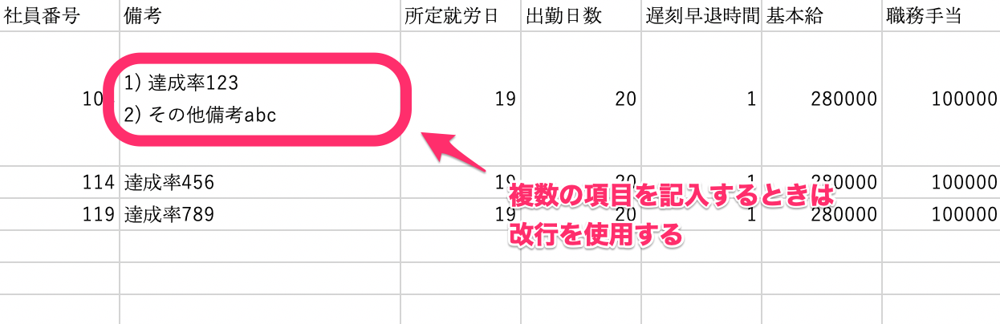

給与明細の **\[備考欄\]** に情報を記入するには、給与明細のCSVファイルを編集します。 

# 1\. \[備考\] 欄に情報を記入する

給与明細のCSVファイルを開き、 **\[備考\]** 欄に記載したい情報を記入します。

:::tips
 **\[備考\]** 欄には、改行も含めて最大1000文字までの文字列を入力できます。
ただし、SmartHR上の給与明細では1000文字すべてが表示されますが、PDFの給与明細では、75文字×5行を超える部分は省略されます。

:::

# 2\. CSVファイルをアップロードする

記入を終えたら、トップページにある **\[給与明細\] > \[追加する\]** をクリックし、CSVファイルをアップロード・公開します。

アップロード・公開の手順について詳しくは、以下の記事にある「給与データのインポート」項目をご覧ください。

[給与明細機能とは](https://knowledge.smarthr.jp/hc/ja/articles/360026107314)

# 従業員側の表示

備考欄は、従業員が受け取る給与明細に以下のように表示されます。

# 備考欄に複数の項目を記載したい場合は？

明細上の備考欄に対応する項目は1つのみなので、複数の項目を盛り込みたい場合は改行を使って記載します。

