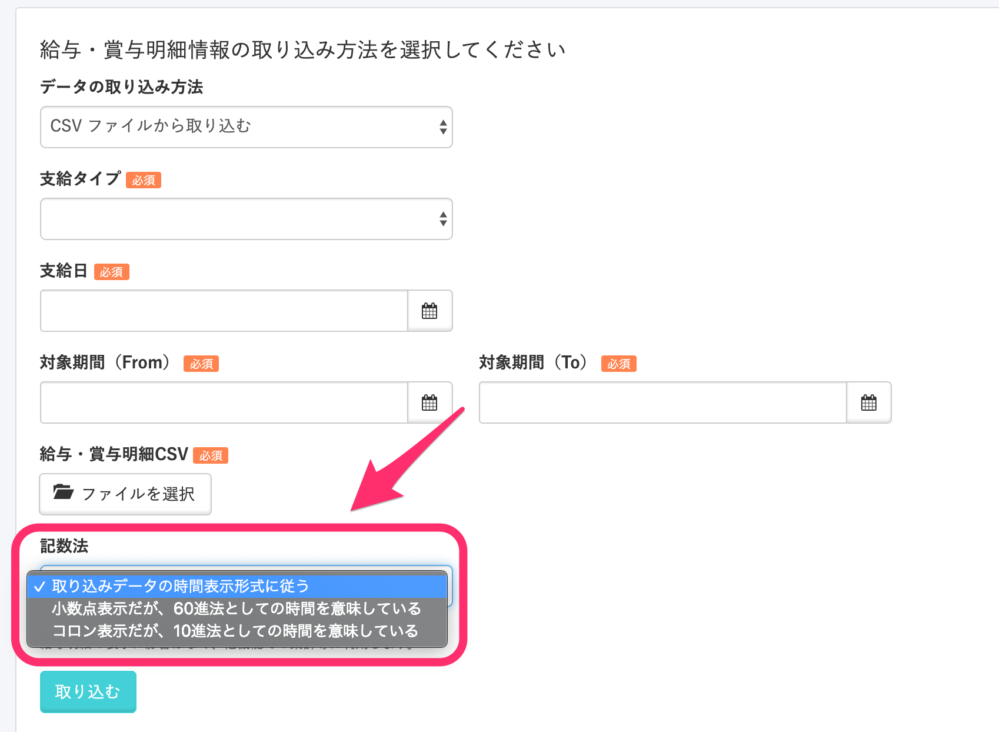

給与明細データを取り込む際の勤務時間などの時間の項目は、**コロン ( : )** を使った表記と、 **ドット（.）** を使った表記のどちらにも対応しています。

給与明細データの取り込み画面で、時間表記の扱い方について選択してください。

# 記数法を指定した際の例

## 記数法で「小数点表示だが、60進法としての時間を意味している」を選択した場合

勤務時間が「10.25」のCSVをインポートすると、給与明細には「10.25」と表示されます。
内部データは「10:25（10時間25分）」として保存します。

## 記数法で「コロン表示だが、10進法としての時間を意味している」を選択した場合

勤務時間が「10:25」のCSVをインポートすると、給与明細には「10:25」と表示されます。
内部データは「10.25（10時間15分）」として保存します。

内部データは他機能で時間計算する際に利用します。
