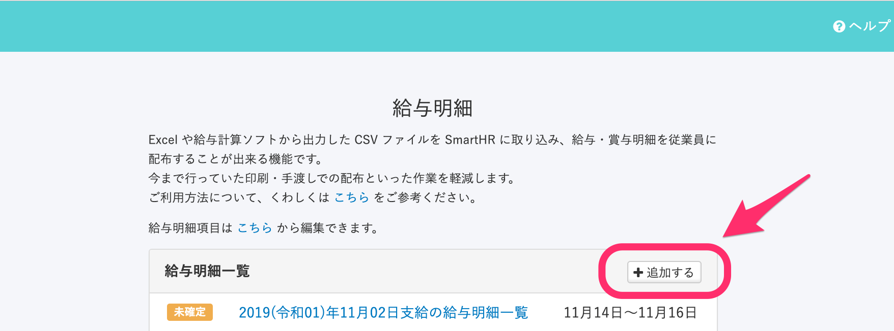
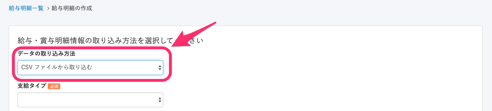
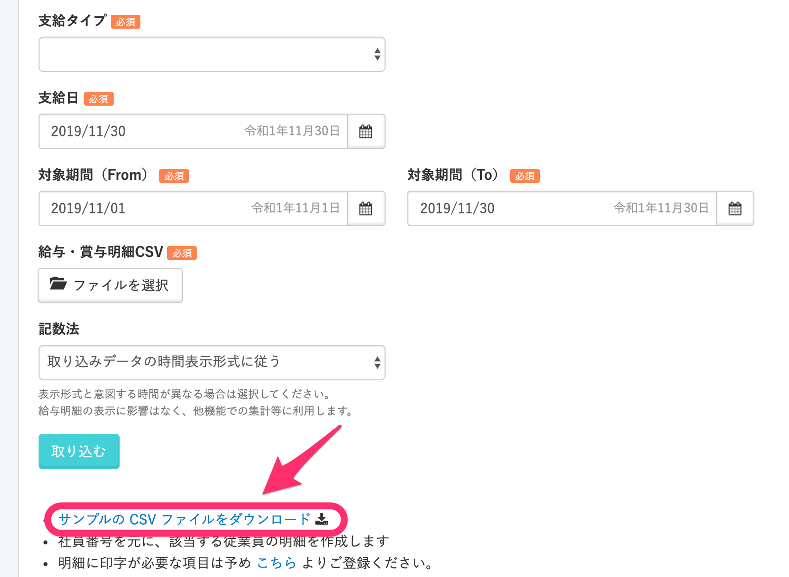
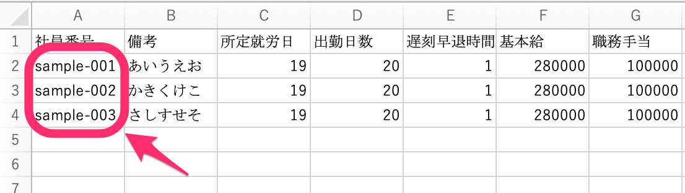
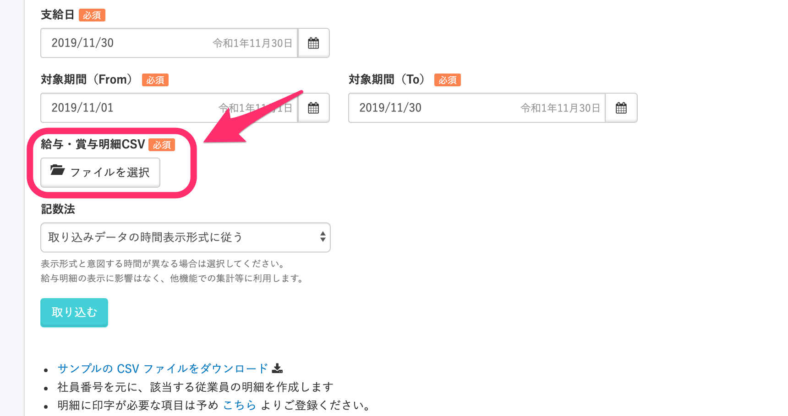
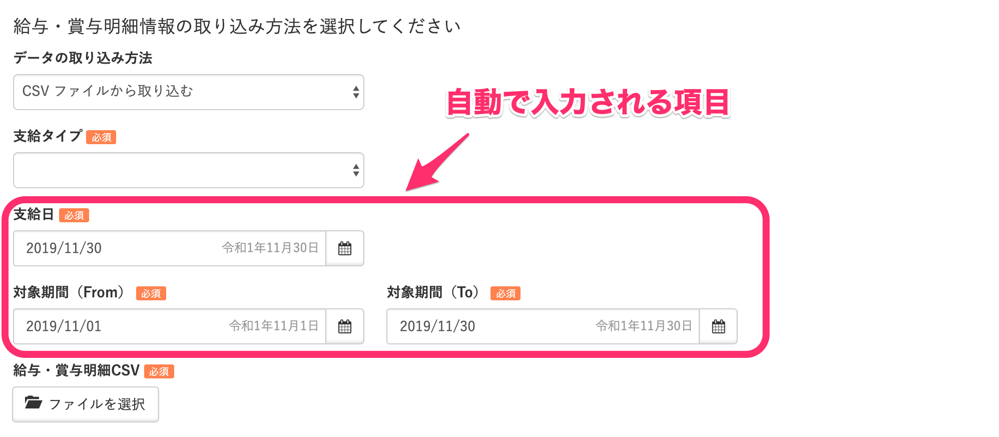
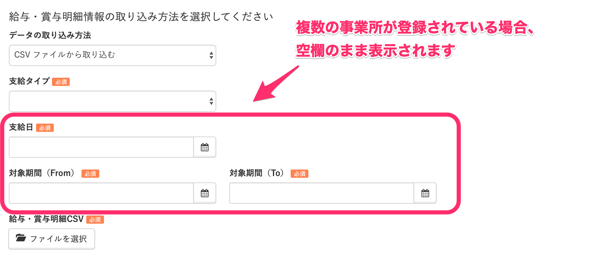
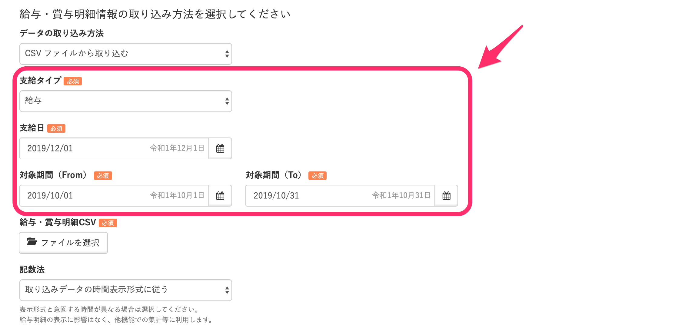
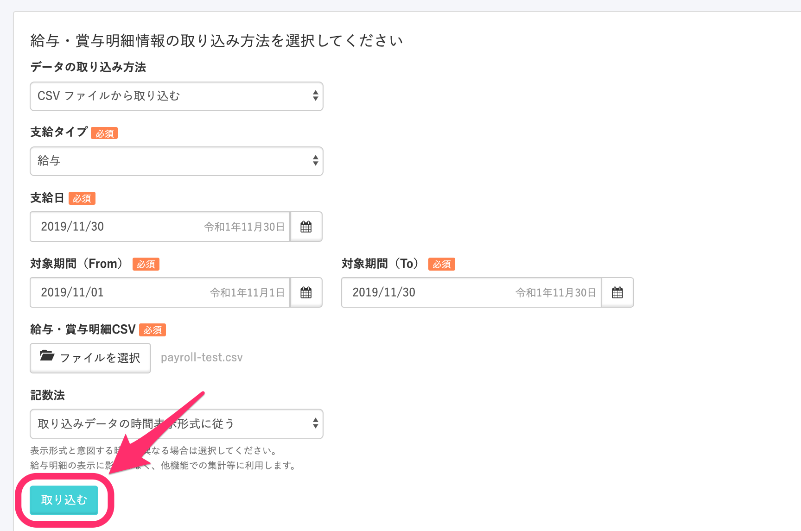
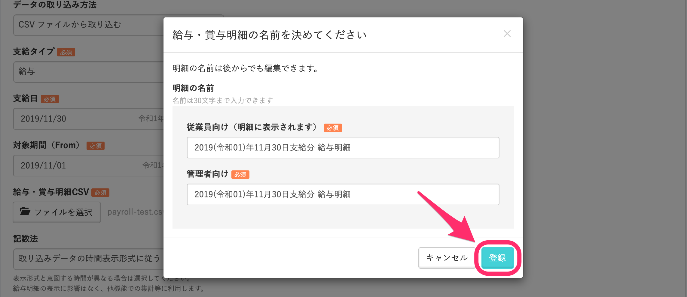

支給日の異なる従業員がいる場合は、通常の支給日が適用される従業員とは別にCSVファイルを作成して、給与明細を登録してください。

# 1\. \[機能\] > \[給与明細\] をクリック

トップページ左側の **\[機能\]** 欄にある **\[給与明細\]** をクリックします。

# 2\. \[追加する\] > \[データの取り込み方法\] を設定

**\[給与明細一覧\]** にある **\[追加する\]** をクリックし、**\[データの取り込み方法\]** 項目を **\[CSVファイルから取り込む\]** に設定します。

# 3\. \[サンプルの CSV ファイルをダウンロード\] をクリック

**\[サンプルのCSVファイルをダウンロード\]** をクリックして、テンプレートファイルをダウンロードします。

# 4\. CSVファイルを編集する

ダウンロードしたCSVファイルを開き、支給日が異なる従業員の給与データを入力します。

:::tips
従業員番号は、A列に登録してください。

:::

# 5\. 編集したCSVファイルを選択

CSVファイルの準備が整ったら、**\[給与・賞与明細CSV\]** 項目にある **\[ファイルを選択\]** をクリックし、編集したCSVファイルをアップロードしてください。

## \[支給日\] と \[対象期間\] 項目について

給与明細をCSVファイルで登録する際に表示される **\[支給日\]** および **\[対象期間\]** には、 **\[会社情報\] >** **\[事業所情報\]** にある **\[給与・税\]** 項目で登録した設定がデフォルトで入る仕組みとなります。

:::tips
ただし、SmartHR内に複数の事業所が登録されている場合、**\[支給日\]** と **\[対象期間\]** は空欄のまま表示されます。

:::

# 6\. \[支給タイプ\]・\[支給日\]・\[対象期間\] を設定する

支給日の異なる従業員の **\[支給タイプ\]**、**\[支給日\]** と **\[対象期間\]** を設定します。

# 7\. \[取り込む\] をクリック

画面下にある **\[取り込む\]** をクリックすると、名称を決めるモーダルが表示されます。

# 8\. \[登録\] をクリック

明細の名前を変更する場合はそれぞれ名前を編集し、**\[登録\]** をクリックすると、取り込み処理が始まります。

CSVファイルを登録すると、**\[バックグラウンド処理一覧\]** にアップロードの結果が表示されます。

アップロードの完了を確認したら、従業員への公開と通知の設定を行なってください。

給与明細の公開と通知の設定方法について詳しくは、以下の記事をご覧ください。

[給与明細機能とは](https://knowledge.smarthr.jp/hc/ja/articles/360026107314) 

# 9\. デフォルトの支給日の給与明細を登録する

支給日の異なる従業員分の給与明細を登録し終えたら、デフォルトの支給日が適用される従業員分の給与明細を登録します。
