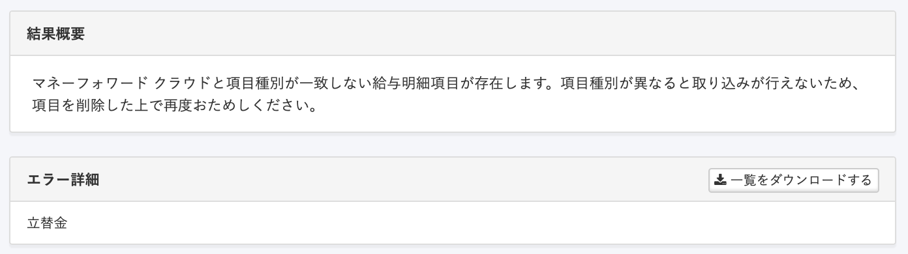
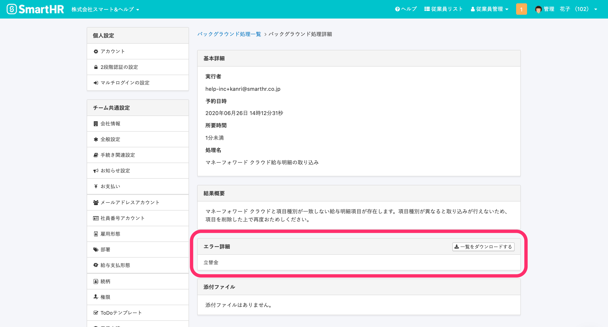
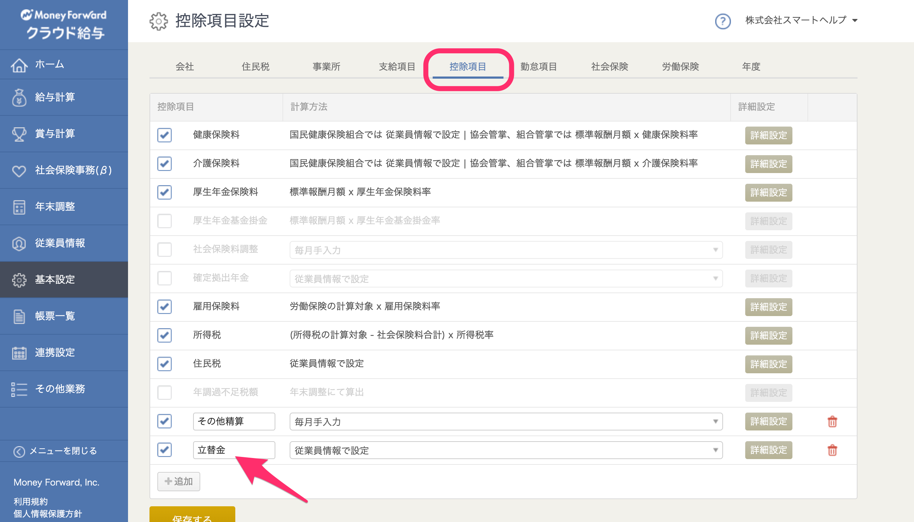
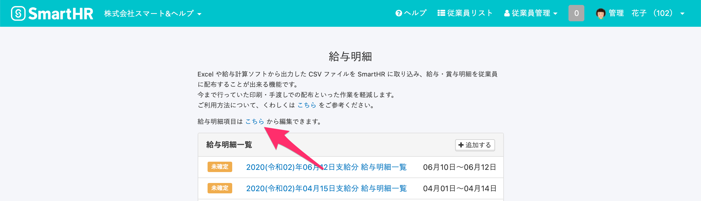
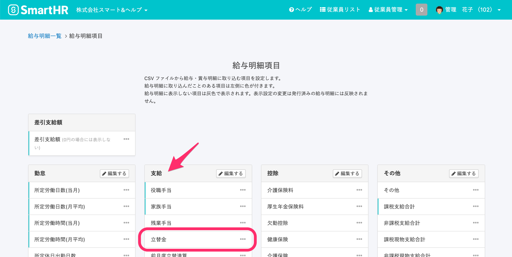

該当のエラーは、マネーフォワード クラウド給与とSmartHRに登録されている給与明細項目の「種別」が一致していないことが原因で発生します。

エラーを解消するには、マネーフォワード クラウド給与とSmartHRで登録している項目種別を確認・修正し、マネーフォワード クラウド給与で「給与明細の確定取消」を行なったうえで、改めて給与明細を取り込んでください。

:::tips
該当のエラーは、マネーフォワード クラウド給与とのアプリケーション連携後、**マネーフォワード クラウド給与で給与明細項目を変更したが、SmartHRの給与明細項目は変更しないまま給与明細の取り込みをした**場合にも発生します。
すでに給与明細の取り込みをしたことがあり、どちらかの給与明細項目を変更した場合には、給与明細を取り込む前に給与明細項目が一致しているかをご確認ください。
:::

# 1\. エラーになった給与明細項目を確認する

画面右上のアカウント名 > **\[共通設定****\]** をクリックすると、画面の左側に **\[****共通設定****\]** のメニューが表示されます。

**\[バックグラウンド処理\]** の一覧から該当の処理名をクリックし、**\[バックグラウンド処理詳細\]** の画面が表示されたら、**\[エラー詳細\]** 項目に記載の内容を確認します。

上図では、「立替金」の項目で種別の不一致が出ていることが示されています。

# 2\. 給与明細項目の種別を確認する

## 2-1. マネーフォワード クラウド給与の確認手順

トップページ左側にある **\[基本設定\]** をクリックし、画面上部のタブから該当の給与項目が含まれている項目を選択します。

上図では、立替金は「控除項目」として登録されていることが確認できます。

## 2-2. SmartHRの確認手順 

### 2-2-1. トップページ左側にある \[給与明細\] をクリックし、給与明細画面の \[こちら\] をクリック

### 2-2-2. 給与明細項目画面で、エラーになった給与明細項目を確認する

#### 

上図では、立替金は「支給項目」として登録されており、マネーフォワード クラウド給与に登録している給与明細項目とは種別が一致していないことが確認できます。

# 3\. 給与明細項目の種別を修正する

SmartHRで給与明細項目の種別を修正する詳しい手順は、以下のヘルプページをご覧ください。

[給与明細項目を設定する](https://knowledge.smarthr.jp/hc/ja/articles/360026265193)

:::alert
SmartHRの仕様では、同名の給与項目をひとつしか登録できません。それにより、マネーフォワード クラウド給与の給与明細項目名を変更することでしか対処できないケースがございます。
例えば、マネーフォワード クラウド給与で「欠勤控除」の項目が **支給** と **控除** の両方で登録されていた場合は、欠勤控除の項目名を  **欠勤控除（支給）** 、 **欠勤控除（控除）** 等として修正してください。
また、マネーフォワード クラウド給与と連携している勤怠サービスがある場合は、勤怠サービス間との項目名についても調整が発生する可能性がございますのでご注意いただくようお願いします。
:::

# 4\. マネーフォワード クラウド給与で給与明細の確定取消をし、改めて確定処理を実行する

SmartHRに取り込みたい給与明細の確定取消をし、改めて確定処理を処理を実行します。

確定取消の詳しい手順、操作時の注意点については、マネーフォワード クラウド給与の使い方ガイドをご覧ください。

[給与計算の確定処理について｜マネーフォワード クラウド給与 使い方ガイド](https://support.biz.moneyforward.com/payroll/guide/payroll/payr06.html)

[Q. 確定処理した給与計算結果を修正することはできないのでしょうか。｜マネーフォワード クラウド給与 使い方ガイド](https://support.biz.moneyforward.com/payroll/faq/input/i04.html)

[Q. 確定済みの給与計算を取り消す際の注意事項を教えてください｜マネーフォワード クラウド給与 使い方ガイド](https://support.biz.moneyforward.com/payroll/faq/payroll-error/cancel-payroll.html)

# 5\. 再度、SmartHRで給与明細の取り込みを実行する

マネーフォワード クラウド給与で確定処理をした給与明細を、再度、SmartHRに取り込みます。

詳しい手順については以下のヘルプページをご覧ください。

[マネーフォワード クラウド給与の給与明細データをSmartHRに取り込む](https://knowledge.smarthr.jp/hc/ja/articles/360026105654)
