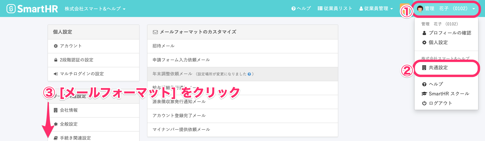
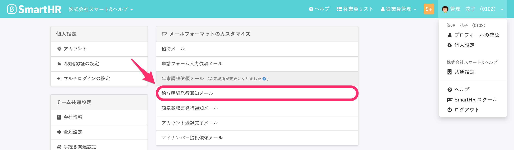
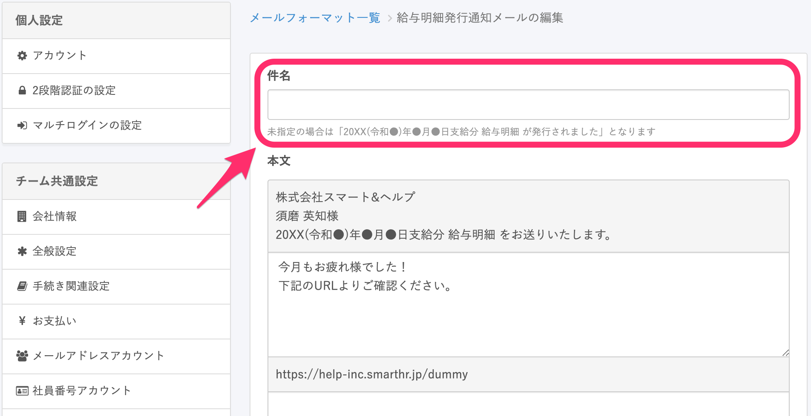

給与明細の発行通知メールに自動で支給年月日を挿入する方法をご説明します。

# 1\. 画面右上のアイコン > \[共通設定\] > \[メールフォーマット\] をクリック

 **\[画面右上のアイコン\] > \[共通設定\]** の順にクリックします。**\[共通設定\]** をクリックすると画面左に **\[共通設定\]** メニューが表示されます。

**\[共通設定\]** メニュー内にある **\[メールフォーマット\]** をクリックしてください。

# 2\. \[給与明細発行通知メール\] をクリック

**\[給与明細発行通知メール\]** をクリックすると、現在使用中のメールフォーマットが表示されます。

# 3\. 件名を編集する

**\[件名\]** 欄を空欄にし、画面の下部にある **\[更新する\]** ボタンを押します。

:::tips
件名を空白にした場合、メールのタイトルは「20XX(令和●)年●月●日支給分 給与明細 が発行されました」と記されます。
日付部分には、対象の給与明細の支給日が自動で挿入されます。
:::

# 従業員が受け取るメール

従業員が給与明細の通知を受け取ったとき、件名は以下のように表示されます。

