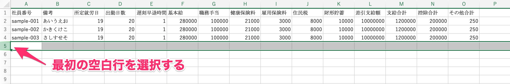
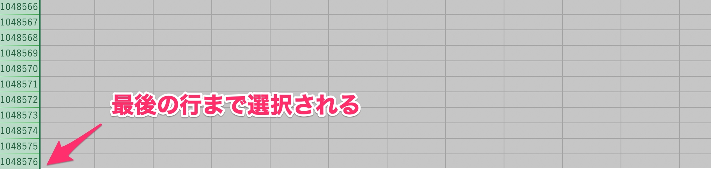

# A. 社員番号が重複した行がないか、空行が含まれていないか確認してください

給与明細データを取り込んだ際に、「社員番号が重複しています」「CSVファイルの行数が登録されている従業員より多いです」というエラーが出た場合、取り込みデータの中に、社員番号が重複した行がないか、空行が含まれていないか確認してください。

CSV/Excel 形式のファイルの場合、目視では確認できないデータが含まれている可能性があります。

社員番号が重複した行がない場合は、該当の CSV/Excel ファイルにある空白行を下記の方法で削除し、もう一度CSVファイルをアップロードしてください。

## 1\. 最初の空白行を選択する

エラーが発生したファイルを開き、最初の空白行を選択します。

## 2\. 「Ctrl（またはCommand）+ Shift + ↓」を同時に押す

最初の空白行を選択したら「Ctrl + Shift + ↓」を同時に押して、最後の行まで選択します。

:::tips
Macの場合は、「Command + Shift + ↓」を同時に押してください。
:::

最後の行まで選択されたら、削除キーを使って行内のデータを消します。

## 3\. 再度CSVファイルをアップロードする

空白行を削除し変更を保存した後にもう一度、SmartHRでCSVファイルをアップロードします。
